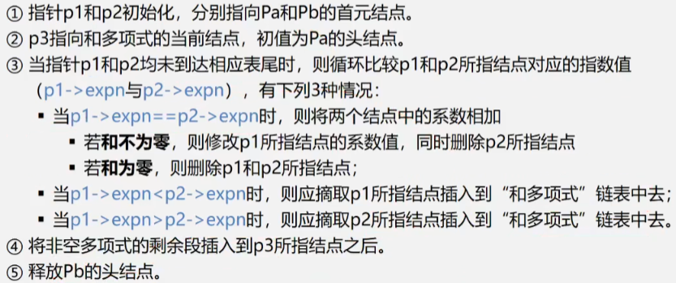

# 第1章 绪论

## 1.1 数据相关概念

### 1.数据

数据(Data) 是客观事物的符号表示，是所有能输入到计算机中并被计算机程序处理的符号的总称。

- 信息的载体
- 能被计算机识别,存储, 加工
- 包括: 
  - 数值型: 整型, 浮点型等
  - 非数值型数据: 文字, 图形, 图像, 声音等.

### 2.数据元素

数据元素(Data Element) 是数据的基本单位，在计算机中通常作为一个整体进行考虑和处理。

数据元素也称为元素、记录, 节点, 顶点等。数据元素用于完整地描述一个对象，如学生表里一个学生的纪录.

### 3.数据项

数据项(Data Item) 是组成数据元素的、有独立含义的、不可分割的最小单位。

例如，学生表中的学号、姓名、性别等都是数据项。

> 所以, 数据--> 数据元素--> 数据项
>
> 学生表--> 学生元素(纪录)--> 学号, 姓名....

### 4.数据对象

数据对象(Data Object) 是性质相同的数据元素的集合，是数据的一个子集。

例如：整数数据对象是集合, 字母字符数据对象, 学生信息表也可以是一个数据对象.

### 数据元素与数据对象

数据元素 : 组成数据的基本单位. 与数据的关系: 是集合的个体.

数据对象: 性质相同的数据元素的集合.  与数据的关系: 是集合的子集.

## 1.2.2数据结构

数据结构(Data Structure) 是相互之间存在一种或多种特定关系的数据元素的集合。

换句话说， 数据结构是带"结构"的数据元素的集合， “结构” 就是指数据元素之间存在的关系。

数据结构包括三方面:

- 数据元素之间的逻辑关系, 即逻辑结构.
- 数据元素及其关系在计算机内的表示, 称为数据的物理结构, 或者 存储结构.
- 数据的运算和实现. 即对数据元素可以进行的操作和这些操作在相应的存储结构上的实现.

### 逻辑结构

- 描述数据元素之间的逻辑关系
- 与数据怎么存储无关, 独立于计算机
- 是抽象的数学模型

### 物理结构(存储结构)

- 数据元素及其关系在计算机内存储器中的存储方式
- 是数据结构在计算机内的表示

存储结构是逻辑关系的映像, 与元素本身的映像.

逻辑结构是数据结构的抽象, 存储结构是数据结构的实现.

### 逻辑结构的种类

> 划分方法一

- 线性结构

  就是一维的, 一条线. 有且只有一个开始和一个终端节点, 所有节点都最多只有一个前趋和一个后继.

  > 比如 线性表, 栈, 队列, 串等

- 非线性结构

  一个节点, 可能有多个直接前趋和直接后继. 如, 树, 图

> 划分方法二  四种基本逻辑结构

- 集合结构 : 结构中的数据元素除了同属一个集合的关系之外, 没有别的关系了.
- 线性结构 : 数据元素直接存在一对一的线性关系.
- 树形结构 : 数据元素之间存在1对多的层次关系
- 图或网状结构: 结构中的数据元素存在多对多的任意关系.

### 存储结构的种类

- 顺序存储结构 : 用一组连续的存储单元, 依次存储数据元素, 数据元素之间的逻辑关系由元素的存储位置来表示.

  代表: 数组

- 链式存储结构 : 用一组位置任意的存储单元存储数据元素, 数据元素之间的逻辑关系用指针表示.

  代表: 各种链表 , 

- 索引存储结构 : 在存储节点信息的同时, 还建立索引表

  索引表中每一项为索引项,  索引项的一般形式是: (关键字, 地址),  关键字是能唯一标识一个节点的那些数据项

- 散列存储结构

  根据节点的关键字直接计算出该节点的存储地址, 比如关键字的值进行模运算得到地址, 就把值存到那个地址.

### 1.2.3 数据类型和ADT

C语言中有很多基本数据类型, 和构造类型.

ADT: 指一个数学模型以及定义在此数学模型上的一组操作.

> 用用户定义, 从问题抽象出的数据模型(逻辑结构)
>
> 定义在数据模型上的一组抽象运算.(操作)

ADT的形式定义:

`(D, S, P) `三元组表示:

其中: D是数据对象, S是D上的关系集, P是对D的基本操作集.

定义格式:

```c
ADT 抽象数据类型名
{
	数据对象:<数据对象的定义>
	数据关系:<数据关系的定义>
	基本操作:<基本操作的定义>
} ADT 抽象数据类型名
```

- 数据对象, 数据关系的定义用伪代码描述

- 基本操作的定义格式:

  基本操作名(参数表)

  初始条件: <初始条件描述>

  操作结果: <操作结果描述>

- 参数表:

  赋值参数, 为操作提供输入值

  引用参数, 以&打头, 除可提供输入值外, 还将返回操作结果.

- 初始条件

  ”初始条件” 描述了操作执行之前数据结构和参数应满足的条件，若初始条件为空，则省略。

- 操作结果

  ”操作结果” 说明了操作正常完成之后，数据结构的变化状况和应返回的结果。

举例:

```
ADT Circle{
	数据对象: D={r,x,y|r,x,y均为实数}
	数据关系: R={<r,x,y>|r是半径,<x,y>是圆心坐标}
	基本操作: 
		Circle(&C, r,x,y) 
		操作结果: 构造一个圆
		double Area(C)
		初始条件: 圆已存在
		操作结果: 计算面积
		double Circumference(C)
		初始条件: 圆已存在
		操作结果: 计算周常
} ADT Circle
```

## 1.3 抽象数据类型的表示与实现

运用抽象数据类型描述数据结构，有助于在设计一个软件系统时，不必首先考虑其中包含的数据对象，以及操作在不同处理器中的表示和实现细节，而是在构成软件系统的每个相对独立的模块上定义一组数据和相应的操作，把这些数据的表示和操作细节留在模块内部解决，在更高的层次上进行软件的分析和设计，从而提高软件的整体性能和利用率。

抽象数据类型的概念与面向对象方法的思想是一致的。抽象数据类型独立于具体实现，将数据和操作封装在一起，使得用户程序只能通过抽象数据类型定义的某些操作来访问其中的数据，从而实现了信息隐藏。

抽象数据类型和类的概念实际上反映了程序或软件设计的两层抽象：抽象数据类型相当千在概念层（或称为抽象层） 上描述问题，而类相当于在实现层上描述问题。

最终表示和实现抽象数据类型，**最好用面向对象的方法.**

下面以复数为例， 给出一个完整的抽象数据类型的定义、表示和实现。看课本.

## 1.4 算法和算法分析

算法就是对特定问题求解方法和步骤的一种描述, 它是指令的有限序列. 其中每个指令表示一个或多个操作.

每个指令表示一个或多个操作.

- 算法描述
  - 自然语言
  - 流程图 NS流程图
  - 伪代码

- 算法特性

  一个算法必须满足以下五个重要特性:

  (1)  有穷性。一个算法必须总是在执行有穷步后结束，且每一步都必须在有穷时间内完成。

  (2)  确定性。对每种情况下所应执行的操作，在算法中都有确切的规定，不会产生二义性，使算法的执行者或阅读者都能明确其含义及如何执行。

  (3)  可行性。算法中的所有操作都可以通过已经实现的基本操作运算执行有限次来实现。

  (4)  输入。一个算法有零个或多个输入。当用函数描述算法时，输入往往是通过形参表示的，在它们被调用时，从主调函数获得输入值。

  (5)  输出。一个算法有一个或多个输出，它们是算法进行信息加工后得到的结果，无输出的算法没有任何意义。当用函数描述算法时，输出多用返回值或引用类型的形参表示。

- 算法设计要求

  评价算法优劣的基本标准.

  (1) 正确性。在合理的数据输入下，能够在有限的运行时间内得到正确的结果。

  (2) 可读性。一个好的算法，首先应便于人们理解和相互交流， 其次才是机器可执行性。可读性强的算法有助于人们对算法的理解，而难懂的算法易千隐藏错误，且难千调试和修改。

  (3) 健壮性。当输入的数据非法时，好的算法能适当地做出正确反应或进行相应处理，而不会产生一些莫名其妙的输出结果。

  (4) 高效性。高效性包括**时间和空间**两个方面。时间高效是指算法设计合理，执行效率高，可以用时间复杂度来度量；空间高效是指算法占用存储容量合理，可以用空间复杂度来度量。时间复杂度和空间复杂度是衡量算法的两个主要指标。

> 好的算法自然要先具备正确性, 健壮性, 可读性.  这个先满足的条件下, 主要考虑算法的效率, 效率高低评判算法优劣.

时间与空间, 有时候是矛盾的, 要结合具体情况, 选择时间换空间, 还是空间换时间.

- 算法时间效率的度量

  用算法写的程序, 在计算机上运行所消耗的时间来衡量.

- 衡蜇算法效率的两类方法

  - 事后统计

    事后统计法需要先将算法实现，然后测算其时间和空间开销。

    这种方法的缺陷很显然，一是必须把算法转换成可执行的程序，二是时空开销的测算结果依赖于计算机的软硬件等环境因素，这容易掩盖算法本身的优劣。

  - 事前分析估算

    通常采用事前分析估算法，通过计算算法的渐近复杂度来衡量算法的效率。

- 事前分析估算法

  一个算法的执行时间大致上等千其所有语句执行时间的总和， 而语句的执行时间则为该条语句的重复执行次数和执行一次所需时间的乘积。

- 问题规模和语句频度

  不考虑计算机的软硬件等环境因素，**影响算法时间代价的最主要因素是问题规模**. 问题规模是算法求解问题输入量的多少，是问题大小的本质表示，一般用整数n表示。问题规模n对不同的问题含义不同.

  一条语句的重复执行次数称作语句频度(FrequencyCount)。

  语句的执行要由源程序经编译程序翻译成目标代码， 目标代码经装配再执行， 因此语句执行一次实际所需的具体时间是与机器的软、硬件环境（如机器速度、编译出的程序质量等）密切相关的。所以， 所谓的算法分析并非精确统计算法实际执行所需时间， 而是针对算法中语句的执行次数做出估计， 从中得到算法执行时间的信息。

  假设每条语句执行一次所需的时间均是单位时间， 则一个算法的执行时间可用该算法中所有语句频度之和来度量。

- 算法的时间复杂度定义

  为了客观地反映一个算法的执行时间, 可以只用算法中的“基本语句" 的**执行次数**来度量算法的工作量。

  所谓“基本语句” 指的是**算法中重复执行次数和算法的执行时间成正比的语句 ,它对算法运行时间的贡献最大**。通常, 算法的执行时间是随问题规模增长而增长的, 因此对算法的评价通常只需考虑其随问题规模增长的趋势。

  这种情况下, 我们只需要考虑当问题规模充分大时, 算法中基本语句的执行次数在渐近意义下的阶。

  一般情况下， 算法中基本语句重复执行的次数是问题规模n的某个函数f(n), 算法的时间量度记作

  `T(n)= O(f(n))`

  它表示随问题规模n的增大, 算法执行时间的增长率和`f(n)`的增长率相同， 称做算法的渐近时间复杂度， 简称时间复杂度(TimeComplexity)。我们用"O"来表示数量级.

  

  所以, 一般情况下, 不用计算所有操作的执行次数, 而是考虑算法中的基本操作执行的次数, 它是问题规模n的某个函数.用T(n)表示.

- 分析算法时间复杂度的基本方法

  

  1. 找出语句频度最大的那条语句作为基本语句
  2. 计算基本语句的频度得到问题规模n的某个函数f(n)
  3. 取其数量级用符号"O"表示

  

  注意: 有些情况下, 算法中的基本操作重复执行的次数还随问题的输入数据集不同而不同.

  ```c
  for(int i = 0; i < n; i++)
  {
      if( e == a[i] ) return i+1;
  }
  return 0;
  ```

  最好情况 : 1    最坏情况 : n 所以平均时间复杂度O(n)

- 算法时间复杂度

  - 最坏时间复杂度: 最坏情况下, 算法的时间复杂度

  - 平均时间复杂度: 指在所有可能输入实例在等概率出现的情况下, 算法的期望运行时间.

  - 最好时间复杂度: 指最好情况下, 算法的时间复杂度.

  一般总是考虑在最坏情况下的时间复杂度，以保证算法的运行时间不会比它更长。

  对于复杂的算法， 可以将它分成几个容易估算的部分， 然后利用“O”加法法则和乘法法则， 计算算法的时间复杂度：	

  a）加法法则

  `T(n) = T1(n) + T2(n) = O(f(n))+ O(g(n)) = O( max( f(n), g(n) ) )`

  b) 乘法法则

  `T(n) = T1(n) x T2(n) = O(f(n)) x O(g(n)) = O( f(n) x g(n) )`

  

- 渐进空间复杂度 

  算法所需要的存储空间的度量, 记作:

  ​          `  S(n) = O(f(n))`    n为问题的规模(或大小)

  算法要占用的空间

  - 算法本身要占用的空间, 输入/输出, 指令, 常熟, 变量等
  - 算法要使用的辅助空间

  ```c
  //【算法1】
  for(i=O;i<n/2;i++)
  {
      t=a[i];
  	a[i]=a[n-i-1];
  	a[n-i一l]=t;
  }
  // 【算法2】
  for (i=O; i<n; i++)	
  	b[i]=a[n-i-1];
  for (i=O; i<n; i++)
  	a [i] =b [i];
  ```

  算法1仅需要另外借助一个变量 t与问题规模n大小无关，所以其空间复杂度为O(1)。
  算法2需要另外借助一个大小为n的辅助数组b, 所以其空间复杂度为O(n)。

## 1.5 小结


(1) 数据结构是一门研究非数值计算程序设计中操作对象,  以及这些对象之间的关系和操作的学科。

(2) 数据结构包括两个方面的内容：数据的逻辑结构和存储结构。同一逻辑结构采用不同的存储方法， 可以得到不同的存储结构。

a. 逻辑结构是从具体问题抽象出来的数学模型，从逻辑关系上描述数据，它与数据的存储无关。根据数据元素之间关系的不同特性， 通常有四类基本逻辑结构：集合结构、线性结构、树形结构和图状结构。

b. 存储结构是逻辑结构在计算机中的存储表示，有两类存储结构：顺序存储结构和链式存储结构。

(3) 抽象数据类型是指由用户定义的、表示应用问题的数学模型， 以及定义在这个模型上的一组操作的总称， 具体包括三部分：数据对象、数据对象上关系的集合， 以及对数据对象的基本操作的集合。

(4) 算法是为了解决某类问题而规定的一个有限长的操作序列。算法具有五个特性：有穷性、确定性、可行性、输入和输出。一个算法的优劣应该从以下四方面来评价：正确性、可读性、健壮性和高效性。

(5) 算法分析的两个主要方面是分析算法的时间复杂度和空间复杂度， 以考察算法的时间和空间效率。一般情况下， 鉴于运算空间较为充足， 故将算法的时间复杂度作为分析的重点。算法执行时间的数量级称为算法的渐近时间复杂度，T(n) = O(f(n) ), 它表示随着问题规模n的增大，算法执行时间的增长率和f(n)的增长率相同， 简称时间复杂度。


# 第2章 线性表

## 2.1 线性表的定义和特点

线性表是**具有相同特性的数据元素**的一个有限序列.

{ a1, a2, a3, ... , a(i-1), ai, a(a+1), ... , an }

a1: 线性起点, 起始节点

an: 线性终点, 终端节点

下标, 是元素的序号, 表示元素在表中的位置.

n=0时, 为空表. n为元素总个数, 即表长


同一线性表中的元素必定具有相同的特性， 即属千同一数据对象， 相邻数据元素之间存在着序偶关系。

对非空的线性表或线性结构， 其特点是：
(1) 存在唯一的一个被称作“第一个" 的数据元素；
(2) 存在唯一的一个被称作“最后一个"的数据元素；
(3) 除第一个之外， 结构中的每个数据元素均只有一个前驱；
(4) 除最后一个之外，结构中的每个数据元素均只有一个后继。


## 2.2 案例


- 稀疏多项式


- 稀疏多项式的运算:


- 顺序存储结构存在问题:

  存储空间的分配不灵活

  运算的空间复杂度高

  我们选择用链式存储. 链表, 上.


相同项系数相加, 结果放A链表里. A中没有的项, 插入进来.


- 不同的问题所涉元素的数据类型不尽相同，可以为简单数据类型，也可以为复杂数据类型.
- 这些问题所涉的基本操作都具有很大的相似性， 如果为每个具体应用都编一个程序显然不是一种很好的方法。
- 解决这类问题的最好方法就是从具体应用中抽象出共性的`逻辑结构和基本操作`（即抽象数据类型），然后采用程序设计语言实现相应的`存储结构和基本操作`。

## 2.3 线性表的类型定义

类型主要是指抽象数据类型. 抽象数据类型, 就是从具体问题中抽象出的数学模型, 以及在这个数学模型上的操作.

线性表是一个相当灵活的数据结构，其长度可根据需要增长或缩短，即对线性表的数据元素不仅可以进行访问，而且可以进行插入和删除等操作。


a(i-1) 是ai的前趋, ai是a(i-1)的后继.

基本操作：
`InitList (&L)`
操作结果：构造一个空的线性表L。
`DestroyList(&L)`
初始条件：线性表L已存在。
操作结果：销毁线性表L。
`ClearList (&L)`
初始条件：线性表L已存在。
操作结果：将L重置为空表。
`ListEmpty(L)`
初始条件：线性表L已存在。
操作结果：若L为空表， 则返回true, 否则返回false。
`ListLength(L)`
初始条件：线性表L已存在。
操作结果：返回L中数据元素个数。
`GetElem(L,i,&e)`
初始条件：线性表L已存在， 且`1<=i<=ListLength(L)`。
操作结果：用e返回L中第1个数据元素的值。
`LocateElem(L,e)`
初始条件：线性表L已存在。`compare()` 是数据元素判定函数.
操作结果：返回L中第1个值与e相同的元素(满足`compare()` )在L中的位置. 若这样的数据元素不存在, 则返回0。
`PriorElem(r,cur_e,&pre_e)`
初始条件：线性表L已存在。
操作结果：若cur_e是L的数据元素，且不是第一个，则用pre_e返回其前驱，否则操作失败，pre_e无定义。
`NextElem(L,cur_e,&next_e)`
初始条件：线性表L已存在。
操作结果：若cur_e是L的数据元素，且不是最后一个，则用next_e返回其后继，否则操作失败，next_e无定义。
`Listinsert(&L,i,e)`
初始条件： 线性表L已存在，且 `1<=i<=ListLength (L) +1`。
操作结果：在L中第1个位置之前插入新的数据元素e, L的长度加1。
`ListDelete(&L,i)`
初始条件：线性表L 已存在且非空，且`1<=i<=ListLength(L)`。
操作结果：删除L的第1个数据元素，L的长度减1。
`TraverseList(L)`
初始条件：线性表L已存在。
操作结果：对线性表L进行遍历，在遍历过程中对L的每个结点访问一次。

> (1)抽象数据类型仅是一个模袒的定义，并不涉及模型的具体实现，因此这里描述中所涉及的参数不必考虑具体数据类型。在实际应用中，数据元素可能有多种类型，到时可根据具体需要选择使用不同的数据类型。
>
> (2) 上述抽象数据类型中给出的操作只是基本操作，由这些基本操作可以构成其他较复杂的操作。
>
> (3)对于不同的应用， 基本操作的接口可能不同。
>
> (4)由抽象数据类型定义的线性表， 可以根据实际所采用的存储结构形式， 进行具
> 体的表示和实现。

## 2.4 线性表的顺序表示和实现

> 前面说到, 线性表的存储结构有 顺序和链式.

### 2.4.1 线性表的顺序存储表示

线性表的顺序表示指的是用一组地址连续的存储单元依次存储线性表的数据元素, 这种表示也称作线性表的顺序存储结构或顺序映像。通常, 称这种存储结构的线性表为顺序表(`Sequential List`)。

就是把逻辑上相邻的数据元素存储在物理上相邻的存储单元中的存储结构.

其特点是，逻辑上相邻的数据元素, 其物理次序也是相邻的。

> 线性表的顺序表示, 又称为顺序存储结构, 或 顺序映像. 
>
> 可以用数组来存储, 未必是在栈上, 也可以是堆内存中. 比如 零长数组, 作为结构体成员. 最好是在堆中.

顺序存储方式, 寻址特简单. 代价是插入与删除操作特别费事.

```c
//写法一
typedef struct {
    unsigned listLen;    //有几个数据元素
    unsigned listSize;  
    ElemType elem[0];    //需要的时候再申请空间
}SqList;
//课本写法
#define MAXSIZE 100
typedef struct {
    unsigned listLen;    //有几个数据元素
    ElemType *elem;    //需要的时候再申请空间
}SqList;
```

### 2.4.2 顺序表中基本操作的实现

- 线性表L的初始化:

  ```c
  //写法一
  int initList_Sq(SqList **L)
  {
      SqList *p = malloc(sizeof(SqList) + (*L).listSize * sizeof(ElemType));
      if (!P)  exit(-2);
      (*L).listLen = 0;
      *L = p;
      return 0;
  }
  //课本写法:
  int initList_Sq(SqList &L)
  {
      L.elem = malloc(sizeof(SqList) + MAXSIZE * sizeof(ElemType));
      if (!L.elem)  exit(-2);
      L.listLen = 0;
      return 0;
  }
  ```


- 销毁线性表

  ```c
  void destroyList(SqList &L)
  {
      if( L.elem ) 
      {
          free(L.elem);
          L.lem = NULL;
      }    
  }
  ```

- 清空线性表内容

  ```c
  void clearList(SqList *p)
  {
      L->listLen = 0; //后面的新数据可以进行覆盖.
  }
  ```

- 求线性表长度

  ```c
  int getSqLen(SqList *L)
  {
      return L->listLen;
  }
  ```

- 线性表判空

  ```c
  int IsEmpty(SqList *L)
  {
      if( 0 == L->listLen ) return 1;
      else  return 0;
  }
  ```

- 顺序表的取值(取i位置的元素内容)

  ```c
  int GetElem(SqList *L, int i, Element **e);
  {
      if(i<1 || i>L->listLen) return -1;
      *e = L->elem + i-1;
      return 0;
  }
  ```

- 查找

  顺序表的查找 循环进行遍历查找.

  ```c
  int locateElem(SqList *L, ElemType e)
  {
      for(int i = 0; i < L->listLen;i++)
          if(e == *(L->elem+i)) return i+1; //这里按照需求, 可以返回找到的地址也行.
      return 0;
  }
  ```

  【算法分析】

  当在顺序表中查找一个数据元素时，其时间主要耗费在数据的比较上， 而比较的次数取决于被查元素在线性表中的位置。
  在查找时， 为确定元素在顺序表中的位置， 需和给定值进行比较的数据元素个数的期望值称为查找算法在查找成功时的平均查找长度(Average Search Length, ASL)。

  

  假设每个元素的查找概率相等, 即: `Pi=1/n`,  则上面的式子就可以简化为: `ASL = (n+1)/2`. 

  顺序表按值查找算法的平均时间复杂度为O(n)。

- 插入

  顺序表的插入. 插入的位置不同, 开销也就不同.

  最简单的是插入在末尾.  其次是插入在中间, 最惨的是插到开头去.

  顺序表插入的特点, 就是元素需要依次后移, 插在最后除外.

  

  

  ```c
  int ListInsert_Sq(SqList *L, int i, ElemType e)
  {
      if ( i<1 || i>L->listLen ) return -1;
      
      if( MAXSIZE == L->listLen ) return -1;
      
      for(int idx = L->listLen -1 ; idx>=i-1; idx--)
          *(L->elem +idx+1) = *(L->elem + idx);
      *(L->elem + i - 1) = e;
      (L->listLen)++;
      return 0;
  }
  ```

  [算法分析]
  当在顺序表中某个位置上插入一个数据元素时, 其时间主要耗费在移动元素上, 而移动元素的个数取决于插入元素的位置。

  

- 删除 

  顺序表的删除

  - 判断删除位置i是否合法(合法值为1<= i <= n), 若不合法则返回ERROR。
  - 将第i+1个至第n个的元素依次向前移动一个位置(i = n时无需移动).
  - 表长减1 。

```c
int ListDelete(SqList *L, int i)
{
    if ( i < 1 || i > L->listLen ) return -1;
    if( 0 == L->listLen ) return -1;
    for(int idx = i; idx < L->listLen; idx++)
        *(L->elem + idx - 1) = *(L->elem + idx);
    return 0;
}
```

顺序表删除算法的平均时间复杂度为O(n)。

> 顺序表可以随机存取表中任一元素，其存储位置可用一个简单、直观的公式来表示。然而，从另一方面来看，这个特点也造成了这种存储结构的缺点：在做插入或删除操作时，需移动大最元素。另外由于数组有长度相对固定的静态特性， 当表中数据元素个数较多且变化较大时，操作过程相对复杂，必然导致存储空间的浪费。
>
> 顺序表也是优点的: 存储密度大, 可以随机存取表中任一元素.
>
> 所有这些问题，都可以通过线性表的另一种表示方法---链式存储结构来解决。

## 2.5 线性表的链式表示和实现

线性表链式存储结构的特点是: 

- 用一组任意的存储单元存储线性表的数据元素.

- 这组存储单元可以是连续的，也可以是不连续的, 甚至是零星分布在内存中.
- 链表中元素的逻辑次序跟物理次序就没什么关系了.

### 2.5.1 单链表的定义和表示

对数据元素ai来说，除了存储其本身的信息之外，还需存储一个指示其直接后继的信息（即直接后继的存储位置）。这两部分信息组成数据元素ai 的存储映像，称为结点(node).

它包括两个域：其中存储数据元素信息的域称为`数据域`；存储直接后继存储位置的域称为`指针域`。指针域中存储的信息称作指针或链。n个结点链结成一个链表，即为线性表 `(a1, a2, ..., an)`的链式存储结构.

又由于此链表的每个结点中只包含一个指针域，故又称线性链表或`单链表`。


> 根据链表结点所含指针个数、指针指向和指针连接方式，可将链表分为单链表、循环链表、双向链表、二叉链表、十字链表、邻接表、邻接多重表等。其中单链表、循环链表和双向链表用于实现线性表的链式存储结构，其他形式多用于实现树和图等非线性结构。


​用单链表表示线性表时，数据元素之间的逻辑关系是由结点中的指针指示的。换句话说，指针为数据元素之间的逻辑关系的映像，则逻辑上相邻的两个数据元素其存储的物理位置不要求紧邻，由此，这种存储结构为**非顺序映像或链式映像**。	

一般情况下，为了处理方便，在单链表的第一个结点之前附设一个结点，称之为**头结点**。

**头结点**是在首元结点之前附设的一个结点，其指针域指向首元结点。头结点的数据域可以不存储任何信息，也可存储与数据元素类型相同的其他附加信息。

**头指针**是指向链表中第一个结点的指针。若链表设有头结点，则头指针所指结点为线性表的头结点；若链表不设头结点，则头指针所指结点为该线性表的首元结点。

单链表是由**表头指针**唯一确定，因此单链表可以用头指针的名宇来命名。若头指针名是L, 则简称该链表为表L。


链表增加头结点的作用如下: 
(1) 便于首元结点的处理

增加了头结点后，首元结点的地址保存在头结点（即其“前驱” 结点）的指针域中，则对链表的第一个数据元素的操作与其他数据元素相同，无需进行特殊处理。

(2) 便于空表和非空表的统一处理

当链表不设头结点时，假设L为单链表的头指针，它应该指向首元结点，则当单链表为长度n 为0 的空表时， L指针为空（判定空表的条件可记为：L== NULL)。

增加头结点后，无论链表是否为空，头指针都是指向头结点的非空指针. 若为空表，则头结点的指针域为空（判定空表的条件可记为：L ->next== NULL).

单链表是**非随机存取**的存储结构，要取得第i个数据元素必须从头指针出发顺链进行寻找，也称为**顺序存取**的存取结构。


- 定义数据结构

  ```c
  typedef struct node
  {
      ElemType data;
      struct node * next;
  }LNode, *LinkList;
  ```

  **为了提高程序的可读性**，在此**对同一结构体指针类**型起了两个名称，`LinkList` 与 `LNode*` , 两者本质上是等价的。通常习惯上用`LinkList `定义单链表，强调定义的是某个单链表的头指针；用`LNode *`定义指向单链表中任意结点的指针变量。例如，若定义`LinkList L`, 则L 为单链表的头指针，若定义`LNode*p`, 则p 为指向单链表中某个结点的指针，用`*p `代表该结点。当然也可以使用定义`LinkList p` , 这种定义形式完全等价于`LNode *p`。

  ```c
  //学生存储学号, 姓名, 成绩
  typedef struct {
      char num[8];
      char name[8];
      unsigned score;
  }ElemType;
  typedef struct Stu{
      ElemType data;
      struct Stu * next;
  }LNode, *Linklist;
  ```

### 2.5.2 单链表基本操作的实现

- 初始化

  算法2.6 单链表的初始化
  【算法步骤】

  - 生成新结点作为头结点，用头指针L指向头结点。
  - 头结点的指针域置空。

  ```c
  LinkList head = NULL;
  InitList(head);
  
  int InitLisk(LinkList **L)
  {
      *L = malloc(sizeof(LNode));
      if ( NULL == *L ) return -1;
      (*L)->next = NULL;
      return 0;
  }
  ```

- 判空

  链表中无元素, 称为空链表. 头指针, 跟头结点都在.

  ```c
  int IsEmpty(LinkList p)
  {
      if ( p->next ) //not NULL
          return 0;
      else 
          return 1;
  }
  ```

- 销毁单链表

  从头指针开始, 依次释放所有节点.

  

  ```c
  int DestroyList(LinkList p)
  {
      LNode * ptr;
      while(p)
      {
          ptr = p;
          p = p->next;       
          free(ptr);
      }
      return 0;
  }
  ```

- 清空链表

  链表还在, 但链表中没有元素, 为空链表(头指针, 和 头节点还在.)

  从首元节点开始, 依次释放所有节点, 并将头结点指针域置空.

  ```c
  int ClearList(LinkList *L) //二级指针
  {
      LNode *p = (*L)->next;
      LNode *q;
      while(p)
      {
          q = p->next;
          free(p);
          p = q;
      }
      (*L)->next = NULL;
      return 0;
  }
  ```

- 求单链表的表长

  遍历, 然后计数.

  ```c
  int ListLength(LinkList L)
  {
      LNode* p = L->next;
      int counter = 0;
      while(p)
      {
          ++counter;
          p = p->next;
      }
      return counter;
  }
  ```

- 取值 找到第i个元素的内容.

  遍历, 计数, 取数.

  ```c
  //给的是ElemType变量的地址, 如果是指针变量的地址, 就用二级指针参数
  int GetElem(LinkList L, unsigned i, ElemType *p)
  {									       
      LNode *p = L->next;
      int counter = 1;
      while(p && (j<i)) //while(p && (j != i))
      {
          p = p->next;
          ++j;
      }
      if ( !p || j>i ) return -1;
      *p = p->data;
  }
  ```

- 查找 

  按值查找, 根据值, 来获取数据的地址, 或者是数据是第几个元素.

  ```C
  LNode * LocateElem(LinkList L, ElemType e)
  {
      LNode *p = L->next;
      while( p && (p->data != e))
          p=p>next;
      return p;
  }
  ```

  ```c
  LNode * LocateElem(LinkList L, ElemType e)
  {
      LNode *p = L->next;
      unsigned counter = 1;
      while( p && (p->data != e))
      {
  		p=p>next;
          ++counter;
      }
      if(p) return counter;
      else
           return 0;
  }
  ```

- 插入 

  在第 i 个节点前插入值为e的新节点

  

  ```c
  int InsertList(LinkList L, unsigned i, ElemType e)
  {
      LNode *p = L;
      unsigned counter = 0;
      while( p && counter < i-1 )
      {
          p = p->next;
          ++counter;
      }
      if(!p || counter > i-1) return -1;
      LNode *new = malloc(sizeof(LNode));
      new->data = e;
      new->next = p->next;
      p->next = new;
      return 0;
  }
  ```

- 删除节点 删除第i个节点

  ```c
  int deleteList(LinkList L, int i, ElemType *e)
  {
      LNode * p = L;
      int count = 0;
      while( p && count < i-1 )
      {
          p = p->next;
          count++;
      }
      if(!p->next || j>i-1) return -1;
      LNode *q = p->next;
      p->next = q->next;
      *e = q->data;   
      free(q);
      return 0;
  }
  ```


- 单链表的查找,插入,删除算法时间效率分析

  `查找`: 因为线性表只能顺序存储, 即查找时需要从头指针找, 查找的视角复杂度为O(n).

  `插入和删除`: 线性表不需要移动元素, 只需修改指针, 一般情况下时间复杂度为O(1). 但若要在单链表中进行前插, 或者删除操作, 则需从头查找其前趋节点, 时间复杂度为O(n).

- 创建单链表

  > 前面单链表初始化操作是创建一个只有一个头结点的空链表，而上面链表的其他算法都是假定链表巳经存在多个结点。那么，如何建立一个包括若干个结点的链表呢？链表和顺序表不同，它是一种动态结构。整个可用存储空间可为多个链表共同享用，每个链表占用的空间不需预先分配划定，而是由系统按需即时生成。因此，建立线性表的链式存储结构的过程就是一个动态生成链表的过程。即从空表的初始状态起，依次建立各元素结点，并逐个插入链表。
  > 根据结点插入位置的不同，链表的创建方法可分为前插法和后插法。

  - 前插法(头插法) :

    前插法是通过将新结点逐个插入链表的头部（头结点之后）来创建链表，每次申请一个新结点，读入相应的数据元素值，然后将新结点插入到头结点之后。

    

    ```c
    void CreateList_H(LinkList *L,int n) //L是二级指针
    {
        *L = malloc(sizeof(LNode));
        if(!*L)  return -1;
        *L->next = NULL;
        for(int i = 0; i < n; ++i)
        {
            LNode *p = malloc(sizeof(LNode));
            if(!p)  return -1;
            scanf("...", &p->data);
            P->next = *L->next; //头结点L的下一个节点, 现在变成p的下一个节点
            *L->next = p;     //L的下一个节点现在是p
        }
    }
    ```

    时间复杂度O(n).

  - 尾插法 (后插法)
    后插法是通过将新结点逐个插入到链表的尾部来创建链表. 同前插法一样, 每次申请一个新结点, 读入相应的数据元素值. 不同的是, 为了使新结点能够插入到表尾, 需要增加一个尾指针r指向链表的尾结点。

    

    ```c
    void CreateList_R(LinkList *L,int n) //L是二级指针
    {
        *L = malloc(sizeof(LNode));
        if(!*L)  return -1;
        *L->next = NULL;
        LNode *r = *L;
        for (int i=0; i<n; i++)
        {
            LNode *p = malloc(sizeof(LNode));
            if(!p)  return -1;
            scanf("...", &p->data);
            p->next = NULL;
            r-next = p;
            r = p;
        }        
    }
    ```

### 2.5.3 循环链表

循环链表(CircularLinked List)是另一种形式的链式存储结构。其特点是表中最后一个结点的指针域指向头结点，整个链表形成一个环。由此，从表中任一结点出发均可找到表中其他结点.


循环单链表的操作和单链表基本一致，差别仅在于：当链表遍历时， 判别当前指针p是否指向表尾结点的终止条件不同。在单链表中，判别条件为`p != NULL`或 `p->next != NULL`, 而循环单链表的判别条件为`p != L 或 p->next != L` 。

在某些情况下，若在循环链表中设立尾指针而不设头指针可使一些操作简化。例如，将两个线性表合并成一个表时，仅需将第一个表的尾指针指向第二个表的第一个结点， 第二个表的尾指针指向第一个表的头结点， 然后释放第二个表的头结点。


有了尾指针, 把两个循环链表合成一个, 就好操作了 .
```c
p = B->next->next; //暂存B的首元节点
B->next = A->next;// B的尾结点指向A的头结点.
A->next = p;      //A的尾结点, 指向B的首元节点.
```

时间复杂度为O(1).


- 带尾指针循环链表的合并

  ```c
  LinkList Connect(LinkList Ta, LinkList Tb)
  {
      LNode *p = Ta->next; //存放Ta标头节点.
      Ta->next = Tb->next->next;
      free(Tb->next);
      Tb->next = p;
      return Tb;
  }
  ```

### 2.5.4 双向链表

链式存储结构的结点中只有一个指示直接后继的指针域， 由此， 从某个结点出发只能顺指针向后寻查其他结点。若要寻查结点的直接前驱， 则必须从表头指针出发。换句话说，在单链表中，查找直接后继结点的执行时间为0(1), 而查找直接前驱的执行时间为O(n)。为克服单链表这种单向性的缺点，可利用双向链表(Double Linked List)。

顾名思义， 在双向链表的结点中有两个指针域， 一个指向直接后继， 另一个指向直接前驱.

- 定义

  ```c
  typedef struct DuLNode
  {
      ElemType data;   //数据域
  	struct DuLNode *prior; //直接前趋
  	struct DuLNode *next;  //直接后继
  } DuLNode,*DuLinkList;
  ```

  

- 双向循环链表

  

在双向链表中, 若d为指向表中某一结点的指针(即d为DuLinkList 型变量), 则显然有
`d->next->prior = d->prior->next = d`   这个表示方式恰当地反映了这种结构的特性。

在双向链表中， 有些操作（如`ListLength`、`GetElem` 和`LocateElem` 等）仅需涉及一个方向的指针，则它们的算法描述和线性链表的操作相同，但在插入、删除时有很大的不同，在双向链表中需同时修改两个方向上的指针，图2.20和图2.21 分别显示了插入和删除结点时指针修改的情况。在插入结点时需要修改四个指针，在删除结点时需要修改两个指针。它们的实现分别如算法2.13和算法2.14 所示，两者的时间复杂度均为O(n)。


- 双向链表的插入

  

  ```c
  int Listinsert_DuL(DuLinkList *L,int i, ElemType e)
  {
      DuLNode *p = NULL;
      if ( !(p=GetElem_DuL(L, i)) ) return -1; //查找跟单链一样
     	DuLNode *s = malloc(sizeof(DuLNode));
      if (!s) return -1;
      s->data = e;
      s->prior = p->prior;
      p->prior->next = s;
      s->next  = p;
      p->prior = s;
      return 0;    
  }
  ```

- 双向链表的删除
  

  ```c
  int ListDelete_DuL(DuLinkList L,int i)
  {
      DuLNode *p = NULL;
      if (!(p=GetElem_DuL(L,i)))
          return -1;
      p->prior->next = p->next;
      p->next->prior = p->prior;
      free(p);
      return 0;
  }
  ```

- 2.5.5 单链, 循环链, 双向链表的时间效率比较


## 2.6 顺序表和链表的比较

- 链式存储结构的优点

  - 节点空间可以动态申请和释放

  - 数据元素的逻辑次序靠节点的指针来表示, 插入和删除时不用移动数据元素.

    在确定插入或删除的位置后, 插入或删除操作无需移动数据, 只需要修改指针, 时间复杂度为O(1).

- 链式存储结构的缺点

  - 存储密度小, 每个节点指针域还需要占用空间. 所谓存储密度是指数据元素本身所占用的存储量和整个结点结构所占用的存储量之比: 

    存储密度 = 数据元素本身占用的存储量 / 结点结构占用的存储量

    显然，顺序表的存储密度为1而链表的存储密度小于1。

  - 链式存储结构是顺序存取的, 对任一节点的操作, 都要先遍历查找, 再操作. 增加了时间复杂度

- 当线性表的长度变化较大，难以预估存储规模时，宜采用链表作为存储结构。

- 链表不需要为其预先分配空间，只要内存空间允许，链表中的元素个数就没有限制。

- 对于频繁进行插入或删除操作的线性表，宜采用链表作为存储结构。

- 顺序表的特点
  - 当线性表的长度变化不大, 易千事先确定其大小时, 为了节约存储空间, 宜采用顺序表作为存储结构.
  - 顺序表的存储空间必须预先分配, 元素个数扩充受一定限制, 易造成存储空间浪费或空间溢出现象.
  - 顺序表是由数组实现的, 它是一种随机存取结构, 指定任意一个位置序号i都可以在O(1)时间内直接存取该位置上的元素, 即取值操作的效率高.
  - 若线性表的主要操作是和元素位置紧密相关的这类取值操作，很少做插入或删除时，宜采用顺序表作为存储结构。


## 2.7 线性表的应用


- 线性表的合并

  算法步骤:

  - 分别获取LA 表长m 和LB 表长n。
  - 从Lb 中第1个数据元素开始, 循环n次执行以下操作:
  - 从LB 中查找第i( 1 <= i <= n)个数据元素赋给e

  - 在La中查找该元素e, 若找不到就插入到La的最后

  ```c
  void MergeList(List LA,List LB)
  {
      int La_len = ListLength(La);
      int Lb_len = ListLength(Lb);
      for(int i = 1; i < n+1; i++)
      {
          GetElem(Lb,i,e);
          if(!LocateElem(La,e))
              ListInsert(La,++La_len,e);
      }
  }
  ```

  上述算法的时间复杂度取决于抽象数据类型List 定义中基本操作的执行时间，假设La和Lb的表长分别为m和n, 循环执行n次， 则：

  - 当采用顺序存储结构时， 在每次循环中， `GetElem`和`ListInsert` 这两个操作的执行时间和表长无关， `LocateElem`的执行时间和表长m 成正比, 因此, 算法的时间复杂度为O(m * n) 。
  - 当采用链式存储结构时， 在每次循环中，`ListInsert` 的执行时间和表长无关， `GetElem`的执行时间和表长n成正比，`LocateElem`的执行时间和表长m成正比， 因此， 若假设m大于n, 算法 的时间复杂度也为O(m * n)。

- 有序表的合并

  若线性表中的数据元素相互之间可以比较， 并且数据元素在线性表中依值非递减或非递增有序排列， 则称该线性表为有序表(Ordered List)。

  如果La和Lb两个表长分别记为m和n, 则合并后的新表Lc的表长应该为m+n。由于Lc中的数据元素或是La中的元素， 或是Lb中的元素， 因此只要先设Lc为空表， 然后将La或Lb中的元素逐个插入到Lc中即可。

  设两个指针pa和pb分别指向La和Lb中的某个元素

  算法步骤:

  - 创建一个表长为m+n的空表Lc
  - 指针pc初始化, 指向Lc的第一个元素。
  - 指针pa和pb初始化, 分别指向La和Lb的第一个元素。
  - 当指针pa和pb均未到达相应表尾时, 则依次比较pa和pb所指向的元素值, 从La或Lb中""摘取"元素值较小的结点插入到Lc的最后。
  - 如果pb已到达Lb的表尾， 依次将La的剩余元素插入Lc的最后。
  - 如果pa已到达La的表尾， 依次将Lb的剩余元素插入Lc的最后。

- 有序表合并 顺序表实现

- 算法步骤:
  ```c
  //顺序表来实现 2.16
  void MergeList_Sq(SqList LA,SqList LB,SqList *LC)
  {
    SqNode *pa = LA.elem;        //指针pa 和pb 的初值分别指向两个表的第一个元素
    SqNode *pb = LB.elem; 
    LC.length= LA.length + LA.length;          //新表长度为待合并两表的长度之和
    LC.elem = malloc(LC.length * sizeof(ElemType));//为合并后的新表分配一个数组空间
    if(!LC.elem)  return -1;         
    SqNode *pc = LC.elem;         // 指针pc 指向新表的第一个元素
    SqNode *pa_last = LA.elem + LA.length - 1; //指针pa_last指向LA的最后一个元素
    SqNode *pb_last = LB.elem + LB.length - 1; //指针pb_last指向LB的最后一个元素
    while(pa <= pa_last && pb<=pb_last)  //LA和LB均未到达表尾
    {
        if(*pa<=*pb) *pc++ = *pa++;
        else  *pc++ = *pb++;
    }
    while (pa<=pa_last) *pc++ = *pa++; //LB已到达表尾，依次将LA的剩余元素插人LC的最后
  while (pb<=pb_last) *pc++ = *pb++;  //LA已到达表尾，依次将LB的剩余元素插入LC的最后
  }
  ```

  算法分析:

  由于LA和LB中元素依值非递减，则对LB中的每个元素，不需要在LA中从表头至表尾进行全程搜索。如果两个表长分别记为m和n, 则算法循环最多执行的总次数为m+n。所以算法的**时间复杂度**为O(m+ n)。	
  算法在归并时，需要开辟新的辅助空间，所以空间复杂度也为O(m+n), **空间复杂度较高**。利用链表来实现上述归并时，不需要开辟新的存储空间，可以使空间复杂度达到最低。

- 有序表合并 链表表实现

  假设头指针为LA和LB的单链表分别为线性表LA和LB的存储结构，现要归并LA和LB得到单链表LC。因为链表结点之间的关系是通过指针指向建立起来的， 所以用链表进行合并不需要另外开辟存储空间，可以直接利用原来两个表的存储空间，合并过程中只需把LA和LB两个表中的结点重新进行链接即可。

  需设立3个指针pa, pb 和pc, 其中pa 和pb 分别指向LA和LB中当前待比较插入的结点，而pc 指向LC中当前最后一个结点(LC的表头结点设为LA的表头结点). 指针的初值为：pa 和pb 分别指向LA和LB表中的第一个结点，pc 指向空表LC中的头结点。同算法2.16一样，通过比较指针pa 和pb 所指向的元素的值，依次从LA或LB中“摘取“ 元素值较小的结点插入到LC 的最后，当其中一个表变空时，只要将另一个表的剩余段链接在pc 所指结点之后即可。

  

```c
void MergeList_L(LinkList LA, LinkList LB, LinkList *LC)
{
    LNode *pa = LA->next;
    LNode *pb = LB->next;
    LNode *pc = *LC = LA; 
    while(pa && pb)
    {
        if(pa->data <= pb->data) 
        {
            pc->next = pa;
            pc = pa;
            pa = pa->next;
        }
        else
        {
            pc->next = pb;
            pc = pb;
            pb = pb->next;
        }
        pc->next = pa ? pa : pb;
        free(LB);
    }   
}
```

时间复杂度: O(LA->Length + LB->Length).  空间复杂度 O(1).


> 这个没有增删, 用顺序表 数组就好.


- 创建一个新数组C
- 分别从头遍历a数组跟b数组的每一项
  - 指数相同, 对应系数相加, 若其和不为零, 则在c中增加一个新项.
  - 指数不同, 则将指数较小的项放到C里.

- 顺序存储结构 存储空间分配不灵活, 空间复杂度高

- 换链式存储

  

  数据域两个数据, 一个指针域.

  ```c
  typedef struct PNode
  {
      float coef; //系数
      int expn;   //指数
      struct PNode *next; //指针域
  } PNode, * Polynomial;
  ```

  算法步骤:

  1. 多项式的创建
      多项式的创建方法类似于链表的创建方法, 区别在于多项式链表是一个有序表, 每项的位置要经过比较才能确定. 首先初始化一个空链表用来表示多项式, 然后逐个输入各项, 通过比较, 找到第一个大于该输入项指数的项, 将输入项插到此项的前面, 这样即可保证多项式链表的有序性.

    

  ```c
  void CreatePolyn(Polynomial *P, int n) // 二级指针 传个指针的地址来 应该就是头指针的地址
  {
      *P = malloc(sizeof(PNode)); //创建头结点给传进来的指针实参赋值.
      if(!*P) return -1;
      
      (*P)->next = NULL;      // *的优先级小于-> 要加()
      
      for(int i = 0; i < n; i++)
      {
          PNode *s = malloc(sizeof(PNode));//新节点
          if(!s) return -1;
          scanf("%f %d", &s->coef, &s->expn);
          PNode *pre = P;   //pre 用来保存q 的前驱, 初值为头结点
          PNode *q = P->next;  //q 初始化, 指向首元结点
          while(q && q->expn<s->expn)  //通过比较指数找到第一个大于输入项指数的项*q 
          {
              pre = q;              // 找到了就把 pre指向q的节点
              q = q->next;         //q指向下一个节点
          }
          s->next = q;     //把s插到q前面
          pre->next = s;   //q的前趋节点指针域指向s
      }
  }
  ```

  2. 多项式的相加
      创建两个多项式链表后, 便可以进行多项式的加法运算了. 假设头指针为Pa和Pb的单链表分别为多项式A和B的存储结构, 指针p1和p2分别指向A和B中当前进行比较的某个结点，则逐一比较两个结点中的指数项, 对于指数相同的项, 对应系数相加, 若其和不为零, 则将插入到“和多项式”链表中去; 对于指数不相同的项， 则通过比较将指数值较小的项插入到“和多项式” 链表中去。

   

  算法步骤:

  

  ```c
  void AddPolyn(Polynomial Pa,Polynomial Pb) 
  {
      PNode *p1 = Pa->next;  //p1指向a链的首元节点
      PNode *p2 = Pb->next;  //p2指向b链的首元节点
      PNode *p3 = Pa;       //结果
      while( p1 && p2)
      {
          if(p1->expn == p2->expn)
          {
              if (fabs(p1->coef + p2->coef) < 1.e-7) //浮点数判和为0
              {
                  PNode *r = p1;
                  p1 = p1->next;
                  free(r);
                  r = p2;
                  p2 = p2->next;
                  free(r);
              }
              else
              {
                  p1->coef = p1->coef + p2->coef;
                  p3->next = p1; 
                  p3 = p1;
                  p1 = p1->next;
                  PNode *r = p2;
                  p2 = p2->next;
                  free(r);
              }   
          }
          else if(p1->expn < p2->expn)
          {
              p3->next = p1;
              p3 = p1;
              p1 = p1->next;
          }
          else
          {
              p3->next = p2;
              p3 = p2;
              p2 = p2->next;
          }
      } //while  p1 p2有一个找完就结束循环
      p3->next=p1?p1:p2; //谁还有节点, 就链过去就行
      free(Pb);
  }
  ```

  该算法的时间复杂度为O(m + n). 空间复杂度为O(1)。

##  本章小结

线性表是整个数据结构课程的重要基础, 本章主要内容如下。

(1)  线性表的逻辑结构特性是指数据元素之间存在着线性关系，在计算机中表示这种关系的两类不同的存储结构是顺序存储结构（顺序表） 和链式存储结构（链表）。

(2)  对于顺序表，元素存储的相邻位置反映出其逻辑上的线性关系，可借助数组来表示。给定数组的下标， 便可以存取相应的元素，可称为随机存取结构。而对千链表，是依靠指针来反映其线性逻辑关系的，链表结点的存取都要从头指针开始，顺链而行，所以不属千随机存取结构，可称之为顺序存取结构。不同的特点使得顺序表和链表有不同的适用情况，表2.2分别从空间、时间和适用情况3方面对二者进行了比较。


(3) 对于链表，除了常用的单链表外，在本章还讨论了两种不同形式的链表， 即循环链表和双向链表，它们有不同的应用场合。

