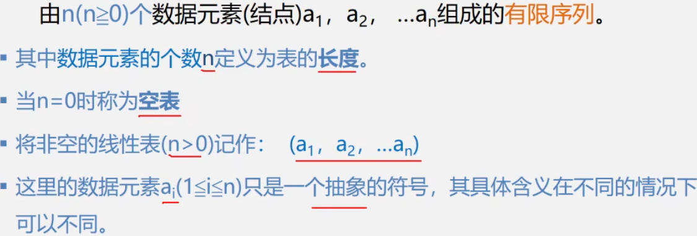

# 第1章 绪论

## 1.1 数据相关概念

### 1.数据

数据(Data) 是客观事物的符号表示，是所有能输入到计算机中并被计算机程序处理的符号的总称。

- 信息的载体
- 能被计算机识别,存储, 加工
- 包括: 
  - 数值型: 整型, 浮点型等
  - 非数值型数据: 文字, 图形, 图像, 声音等.

### 2.数据元素

数据元素(Data Element) 是数据的基本单位，在计算机中通常作为一个整体进行考虑和处理。

数据元素也称为元素、记录, 节点, 顶点等。数据元素用于完整地描述一个对象，如学生表里一个学生的纪录.

### 3.数据项

数据项(Data Item) 是组成数据元素的、有独立含义的、不可分割的最小单位。

例如，学生表中的学号、姓名、性别等都是数据项。

> 所以, 数据--> 数据元素--> 数据项
>
> 学生表--> 学生元素(纪录)--> 学号, 姓名....

### 4.数据对象

数据对象(Data Object) 是性质相同的数据元素的集合，是数据的一个子集。

例如：整数数据对象是集合, 字母字符数据对象, 学生信息表也可以是一个数据对象.

### 数据元素与数据对象

数据元素 : 组成数据的基本单位. 与数据的关系: 是集合的个体.

数据对象: 性质相同的数据元素的集合.  与数据的关系: 是集合的子集.

## 1.2.2数据结构

数据结构(Data Structure) 是相互之间存在一种或多种特定关系的数据元素的集合。

换句话说， 数据结构是带"结构"的数据元素的集合， “结构” 就是指数据元素之间存在的关系。

数据结构包括三方面:

- 数据元素之间的逻辑关系, 即逻辑结构.
- 数据元素及其关系在计算机内的表示, 称为数据的物理结构, 或者 存储结构.
- 数据的运算和实现. 即对数据元素可以进行的操作和这些操作在相应的存储结构上的实现.

### 逻辑结构

- 描述数据元素之间的逻辑关系
- 与数据怎么存储无关, 独立于计算机
- 是抽象的数学模型

### 物理结构(存储结构)

- 数据元素及其关系在计算机内存储器中的存储方式
- 是数据结构在计算机内的表示

存储结构是逻辑关系的映像, 与元素本身的映像.

逻辑结构是数据结构的抽象, 存储结构是数据结构的实现.

### 逻辑结构的种类

> 划分方法一

- 线性结构

  就是一维的, 一条线. 有且只有一个开始和一个终端节点, 所有节点都最多只有一个前趋和一个后继.

  > 比如 线性表, 栈, 队列, 串等

- 非线性结构

  一个节点, 可能有多个直接前趋和直接后继. 如, 树, 图

> 划分方法二  四种基本逻辑结构

- 集合结构 : 结构中的数据元素除了同属一个集合的关系之外, 没有别的关系了.
- 线性结构 : 数据元素直接存在一对一的线性关系.
- 树形结构 : 数据元素之间存在1对多的层次关系
- 图或网状结构: 结构中的数据元素存在多对多的任意关系.

### 存储结构的种类

- 顺序存储结构 : 用一组连续的存储单元, 依次存储数据元素, 数据元素之间的逻辑关系由元素的存储位置来表示.

  代表: 数组

- 链式存储结构 : 用一组位置任意的存储单元存储数据元素, 数据元素之间的逻辑关系用指针表示.

  代表: 各种链表 , 

- 索引存储结构 : 在存储节点信息的同时, 还建立索引表

  索引表中每一项为索引项,  索引项的一般形式是: (关键字, 地址),  关键字是能唯一标识一个节点的那些数据项

- 散列存储结构

  根据节点的关键字直接计算出该节点的存储地址, 比如关键字的值进行模运算得到地址, 就把值存到那个地址.

### 1.2.3 数据类型和ADT

C语言中有很多基本数据类型, 和构造类型.

ADT: 指一个数学模型以及定义在此数学模型上的一组操作.

> 用用户定义, 从问题抽象出的数据模型(逻辑结构)
>
> 定义在数据模型上的一组抽象运算.(操作)

ADT的形式定义:

`(D, S, P) `三元组表示:

其中: D是数据对象, S是D上的关系集, P是对D的基本操作集.

定义格式:

```c
ADT 抽象数据类型名
{
	数据对象:<数据对象的定义>
	数据关系:<数据关系的定义>
	基本操作:<基本操作的定义>
} ADT 抽象数据类型名
```

- 数据对象, 数据关系的定义用伪代码描述

- 基本操作的定义格式:

  基本操作名(参数表)

  初始条件: <初始条件描述>

  操作结果: <操作结果描述>

- 参数表:

  赋值参数, 为操作提供输入值

  引用参数, 以&打头, 除可提供输入值外, 还将返回操作结果.

- 初始条件

  ”初始条件” 描述了操作执行之前数据结构和参数应满足的条件，若初始条件为空，则省略。

- 操作结果

  ”操作结果” 说明了操作正常完成之后，数据结构的变化状况和应返回的结果。

举例:

```
ADT Circle{
	数据对象: D={r,x,y|r,x,y均为实数}
	数据关系: R={<r,x,y>|r是半径,<x,y>是圆心坐标}
	基本操作: 
		Circle(&C, r,x,y) 
		操作结果: 构造一个圆
		double Area(C)
		初始条件: 圆已存在
		操作结果: 计算面积
		double Circumference(C)
		初始条件: 圆已存在
		操作结果: 计算周常
} ADT Circle
```

## 1.3 抽象数据类型的表示与实现

运用抽象数据类型描述数据结构，有助于在设计一个软件系统时，不必首先考虑其中包含的数据对象，以及操作在不同处理器中的表示和实现细节，而是在构成软件系统的每个相对独立的模块上定义一组数据和相应的操作，把这些数据的表示和操作细节留在模块内部解决，在更高的层次上进行软件的分析和设计，从而提高软件的整体性能和利用率。

抽象数据类型的概念与面向对象方法的思想是一致的。抽象数据类型独立于具体实现，将数据和操作封装在一起，使得用户程序只能通过抽象数据类型定义的某些操作来访问其中的数据，从而实现了信息隐藏。

抽象数据类型和类的概念实际上反映了程序或软件设计的两层抽象：抽象数据类型相当千在概念层（或称为抽象层） 上描述问题，而类相当于在实现层上描述问题。

最终表示和实现抽象数据类型，**最好用面向对象的方法.**

下面以复数为例， 给出一个完整的抽象数据类型的定义、表示和实现。看课本.

## 1.4 算法和算法分析

算法就是对特定问题求解方法和步骤的一种描述, 它是指令的有限序列. 其中每个指令表示一个或多个操作.

每个指令表示一个或多个操作.

- 算法描述
  - 自然语言
  - 流程图 NS流程图
  - 伪代码

- 算法特性

  一个算法必须满足以下五个重要特性:

  (1)  有穷性。一个算法必须总是在执行有穷步后结束，且每一步都必须在有穷时间内完成。

  (2)  确定性。对每种情况下所应执行的操作，在算法中都有确切的规定，不会产生二义性，使算法的执行者或阅读者都能明确其含义及如何执行。

  (3)  可行性。算法中的所有操作都可以通过已经实现的基本操作运算执行有限次来实现。

  (4)  输入。一个算法有零个或多个输入。当用函数描述算法时，输入往往是通过形参表示的，在它们被调用时，从主调函数获得输入值。

  (5)  输出。一个算法有一个或多个输出，它们是算法进行信息加工后得到的结果，无输出的算法没有任何意义。当用函数描述算法时，输出多用返回值或引用类型的形参表示。

- 算法设计要求

  评价算法优劣的基本标准.

  (1) 正确性。在合理的数据输入下，能够在有限的运行时间内得到正确的结果。

  (2) 可读性。一个好的算法，首先应便于人们理解和相互交流， 其次才是机器可执行性。可读性强的算法有助于人们对算法的理解，而难懂的算法易千隐藏错误，且难千调试和修改。

  (3) 健壮性。当输入的数据非法时，好的算法能适当地做出正确反应或进行相应处理，而不会产生一些莫名其妙的输出结果。

  (4) 高效性。高效性包括**时间和空间**两个方面。时间高效是指算法设计合理，执行效率高，可以用时间复杂度来度量；空间高效是指算法占用存储容量合理，可以用空间复杂度来度量。时间复杂度和空间复杂度是衡量算法的两个主要指标。

> 好的算法自然要先具备正确性, 健壮性, 可读性.  这个先满足的条件下, 主要考虑算法的效率, 效率高低评判算法优劣.

时间与空间, 有时候是矛盾的, 要结合具体情况, 选择时间换空间, 还是空间换时间.

- 算法时间效率的度量

  用算法写的程序, 在计算机上运行所消耗的时间来衡量.

- 衡蜇算法效率的两类方法

  - 事后统计

    事后统计法需要先将算法实现，然后测算其时间和空间开销。

    这种方法的缺陷很显然，一是必须把算法转换成可执行的程序，二是时空开销的测算结果依赖于计算机的软硬件等环境因素，这容易掩盖算法本身的优劣。

  - 事前分析估算

    通常采用事前分析估算法，通过计算算法的渐近复杂度来衡量算法的效率。

- 事前分析估算法

  一个算法的执行时间大致上等千其所有语句执行时间的总和， 而语句的执行时间则为该条语句的重复执行次数和执行一次所需时间的乘积。

- 问题规模和语句频度

  不考虑计算机的软硬件等环境因素，**影响算法时间代价的最主要因素是问题规模**. 问题规模是算法求解问题输入量的多少，是问题大小的本质表示，一般用整数n表示。问题规模n对不同的问题含义不同.

  一条语句的重复执行次数称作语句频度(FrequencyCount)。

  语句的执行要由源程序经编译程序翻译成目标代码， 目标代码经装配再执行， 因此语句执行一次实际所需的具体时间是与机器的软、硬件环境（如机器速度、编译出的程序质量等）密切相关的。所以， 所谓的算法分析并非精确统计算法实际执行所需时间， 而是针对算法中语句的执行次数做出估计， 从中得到算法执行时间的信息。

  假设每条语句执行一次所需的时间均是单位时间， 则一个算法的执行时间可用该算法中所有语句频度之和来度量。

- 算法的时间复杂度定义

  为了客观地反映一个算法的执行时间, 可以只用算法中的“基本语句" 的**执行次数**来度量算法的工作量。

  所谓“基本语句” 指的是**算法中重复执行次数和算法的执行时间成正比的语句 ,它对算法运行时间的贡献最大**。通常, 算法的执行时间是随问题规模增长而增长的, 因此对算法的评价通常只需考虑其随问题规模增长的趋势。

  这种情况下, 我们只需要考虑当问题规模充分大时, 算法中基本语句的执行次数在渐近意义下的阶。

  一般情况下， 算法中基本语句重复执行的次数是问题规模n的某个函数f(n), 算法的时间量度记作

  `T(n)= O(f(n))`

  它表示随问题规模n的增大, 算法执行时间的增长率和`f(n)`的增长率相同， 称做算法的渐近时间复杂度， 简称时间复杂度(TimeComplexity)。我们用"O"来表示数量级.

  

  所以, 一般情况下, 不用计算所有操作的执行次数, 而是考虑算法中的基本操作执行的次数, 它是问题规模n的某个函数.用T(n)表示.

- 分析算法时间复杂度的基本方法

  

  1. 找出语句频度最大的那条语句作为基本语句
  2. 计算基本语句的频度得到问题规模n的某个函数f(n)
  3. 取其数量级用符号"O"表示

  

  注意: 有些情况下, 算法中的基本操作重复执行的次数还随问题的输入数据集不同而不同.

  ```c
  for(int i = 0; i < n; i++)
  {
      if( e == a[i] ) return i+1;
  }
  return 0;
  ```

  最好情况 : 1    最坏情况 : n 所以平均时间复杂度O(n)

- 算法时间复杂度

  - 最坏时间复杂度: 最坏情况下, 算法的时间复杂度

  - 平均时间复杂度: 指在所有可能输入实例在等概率出现的情况下, 算法的期望运行时间.

  - 最好时间复杂度: 指最好情况下, 算法的时间复杂度.

  一般总是考虑在最坏情况下的时间复杂度，以保证算法的运行时间不会比它更长。

  对于复杂的算法， 可以将它分成几个容易估算的部分， 然后利用“O”加法法则和乘法法则， 计算算法的时间复杂度：	

  a）加法法则

  `T(n) = T1(n) + T2(n) = O(f(n))+ O(g(n)) = O( max( f(n), g(n) ) )`

  b) 乘法法则

  `T(n) = T1(n) x T2(n) = O(f(n)) x O(g(n)) = O( f(n) x g(n) )`

  

- 渐进空间复杂度 

  算法所需要的存储空间的度量, 记作:

  ​          `  S(n) = O(f(n))`    n为问题的规模(或大小)

  算法要占用的空间

  - 算法本身要占用的空间, 输入/输出, 指令, 常熟, 变量等
  - 算法要使用的辅助空间

  ```c
  //【算法1】
  for(i=O;i<n/2;i++)
  {
      t=a[i];
  	a[i]=a[n-i-1];
  	a[n-i一l]=t;
  }
  // 【算法2】
  for (i=O; i<n; i++)	
  	b[i]=a[n-i-1];
  for (i=O; i<n; i++)
  	a [i] =b [i];
  ```

  算法1仅需要另外借助一个变量 t与问题规模n大小无关，所以其空间复杂度为O(1)。
  算法2需要另外借助一个大小为n的辅助数组b, 所以其空间复杂度为O(n)。

## 1.5 小结


(1) 数据结构是一门研究非数值计算程序设计中操作对象,  以及这些对象之间的关系和操作的学科。

(2) 数据结构包括两个方面的内容：数据的逻辑结构和存储结构。同一逻辑结构采用不同的存储方法， 可以得到不同的存储结构。

a. 逻辑结构是从具体问题抽象出来的数学模型，从逻辑关系上描述数据，它与数据的存储无关。根据数据元素之间关系的不同特性， 通常有四类基本逻辑结构：集合结构、线性结构、树形结构和图状结构。

b. 存储结构是逻辑结构在计算机中的存储表示，有两类存储结构：顺序存储结构和链式存储结构。

(3) 抽象数据类型是指由用户定义的、表示应用问题的数学模型， 以及定义在这个模型上的一组操作的总称， 具体包括三部分：数据对象、数据对象上关系的集合， 以及对数据对象的基本操作的集合。

(4) 算法是为了解决某类问题而规定的一个有限长的操作序列。算法具有五个特性：有穷性、确定性、可行性、输入和输出。一个算法的优劣应该从以下四方面来评价：正确性、可读性、健壮性和高效性。

(5) 算法分析的两个主要方面是分析算法的时间复杂度和空间复杂度， 以考察算法的时间和空间效率。一般情况下， 鉴于运算空间较为充足， 故将算法的时间复杂度作为分析的重点。算法执行时间的数量级称为算法的渐近时间复杂度，T(n) = O(f(n) ), 它表示随着问题规模n的增大，算法执行时间的增长率和f(n)的增长率相同， 简称时间复杂度。


# 第2章 线性表

## 2.1 线性表的定义和特点

线性表是**具有相同特性的数据元素**的一个有限序列.

{ a1, a2, a3, ... , a(i-1), ai, a(a+1), ... , an }

a1: 线性起点, 起始节点

an: 线性终点, 终端节点

下标, 是元素的序号, 表示元素在表中的位置.

n=0时, 为空表. n为元素总个数, 即表长



同一线性表中的元素必定具有相同的特性， 即属千同一数据对象， 相邻数据元素之间存在着序偶关系。

对非空的线性表或线性结构， 其特点是：
(1) 存在唯一的一个被称作“第一个" 的数据元素；
(2) 存在唯一的一个被称作“最后一个"的数据元素；
(3) 除第一个之外， 结构中的每个数据元素均只有一个前驱；
(4) 除最后一个之外，结构中的每个数据元素均只有一个后继。


## 2.2 案例


- 稀疏多项式


- 稀疏多项式的运算:


- 顺序存储结构存在问题:

  存储空间的分配不灵活

  运算的空间复杂度高

  我们选择用链式存储. 链表, 上.


相同项系数相加, 结果放A链表里. A中没有的项, 插入进来.


- 不同的问题所涉元素的数据类型不尽相同，可以为简单数据类型，也可以为复杂数据类型.
- 这些问题所涉的基本操作都具有很大的相似性， 如果为每个具体应用都编一个程序显然不是一种很好的方法。
- 解决这类问题的最好方法就是从具体应用中抽象出共性的`逻辑结构和基本操作`（即抽象数据类型），然后采用程序设计语言实现相应的`存储结构和基本操作`。

