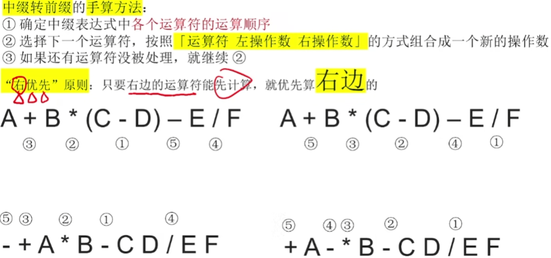
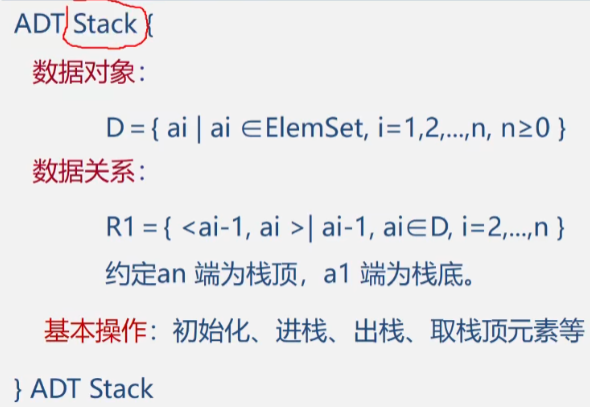
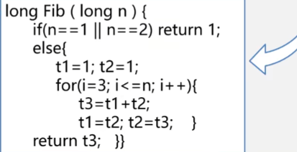

# 第3章 栈和队列

> 栈和队列是两种重要的线性结构. 从数据结构角度看, 栈和队列也是线性表,  其特殊性在于栈和队列的基本操作是线性表操作的子集, 它们是操作受限的线性表, 因此, 可称为限定性的数据结构。但从数据类型角度看，它们是和线性表不相同的两类重要的抽象数据类型。

## 3.1 栈和队列的定义和特点

栈和队列是限定插入和删除只能在表的"端点"进行的线性表.

栈特点: 后进的先出, 先进的后出.

栈应用: 数制转换, 括号匹配的检验, 行编辑程序, 迷宫求解, 表达式求值, 八皇后问题, 函数调用, 递归调用的实现.

队列的特点: 进队只能从队尾, 出队只能从队头. 先进先出.

队列应用: 脱机打印, 多用户排队使用CPU和主存, 按用户优先级每个优先级一个队列, 实时控制系统中信号接收的先后顺序处理, 网络电文传输, 按到达时间先后顺序依次进行.

### 3.1.1 栈的定义和特点

栈(stack) 是限定仅在表尾(栈顶)进行插入或删除操作的线性表. Last in First out,  LIFO.

因此, 对栈来说, 表尾端有其特殊含义, 称为栈顶(top), 相应地, 表头端称为栈底(bottom)。不含元素的空表称为空栈。


插入元素到栈顶的操作, 称为压栈或入栈. PUSH

从栈顶删除最后一个元素的操作, 称为出栈或弹栈. POP

- 栈的相关概念

  定义: 只能在栈顶进行插入和删除操作的线性表

  逻辑结构: 线性表一样, 一对一.

  存储架构: 顺序或链式, 但顺序更多用. 因为总长度一般不会变的.

  运算规则: 只能在栈顶操作, LIFO.

  实现方式: 编写入栈出栈函数.


### 3.1.2 队列的定义和特点

队列(queue)是一种先进先出(First In First Out, FIFO)的线性表. 

它只允许在表的一端进行插入, 而在另一端删除元素.

在队列中，允许插入的一端称为队尾(rear), 允许删除的一端则称为队头(front)。


队列在程序设计中也经常出现。一个最典型的例子就是操作系统中的作业排队。在允许多道程序运行的计算机系统中，同时有几个作业运行。如果运行的结果都需要通过通道输出，那就要按请求输入的先后次序排队。每当通道传输完毕可以接受新的输出任务时， 队头的作业先从队列中退出做输出操作。凡是申请输出的作业都从队尾进入队列。

- 队列的相关概念

  定义: 只允许在表的一端进行插入, 而在另一端删除元素的线性表

  逻辑结构: 线性表一样, 一对一.

  存储架构: 顺序或链式, 但循环顺序更多用.

  运算规则: FIFO

  实现方式: 编写入队 出队函数.

## 3.2 案例引入

- **案例3.1: 数制的转换**


​	模运算, 得到余数一次入栈, 然后出栈就行了.

- **案例3.2: 括号匹配的检验**


​	左括号入栈, 遇到右括号就跟栈顶的左括号匹配. 第一个入栈的左括号肯定是最深的, 需要最后去匹配的.

​	比如写代码的时候, 函数体括号{}肯定是在最深的地方. 里面还有各种代码块的括号.


​	算法:

​	

```c
int bracketCheck(char str[], int len)
{
    SqStack S;
    InitStack(&S); //初始化栈
    for (int i = 0; i < len; i++)
    {
        if( '(' == str[i] || '[' == str[i] || '{' == str[i])
            Push(&S,str[i]);  //入栈
        else
        {
            if(StackEmpty(S)) return -1; //栈已经空了
            
            char topElem;
            Pop(&S, &topElem);  //栈顶元素出栈
            if( ')'== str[i] && topElem != '(') //匹配
                return -1;
             if( ']'== str[i] && topElem != '[')
                return -1;
            if( '}'== str[i] && topElem != '{')
                return -1;
        }
    }
    return StackEmpty(S); //栈是否为空
}
```

- **案例3.3: 表达式求值** 

  这部分<**数据结构与算法分析(C语言描述)**> 有讲.

  表达式求值是程序设计语言编译中的一个最基本间题， 其实现是栈应用的又一个典型例子。

  "算符优先法"， 是一种简单直观、广为使用的表达式求值算法。

  要把一个表达式翻译成正确求值的一个机器指令序列， 或者直接对表达式求值， 首先要能够正确解释表达式。算符优先法就是根据算术四则运算规则确定的运算优先关系， 实现对表达式的编译或解释执行的。

  在表达式计算中先出现的运算符不一定先运算，具体运算顺序是需要通过运算符优先关系的比较，确定合适的运算时机，而运算时机的确定是可以借助栈来完成的。将扫描到的不能进行运算的运算数和运算符先分别压入运算数栈和运算符栈中， 在条件满足时再分别从栈中弹出进行运算。

  

  

  

  **有时候运算的顺序并不唯一, 且不影响结果**. 但计算机来算, 只有一种.

  

  **左优先原则**:

  

  比如:

  正常是先算乘法, 再算除法. 但实际上, 先算A+B并不会影响最后的结果, 但是可以让计算机更好的操作.

  

  

  **中缀转前缀**, 要用**右优先**的原则:

  

  计算过程:

  

  

  上面的中缀表达式转前缀, 后缀表达式都是手算的, 那如何用程序来自动转换呢?

  **机算 中缀转后缀:**

  

  遇到括号的处理:

  

  **中缀表达式的计算(栈来实现):**

  实质上就是上面内容, **机算中缀表达式转后缀表达式**, 跟**机算后缀表达式**, 两部分的合体.

  

  

- 案例3.4: 舞伴问题

  

## 3.3 栈的表示和操作的实现

### 3.3.1 栈的类型定义

栈的基本操作除了入栈和出栈外， 还有栈的初始化、栈空的判定， 以及取栈顶元素等. 先看定义:



>  n为0, 就是空栈.

- 基本操作：
  InitStack(&S)
  操作结果：构造一个空栈S。
  DestroyStack(&S)
  初始条件：栈S已存在。
  操作结果：栈S被销毁。
  ClearStack(&S)
  初始条件：栈S已存在。
  操作结果：将S清为空栈。
  StackEmpt y(S)
  初始条件：栈S已存在。
  操作结果：若栈S为空栈， 则返回true, 否则返回false。
  StackLength (S)
  初始条件：栈S已存在。
  操作结果：返回s的元素个数， 即栈的长度。
  GetTop(S)
  初始条件：栈S已存在且非空。
  操作结果：返回S的栈顶元素， 不修改栈顶指针。
  Push(&S,e)
  初始条件：栈S已存在。
  操作结果：插入元素e为新的栈顶元素。
  Pop(&S,&e)
  初始条件：栈s已存在且非空。
  操作结果：删除S的栈顶元素，并用e返回其值。
  StackTraverse(S)
  初始条件：栈S已存在且非空。
  操作结果：从栈底到栈顶依次对S的每个数据元素进行访问。

### 3.3.2 顺序栈的表示和实现

顺序栈是指利用顺序存储结构实现的栈，即利用一组地址连续的存储单元依次存放自栈底到栈顶的数据元素.栈底一般是在低地址.

附设指针top指示`栈顶`元素在顺序栈中的位置, 另设指针base 指示`栈底`元素在顺序栈中的位置.

当top 和base 的值相等时, 表示空栈. top-base  == stacksize的时候 表示栈满


使用数组作为顺序栈存储的特点:

简单, 方便, 但容易产生溢出.

- 上溢 overflow: 栈已经满了, 又要压入元素
- 下溢 underflow: 栈已经空了, 还要出栈.

> 上溢是一种错误, 使问题的处理无法进行. 而下溢一般认为是一种结束条件, 即问题处理结束.

- 数据类型定义:

```c
typedef struct {
    ....
}SElemType;

#define MAXSIZE 100
typedef struct { // 动态分配的顺序栈
    SElemType *base;  //栈底指针 malloc时记录地址到base 
    SElemType *top;   //栈顶指针
    int stacksize;   //栈的最大size
}SqStack;

typedef struct { //静态分配的顺序栈
    SElemType data[MAXSIZE]; //静态数组
    int top;  //栈顶指针.
}SqStack;
```

base为栈底指针, 初始化完成后, 栈底指针base始终指向栈底的位置, 若base 的值为NULL, 则表明栈结构不存在. top为栈顶指针, 其初值指向栈底. 每当插入新的栈顶元素时, 指针top增1; 删除栈顶元素时, 指针top减1. 因此, 栈空时, top 和base 的值相等, 都指向栈底; 栈非空时, top 始终指向栈顶元素的上一个位置.


- 算法3.1 顺序栈的初始化

  顺序栈的初始化操作就是为顺序栈动态分配一个预定义大小的数组空间。

  [算法步骤]

  - 为顺序栈动态分配一个最大容最为MAXSIZE 的数组空间, 使base 指向这段空间的基地址, 即栈底。
  - 栈顶指针top 初始为base, 表示栈为空。
  - stacksize 置为栈的最大容鼠MAXSIZE.

  ```c
  int InitStack(SqStack *S) //传进来变量的地址. 
  {//构造一个空栈S
      S->base = malloc(MAXSIZE*sizeof(SElemType));
      if(!S->base) exit(OVERFLOW);
      S->top = S->base;
      S->stacksize = MAXSIZE;
      return 0;
  }
  ```

- 算法补充 顺序栈 判断是否为空

  ```c
  int StackEmpty(SqStack *p) //传进来变量的地址. 
  {
      if (p->top == p->base)  return 1;
      else  return 0;
  }
  ```

- 算法补充 求顺序栈的实际长度

  ```c
  int StackLength(SqStack *p) //传进来变量的地址. 
  {
      return p->top - p->base;
  }
  ```

- 算法补充 清空顺序栈

  ```c
  void StackCLear(SqStack *p)//传进来变量的地址.
  {
      if(p->base) p->top = p->base;
  }
  ```

- 算法补充 销毁顺序栈

  ```c
  int DestroyStack(SqStack *p)
  {
      if(p->base)
      {
          free(p->base);
          p->stacksize = 0;
          p->base = p->top = NULL;
          return 0;
      }
      return -1;
  }
  ```

- 算法3.2 顺序栈的入栈

  入栈操作是指在栈顶插入一个新的元素。

  算法步骤:

  - 判断栈是否满， 若满则返回ERROR。
  - 将新元素压入栈顶， 栈顶指针加1。

  ```c
  int Push (SqStack *s, SElemType e)
  {
      if( (s->top - s->base) == s->stacksize) return -1;
      *s->top++ = e;
      return 0;
  }
  ```

- 算法3.3 顺序栈的出栈

  算法步骤: 

  - 判断栈是否空， 若空则返回ERROR。
  - 栈顶指针减1, 栈顶元素出栈。

  ```c
  int Pop(SqStack *S,SElemType *e)
  {
      if(S->top == S->base) return ERROR;
      *e = *(--S->top);
  }
  ```

由于顺序栈和顺序表一样， 受到最大空间容量的限制， 虽然可以在“满员” 时重新分配空间扩大容量， 但工作量较大， 应该尽量避免。因此在应用程序无法预先估计栈可能达到的最大容量时， 还是应该使用下面介绍的链栈。

### 3.3.3 链栈的表示和实现

链栈是指采用链式存储结构实现的栈。通常链栈用单链表来表示.

```c
typedef struct {
	 ....
 }ElemType;
//－－－－－ 链栈的存储结构－－－－－
typedef struct StackNode {
	ElemType data;
	struct StackNode *next;
} StackNode, * LinkStack;
```


由于栈的主要操作是在栈顶插入和删除， 显然以链表的头部作为栈顶是最方便的， 而且没必要像单链表那样为了操作方便附加一个头结点。

这里链表头指针就是栈顶了. 不存在栈满的情况. 空栈就是头指针指向空.

由于栈的主要操作是在栈顶插入和删除, 显然以链表的头部作为栈顶是最方便的, 而且没必要像单链表那样为了操作方便附加一个头结点。

- 算法3.5 链栈的初始化

  链栈的初始化操作就是构造一个空栈, 因为没必要设头结点, 所以直接将栈顶指针置空即可.

  ```c
  LinkStack headPtr = NULL; //声明个头指针.
  int InitStack(LinkStack *S) //需要该实参内的数据, 传指针的地址
  {	//构造一个空栈s, 栈顶指针置空
  	*S = NULL; //实参 头指针指向NULL
  	return 0;
  }
  InitStack(&headPtr); //不能直接把headPtr的值, 给形参, 不能改变headPtr的值.
  ```

- 算法补充 判断链栈是否为空

  ```c
  int StackIsEmpty(LinkStack S) //不用改变头指针的指向, 指针值传递就行
  {
      if ( NULL == S ) return 1;
      else return 0;
  }
  ```

- 算法3.6 链栈的入栈

  - 为入栈元素e 分配空间， 用指针p 指向。

  - 将新结点数据域置为e。
  - 将新结点插入栈顶。
  - 修改栈顶指针为p。

  ```c
  int Push(LinkStack *S, SElemType e)//需要改变头指针的指向了, 值传递就不行
  {
      StackNode *p = malloc(sizeof(StackNode));
      if (!p) return -1;
      p->data = e;
      p->next = *S;
      *S = p;
      return 0;
  }
  ```

- 算法3.7 链栈的出栈

  - 判断栈是否为空， 若空则返回ERROR。
  - 将栈顶元素赋给e。
  - 临时保存栈顶元素的空间， 以备释放。
  - 修改栈顶指针， 指向新的栈顶元素
  - 释放原栈顶元素的空间。

  ```c
  int Pop(LinkStack *S, SElemType *e)
  {
      if( NULL == *S ) return -1;
      *e = (*S)->data;
      StackNode *p = *S;
      *S = (*S)->next;
      free(p);
      return 0;
  }
  ```

- 算法3.8 取出栈顶元素

  与顺序栈一样， 当栈非空时， 此操作返回当前栈顶元素的值， 栈顶指针S保持不变.

  ```c
  SElemType GetTop(LinkStack S)
  {
      if ( S )
          return S->data;       
  }
  ```

## 3.4 栈与递归

- **递归的定义:**

  所谓递归是指，**若在一个函数、过程或者数据结构定义的内部又直接（或间接）出现定义本身的应用**， 则称它们是递归的， 或者是递归定义的.

  适用于: 可以把原始问题转为属性相同, 但规模更小的问题.

  

- 常用递归的情况:

  - **递归定义的**数学函数

    比如阶乘函数, 2阶斐波那契数列.

    

    > 上图所示为主程序调用函数Fact (4)的执行过程。在函数过程体中，else 语句以参数3 、2 、1 、0 执行递归调用。最后一次递归调用的函数因参数n为0执行if 语句, 递归终止, 逐步返回, 返回时依次计算`1*1 、2*1 、3*2 、4*6,` 最后将计算结果24 返回给主程序。

    ```c
    long Fib(long n)
    {
    	if(n==1 || n==2) return 1; //递归终止的条件
    	else return Fib(n-1)+ Fib(n-2); //递归步骤
    }
    ```

  - 具有递归特性的数据结构

    比如二叉树

  - 可递归求解的问题

    迷宫问题.

- 递归问题 -- 分治法求解

  分治法: 对于一个较为复杂的问题, 能够分解成几个相对简单的且解法相同或类似的子问题来求解. 

  采取“分治法” 进行递归求解的问题需要满足以下三个条件:

  (1)  能将一个问题转变成一个新问题,  而新问题与原问题的解法相同或类同, 不同的仅是处理的对象, 并且这些处理对象更小且变化有规律。
  (2)  可以通过上述转化而使问题简化。
  (3)  必须有一个明确的递归出口, 或称递归的边界。	

  例如， 在下图中，计算4!时先计算3!' 然后再进一步分解进行求解，这种分解－求解的策略叫做“分治法”。

  

  "分治法"求解递归问题算法的一般形式为：

  ```c
  void p (参数表）
  {
  	if(递归结束条件成立) 可直接求解;  //递归终止条件 -- 基本项
  	else p(较小的参数);         //递归步骤  -- 归纳项
  }
  ```

  

  

- 递归的优缺点:

  - 优点: 结构清晰 程序易读
  - 缺点: 每次调用都要开辟栈帧, 保存状态信息, 入栈; 返回时还要依次出栈, 恢复状态信息. 时间开销太大.

  所以在时间效率要求较高时, 我们一般把递归调用, 转为非递归的程序, 方式有两种:

  - 一是尾递归, 单向递归转化为循环结构

    

    > 虽有一处以上的递归调用语句, 但各次递归调用语句的参数只和主调函数油管, 相互之间参数无关, 并且这些递归调用语句处于算法的最后.  这种就是单向递归.

    

    

    

   - 二是自己写栈模拟系统运行时的栈

     利用栈将递归转换为非递归的方法:

     

- 递归过程与递归工作栈

  当在一个函数的运行期间调用另一个函数时, 在运行被调用函数之前, 系统需先完成3件事:

  (1) 将所有的实参、返回地址等信息传递给被调用函数保存；
  (2) 为被调用函数的局部变量分配存储区；
  (3) 将控制转移到被调函数的入口。

  而从被调用函数返回调用函数之前， 系统也应完成3件工作：

  (1) 保存被调函数的计算结果；
  (2) 释放被调函数的数据区；
  (3) 依照被调函数保存的返回地址将控制转移到调用函数。

  当有多个函数构成嵌套调用时,  按照"`后调用先返回`"的原则, 上述函数之间的信息传递和控制转移必须通过"栈"来实现,  即系统将整个程序运行时所需的数据空间安排在一个栈中, 每当调用一个函数时, 就为它在栈顶分配一个存储区, 每当从一个函数退出, 就释放它的存储区, 则当前正运行的函数的数据区必在栈顶。

  例如, 在图3.9 (C)所示的主函数main中调用了函数first, 而在函数first中又调用了函数second, 则图3.9 (a)所示为当前正在执行函数second中某个i吾句时栈的状态，而图3.9 (b)展示从函数second 退出之后正执行函数first中某个语句时栈的状态（图中以语句标号表示返回地址）。

  > 一个递归函数的运行过程类似于多个函数的嵌套调用, 只是调用函数和被询用函数是同一个函数, 因此, 和每次调用相关的一个重要概念是递归函数运行的"层次".假设调用该递归函数的主函数为第0层, 则从主函数调用递归函数为进入第1层；从第l 层递归调用本函数为进入“下一层＂, 即第`i+1`层. 反之, 退出第i层递归应返回至"上一层", 即第`i-1`层. 为了保证递归函数正确执行, 系统需设立一个"递归工作栈"作为整个递归函数运行期间使用的数据存储区. 每一层递归所需信息构成一个工作记录, 其中包括所有的实参、所有的局部变量, 以及上一层的返回地址. 每进入一层递归，就产生一个新的工作记录压入栈顶。每退出一层递归，就从栈顶弹出一个工作记录，则当前执行层的工作记录必是递归工作栈栈顶的工作记录，称这个记录为”**活动记录**”。

<div align=center></div>

- 递归算法的效率

  - 时间复杂度的分析

    迭代法是求解递归方程的一种常用方法，其基本步骤是迭代地展开递归方程的右端，使之成为一个非递归的和式，然后通过对和式的估计来达到对方程左端（即方程的解）的估计。

    设Fact(n)的执行时间是T(n). 此递归函数中语句if(n ==0) return 1 ; 的执行时间是O(1),递归调用Fact(n-1)的执行时间是T(n-1), 所以else return n*Fact(n-1); 的执行时间是O(1)+T(n-1)。

    递归方程的解为：T(n)=O(n).
    采用这种方法计算Fibonacci 数列和Hanoi 塔问题递归算法的时间复杂度均为O(2^n)。

  - 空间复杂度的分析

    递归函数在执行时, 系统需设立一个"递归工作栈" 存储每一层递归所需的信息, 此工作栈是递归函数执行的辅助空间, 因此, 分析递归算法的空间复杂度需要分析工作栈的大小。
    对于递归算法, 空间复杂度 S(n) = O(f (n))
    其中，f(n)为"递归工作栈" 中工作记录的个数与问题规模n的函数关系。
    根据这种分析方法不难得到，前面讨论的阶乘间题、Fibonacci 数列问题、Hanoi 塔问题的递归
    算法的空间复杂度均为O(n)。

## 3.5 队列的表示和操作的实现

- review:

<div align=left></div>

<div align=left></div>


### 3.5.1 队列的抽象类型定义


怎么存放, 涉及物理存储方式, 大概就两种顺序, 和链式.

### 3.5.2 循环队列

- 顺序队列 数组存放

  ```c
  #define MAXQSIZE 100 //最大队列长度宏定义
  typedef struct {
      ...
  } QElemType;
  typedef struct { //动态
      QElemType *base; //用于指向malloc的空间
      int front; //存放队列头的下标
      int rear; //队尾
  }SqQueue;
  
  typedef struct { //静态
      QElemType data[MAXQSIZE]; //用于指向malloc的空间
      int front; //存放队列头的下标
      int rear; //队尾
      //int size; 如果不想浪费那一个空间, 就添加这个变量存放队列的长度 这是方案二
      //int tag; 0是表示最后一次是删除操作, 1为插入操作. front == rear && tag==0 队空 
      //这是方案三                                //front == rear && tag == 1队满
  }SqQueue;
  ```

  为了在C 语言中描述方便起见，在此约定：初始化创建空队列时，令front = rear = 0 , 每当插入新的队列尾元素时，尾指针rear增1; 每当删除队列头元素时， 头指针front增1。因此，在非空队列中，头指针始终指向队列头元素，而尾指针始终指向队列尾元素的下一个位置，如下图所示。

  

  > 入队, 头不动尾动, 出队, 尾不动头动.

- 真溢出与假溢出

  

  - 解决方法:

  

  - 循环队列:

  下标n对MAXQSIZE的取模, n%MAXQSIZE, 就好像一个表盘一样, 钟表的一圈是12, 这个一圈是MAXQSIZE.

  这样base[0]就接在base[MAXQSIZE-1] 之后了.

  - 插入元素: 

    Q.base[Q.rear] = x;  Q.rear=(Q.rear+1)%MAXQSIZE;

  - 删除元素:

    x = Q.base[Q.front];   Q.front = (Q.front+1)%MAXQSIZE;

  

- 循环队列判空与判满

  上面我们可以知道, 循环队列的队空与队满都是front==rear, 故循环队列不能以头、尾指针的值是否相同来判别队列空间是“满” 还是“空”。

  有以下两种处理方法: 

  - **少用一个元素空间**

    即队列空间大小为m时，有m-1个元素就认为是队满。这样判断队空的条件不变， 即当头、尾指针的值相同时， 则认为队空；而当尾指针在循环意义上加1后是等于头指针， 则认为队满。因此， 在循环队列中队空和队满的条件是：
    **队空的条件**： `Q.front == Q.rear`
    **队满的条件**： `(Q.rear+ 1)%MAXQSIZE == Q.front`

  - 另设一个标志位以区别队列是“空” 还是“满＂ 

  > 主要用第一种, 少用一个空间. 让front跟rear别指到一起就完了


- 算法3.11 循环队列的初始化

  ```c
  int InitQueue (SqQueue *Q) //实参变量的地址传进来, 不然没用.
  {
      Q->base = malloc(MAXQSIZE*sizeof(QElemType)); //申请空间.
      if(!Q->base) return -1; //判成功
      Q->front = Q->rear = 0; //初始化为空.
      return 0;
  }
  ```

- 算法3.12 求循环队列的长度

  对于非循环队列，尾指针和头指针的差值便是队列长度，而对于循环队列，差值可能为负数，所以需要将差值加上MAXQSIZE, 然后与MAXQSIZE求余。

  ```c
  int QueueLength(SqQueue const *Q)
  {
      return ((Q->rear - Q->front + MAXQSIZE) % MAXQSIZE);
  }
  ```

- 算法3.13 循环队列的入队

  - 判断队列是否满， 若满则返回ERROR。
  - 将新元素插入队尾。
  - 队尾指针加1。

  ```c
  int EnQueue(SqQueue *Q, QElemType e)
  {
      if((Q->rear+1)%MAXQSIZE == Q->front) return -1; //队满
      Q->base[Q->rear] = e;         //新元素入队尾
      Q->rear = (Q->rear+1)%MAXQSIZE; //队尾往后挪一个
      return 0;
  }
  ```

- 算法3.14 循环队列的出队

  - 判断队列是否为空， 若空则返回ERROR。
  - 保存队头元素。
  - 队头指针加1。

  ```c
  int DeQueue(SqQueue *Q, QElemType *e)
  {   //删除Q的队头元素, 用e返回其值
      if(Q->rear == Q->front) return -1;
      *e = Q->base[Q->front];
      Q->front = (Q->front+1)%MAXQSIZE;
      return 0;
  }
  ```

- 算法3.15 取循环队列的队头元素

  ```c
  SElemType GetHead(SqQueue *Q)
  {
      if(Q->rear != Q->front)
          return Q->base[Q->front];
  }
  ```

如果用户的应用程序中设有循环队列，则必须为它设定一个最大队列长度；若用户无法预估所用队列的最大长度， 则宜采用链队。

### 3.5.3 链队 -- 队列的链式表示和实现

链队是指采用链式存储结构实现的队列。通常链队用单链表来表示,  一个链队显然需要两个分别指示队头和队尾的指针（分别称为头指针和尾指针）才能唯一确定。这里和线性表的单链表一样， 为了操作方便起见，给链队添加一个头结点， 并令头指针始终指向头结点。 不定长的队列就可以用链式.


```c
//－ － － － － 队列的链式存储结构－ － － － －
#define MAXQSIZE 100
typedef struct Qnode
{
    QElemType data;
    struct Qnode *next;
} QNode, * QueuePtr;
typedef struct
{
    QueuePtr front;//指针
    QueuePtr rear;
}LinkQueue;
```

链式队列空队就是 队首队尾指针指同一个.

入队就是尾插法. 出队就是删除首元节点.


- 算法3.16 链队的初始化

  链队的初始化操作就是构造一个只有一个头结点的空队.

  - 生成新结点作为头结点， 队头和队尾指针指向此结点。
  - 头结点的指针域置空。

  ```c
  int InitQueue (LinkQueue *Q)
  {
      Q->front = Q->rear = (QNode *)malloc(sizeof(QNode));
      Q->front->next = NULL;
  }
  ```

- 算法补充 销毁链队列

  从头结点依次释放

  ```c
  int DestroyQueue(LinkQueue *Q)
  {
      while(Q->front)
      {
          Q->rear = Q->front->next;
          free(Q->front);
          Q->front = Q->rear;
      }
      return 0;
  }
  ```

- 算法3.17 链队的入队

  为入队元素分配结点空间，用指针p指向。
  将新结点数据域置为e。
  将新结点插入到队尾。
  修改队尾指针为p。

  ```c
   int EnQueue(LinkQueue *Q, QElemType e)
   {
       QNode *p = (QNode *)malloc(sizeof(QNode)); //借助一个中间指针 QNode *p
       if(!p) return -1;
       p->data = e;
       p->next = NULL;
       Q->rear->next = p; //指向新的节点.
       Q->rear = p;
       return -1;
   }
  //不带头结点
   int EnQueue(LinkQueue *Q, QElemType e)
   {
       QNode *p = (QNode *)malloc(sizeof(QNode)); //借助一个中间指针 QNode *p
       if(!p) return -1;
       p->data = e;
       p->next = NULL;
       if(Q->front == NULL)
       {
           Q->front = s;
           Q->rear = s;
       }
       else
       {
           Q->rear->next = s;
           Q->rear = s;
       }
       return 1;
   }
  ```

- 算法3.18 链队的出队

  链队在出队前也需要判断队列是否为空，不同的是，链队在出队后需要释放出队头元素的所占空间.

  判断队列是否为空，若空则返回ERROR。
  临时保存队头元素的空间，以备释放。
  修改队头指针，指向下一个结点。
  判断出队元素是否为最后一个元素，若是，则将队尾指针重新赋值， 指向头结点。
  释放原队头元素的空间。

  ``` c
  int DeQueue(LinkQueue Q, QElemType *e)
  {
      if(Q->front == Q->rear) return -1;
      
      QNode *p = Q->front->next; //头结点后面的那个结点
      *e = p->data;
      Q->front->next = p->next;
      if(Q->rear == p)  Q->rear = Q->front; //最后一个的话 rear指向front
      free(p);
      return 0;
  }
  //不带头结点
  int DeQueue(LinkQueue Q, QElemType *e)
  {
      if(!Q->front) return -1; //空
      QNode *p = Q->front;
      *e = p->data;
      if(Q->rear == p)
      {
          Q->front = Q->rear = NULL;
      }
      free(p);
      return 1;
  }
  ```

- 算法3.19 取链队的队头元素。

  当队列非空时，此操作返回当前队头元素的值，队头指针保持不变。

  ```c
  QElemType GetHead(LinkQueue *Q)
  {
      if(Q->front != Q->rear)
      {
          return Q->front->next->data;
      }
  }
  ```

### 3.5.4 双端队列


## 数据结构不要学死了, 灵活掌握思想.