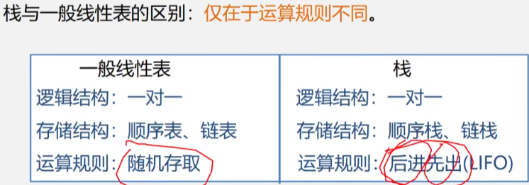

# 第3章 栈和队列

> 栈和队列是两种重要的线性结构. 从数据结构角度看, 栈和队列也是线性表,  其特殊性在于栈和队列的基本操作是线性表操作的子集, 它们是操作受限的线性表, 因此, 可称为限定性的数据结构。但从数据类型角度看，它们是和线性表不相同的两类重要的抽象数据类型。

## 3.1 栈和队列的定义和特点

栈和队列是限定插入和删除只能在表的"端点"进行的线性表.

栈特点: 后进的先出, 先进的后出.

栈应用: 数制转换, 括号匹配的检验, 行编辑程序, 迷宫求解, 表达式求值, 八皇后问题, 函数调用, 递归调用的实现.

队列的特点: 进队只能从队尾, 出队只能从队头. 先进先出.

队列应用: 脱机打印, 多用户排队使用CPU和主存, 按用户优先级每个优先级一个队列, 实时控制系统中信号接收的先后顺序处理, 网络电文传输, 按到达时间先后顺序依次进行.

### 3.1.1 栈的定义和特点

栈(stack) 是限定仅在表尾(栈顶)进行插入或删除操作的线性表. Last in First out,  LIFO.

因此, 对栈来说, 表尾端有其特殊含义, 称为栈顶(top), 相应地, 表头端称为栈底(bottom)。不含元素的空表称为空栈。


插入元素到栈顶的操作, 称为压栈或入栈. PUSH

从栈顶删除最后一个元素的操作, 称为出栈或弹栈. POP

- 栈的相关概念

  定义: 只能在栈顶进行插入和删除操作的线性表

  逻辑结构: 线性表一样, 一对一.

  存储架构: 顺序或链式, 但顺序更多用. 因为总长度一般不会变的.

  运算规则: 只能在栈顶操作, LIFO.

  实现方式: 编写入栈出栈函数.



### 3.1.2 队列的定义和特点

队列(queue)是一种先进先出(First In First Out, FIFO)的线性表. 

它只允许在表的一端进行插入, 而在另一端删除元素.

在队列中，允许插入的一端称为队尾(rear), 允许删除的一端则称为队头(front)。


队列在程序设计中也经常出现。一个最典型的例子就是操作系统中的作业排队。在允许多道程序运行的计算机系统中，同时有几个作业运行。如果运行的结果都需要通过通道输出，那就要按请求输入的先后次序排队。每当通道传输完毕可以接受新的输出任务时， 队头的作业先从队列中退出做输出操作。凡是申请输出的作业都从队尾进入队列。

- 队列的相关概念

  定义: 只允许在表的一端进行插入, 而在另一端删除元素的线性表

  逻辑结构: 线性表一样, 一对一.

  存储架构: 顺序或链式, 但循环顺序更多用.

  运算规则: FIFO

  实现方式: 编写入队 出队函数.

## 3.2 案例引入

- 案例3.1: 数制的转换


​	模运算, 得到余数一次入栈, 然后出栈就行了.

- 案例3.2: 括号匹配的检验


​	左括号入栈, 遇到右括号就跟栈顶的左括号匹配. 第一个入栈的左括号肯定是最深的, 需要最后去匹配的.

​	比如写代码的时候, 函数体括号{}肯定是在最深的地方. 里面还有各种代码块的括号.


- 案例3.3: 表达式求值

  表达式求值是程序设计语言编译中的一个最基本间题， 其实现是栈应用的又一个典型例子。

  "算符优先法"， 是一种简单直观、广为使用的表达式求值算法。

  要把一个表达式翻译成正确求值的一个机器指令序列， 或者直接对表达式求值， 首先要能够正确解释表达式。算符优先法就是根据算术四则运算规则确定的运算优先关系， 实现对表达式的编译或解释执行的。

  在表达式计算中先出现的运算符不一定先运算，具体运算顺序是需要通过运算符优先关系的比较，确定合适的运算时机，而运算时机的确定是可以借助栈来完成的。将扫描到的不能进行运算的运算数和运算符先分别压入运算数栈和运算符栈中， 在条件满足时再分别从栈中弹出进行运算。

  

- 案例3.4: 舞伴问题

  

## 3.3 栈的表示和操作的实现

### 3.3.1 栈的类型定义

栈的基本操作除了入栈和出栈外， 还有栈的初始化、栈空的判定， 以及取栈顶元素等. 先看定义:


>  n为0, 就是空栈.

- 基本操作：
  InitStack(&S)
  操作结果：构造一个空栈S。
  DestroyStack(&S)
  初始条件：栈S已存在。
  操作结果：栈S被销毁。
  ClearStack(&S)
  初始条件：栈S已存在。
  操作结果：将S清为空栈。
  StackEmpt y(S)
  初始条件：栈S已存在。
  操作结果：若栈S为空栈， 则返回true, 否则返回false。
  StackLength (S)
  初始条件：栈S已存在。
  操作结果：返回s的元素个数， 即栈的长度。
  GetTop(S)
  初始条件：栈S已存在且非空。
  操作结果：返回S的栈顶元素， 不修改栈顶指针。
  Push(&S,e)
  初始条件：栈S已存在。
  操作结果：插入元素e为新的栈顶元素。
  Pop(&S,&e)
  初始条件：栈s已存在且非空。
  操作结果：删除S的栈顶元素，并用e返回其值。
  StackTraverse(S)
  初始条件：栈S已存在且非空。
  操作结果：从栈底到栈顶依次对S的每个数据元素进行访问。

### 3.3.2 顺序栈的表示和实现

顺序栈是指利用顺序存储结构实现的栈，即利用一组地址连续的存储单元依次存放自栈底到栈顶的数据元素.栈底一般是在低地址.

附设指针top指示`栈顶`元素在顺序栈中的位置, 另设指针base 指示`栈底`元素在顺序栈中的位置.

当top 和base 的值相等时, 表示空栈. top-base  == stacksize的时候 表示栈满


使用数组作为顺序栈存储的特点:

简单, 方便, 但容易产生溢出.

- 上溢 overflow: 栈已经满了, 又要压入元素
- 下溢 underflow: 栈已经空了, 还要出栈.

> 上溢是一种错误, 使问题的处理无法进行. 而下溢一般认为是一种结束条件, 即问题处理结束.

- 数据类型定义:

```c
typedef struct {
    ....
}SElernType;

#define MAXSIZE 100
typedef struct {
    SElernType *base;  //栈底指针
    SElernType *top;   //栈顶指针
    int stacksize;   //栈的最大size
}SqStack;
```

base为栈底指针, 初始化完成后, 栈底指针base始终指向栈底的位置, 若base 的值为NULL, 则表明栈结构不存在. top为栈顶指针, 其初值指向栈底. 每当插入新的栈顶元素时, 指针top增1; 删除栈顶元素时, 指针top减1. 因此, 栈空时, top 和base 的值相等, 都指向栈底; 栈非空时, top 始终指向栈顶元素的上一个位置.


- 算法3.1 顺序栈的初始化

  顺序栈的初始化操作就是为顺序栈动态分配一个预定义大小的数组空间。

  [算法步骤]

  - 为顺序栈动态分配一个最大容最为MAXSIZE 的数组空间, 使base 指向这段空间的基地址, 即栈底。
  - 栈顶指针top 初始为base, 表示栈为空。
  - stacksize 置为栈的最大容鼠MAXSIZE.

  ```c
  int InitStack(SqStack *S) //传进来变量的地址. 
  {//构造一个空栈S
      S->base = malloc(MAXSIZE*sizeof(SElernType));
      if(! S->base) exit(OVERFLOW);
      S->top = S->base;
      S->stacksize = MAXSIZE;
      return 0;
  }
  ```

- 算法补充 顺序栈 判断是否为空

  ```c
  int StackEmpty(SqStack *p) //传进来变量的地址. 
  {
      if (p->top == p->base)  return 1;
      else  return 0;
  }
  ```

- 算法补充 求顺序栈的实际长度

  ```c
  int StackLength(SqStack *p) //传进来变量的地址. 
  {
      return p->top - p->base;
  }
  ```

- 算法补充 清空顺序栈

  ```c
  void StackCLear(SqStack *p)//传进来变量的地址.
  {
      if(p->base) p->top = p->base;
  }
  ```

- 算法补充 销毁顺序栈

  ```c
  int DestroyStack(SqStack *p)
  {
      if(p->base)
      {
          free(p->base);
          p->stacksize = 0;
          p->base = p->top = NULL;
          return 0;
      }
      return -1;
  }
  ```

- 算法3.2 顺序栈的入栈

  入栈操作是指在栈顶插入一个新的元素。

  算法步骤:

  - 判断栈是否满， 若满则返回ERROR。
  - 将新元素压入栈顶， 栈顶指针加1。

  ```c
  int Push (SqStack *s, SElemType e)
  {
      if( (s->top - s->base) == s->stacksize) return -1;
      *p->top++ = e;
      return 0;
  }
  ```

- 算法3.3 顺序栈的出栈

  算法步骤: 

  - 判断栈是否空， 若空则返回ERROR。
  - 栈顶指针减1, 栈顶元素出栈。

  ```c
  int Pop(SqStack *S,SElemType *e)
  {
      if(S->top == S->base) return ERROR;
      *e = *(--S->top);
  }
  ```

由于顺序栈和顺序表一样， 受到最大空间容量的限制， 虽然可以在“满员” 时重新分配空间扩大容量， 但工作量较大， 应该尽量避免。因此在应用程序无法预先估计栈可能达到的最大容量时， 还是应该使用下面介绍的链栈。

### 3.3.3 链栈的表示和实现

链栈是指采用链式存储结构实现的栈。通常链栈用单链表来表示.

```c
typedef struct {
	 ....
 }ElemType;
//－－－－－ 链栈的存储结构－－－－－
typedef struct StackNode {
	ElemType data;
	struct StackNode *next;
} StackNode, *LinkStack;
```


由于栈的主要操作是在栈顶插入和删除， 显然以链表的头部作为栈顶是最方便的， 而且没必要像单链表那样为了操作方便附加一个头结点。

这里链表头指针就是栈顶了. 不存在栈满的情况. 空栈就是头指针指向空.