# 第4章 串,数组和广义表

计算机上的非数值处理的对象大部分是字符串数据， 字符串一般简称为串。串是一种特殊的线性表， 其特殊性体现在数据元素是一个字符， 也就是说， 串是一种内容受限的线性表。在不同类型的应用中， 所处理的字符串具有不同的特点， 要有效地实现字符串的处理， 就必须根据具体情况使用合适的存储结构。

本章后两部分讨论的多维数组和广义表可以看成是线性表的一种扩充, 即线性表的数据元素自身又是一个数据结构.

## 4.1 串的定义

串(string)(或字符串)是由零个或多个字符组成的有限序列.

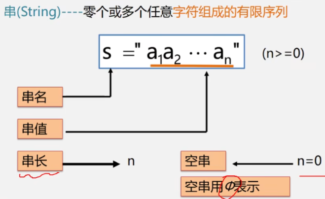

s是串的名， 用双引号括起来的字符序列是串的值；`ai(1<=i<=n)`可以是字母、数字或其他字符；串中字符的数目n称为串的长度。零个字符的串称为空串(null string) , 其长度为零。

串中`任意个连续`的`字符`组成的子序列称为该串的子串。包含子串的串相应地称为主串。通常称`字符`在序列中的序号为该字符在串中的位置。`子串在主串中的位置`则以`子串的第一个字符`在主串中的位置来表示。

`空格`常常是串的字符集合中的一个元素；因而可以出现在其他字符中间。由一个或多个空格组成的串`" "`称为空格串(blank string, 请注意：此处不是空串）， 其长度为串中空格字符的个数。 空格也是个ascii码.

比如: "abcde"的子串: "", "a", "ab", "abc", "abcd", "abcde"等. 

`真子串` 是指不包含自身的所有子串.

例如， 假设a、b、C 、d为如下的4个串：
`a= "BEI", b= "JING"`
`c= "BEIJING", d= "BEI JING"`
则它们的长度分别为3、4、7和8; 并且a和b都是c和d的子串，a在c和d中的位置都是1, 
而b在c中的位置是4, 在d中的位置则是5。

`串相等:` 当且仅当这两个串的值相等。也就是说， 只有当两个串的`长度相等`，并且各个`对应位置的字符都相等`时才相等.

## 4.2 案例引入

字符串在实际中有极为广泛的应用， 在文字编辑、信息检索、语言编译等软件系统中， 字符串均是重要的操作对象；在网络入侵检测、计算机病毒特征码匹配以及DNA 序列匹配等应用中，都需要进行串匹配， 也称`模式匹配`。

- 案例4.1: 病毒感染检测

病毒的DNA 序列都是环状的.

为了方便研究，研究者将人的DNA 和病毒DNA 均表示成由一些字母组成的字符串序列，然后检测某种病毒DNA 序列是否在患者的DNA 序列中出现过，如果出现过，则此人感染了该病毒， 否则没有感染.

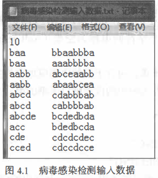

假设病毒的DNA 序列为baa, 患者1 的DNA 序列为aaabbba,则感染， 患者2 的DNA 序列为babbba, 则未感染。（注意， 人的DNA 序列是线性的， 而病毒的DNA 序列是环状的）.

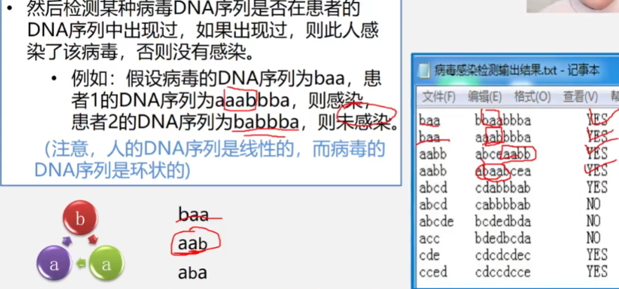

## 4.3 串的类型定义、存储结构及其运算

### 4.3.1 串的抽象类型定义

串的逻辑结构和线性表极为相似，区别仅在于串的数据对象约束为字符集。然而，串的基本操作和线性表有很大差别。在线性表的基本操作中，大多以“单个元素” 作为操作对象. 而在串的基本操作中，通常以“ 串的整体” 作为操作对象.

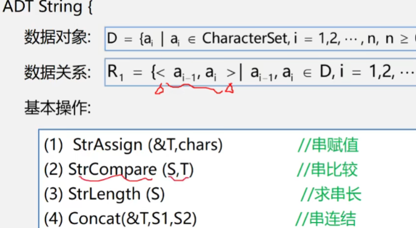

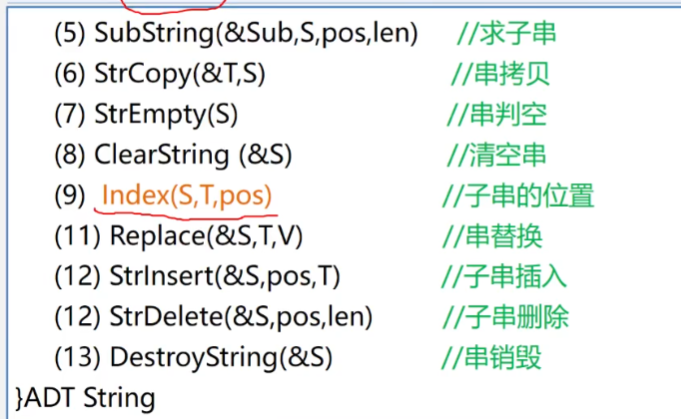

任何数据结构, 都要考虑`逻辑结构`跟`存储结构`. 串, 也有顺序串, 链串.

### 4.3.2 串的存储结构

- 串的顺序存储

  类似于线性表的顺序存储结构， 用一组地址连续的存储单元存储串值的字符序列。按照预定义的大小， 为每个定义的串变量分配一个固定长度的存储区， 则可用定长数组如下描述：

  ```c
  //－ － － － － 串的定长顺序存储结构－ － － － －
  #define MAXLEN 255   //串的最大长度
  typedef struct {
      char ch[MAXLEN];  //存储串的一维数组 
      int length;    //串的当前长度 
  }SString;
  ```

  为了便于说明问题, 本章后面算法描述当中所用到的顺序存储的字符串都是`从下标为1的数组分量开始存储`的， ``下标为0的分量闲置不用`。

  这种定义方式是静态的, 在编译时刻就确定了串空间的大小。

  而多数情况下, 串的操作是以串的整体形式参与的, 串变量之间的长度相差较大, 在操作中串值长度的变化也较大, 这样为串变量设定固定大小的空间不尽合理. 因此最好是根据实际需要, 在程序执行过程中动态地分配和释放字符数组空间。在C语言中, 存在一个称之为"堆"(Heap)的自由存储区, 可以为每个新产生的串动态分配一块实际串长所需的存储空间, 若分配成功, 则返回一个指向起始地址的指针, 作为串的基址, 同时为了以后处理方便, 约定串长也作为存储结构的一部分. 这种字符串的存储方式也称为串的堆式顺序存储结构, 定义如下：

  ```c
  //----------- 串的堆式顺序存储结构 ------------
  #define MAXLEN 255   //串的最大长度
  typedef struct {
      char *ch;  //若非空串, 则按串长分配存储区， 否则ch 为NULL
      int length;    //串的当前长度
  }HString;
  ```

- 串的链式存储

  顺序串的插入和删除操作不方便，需要移动大量的字符。因此， 可采用单链表方式存储串。由于串结构的特殊性一结构中的每个数据元素是一个字符，则在用链表存储串值时，存在一个"结点大小"的问题，即每个结点可以存放一个字符，也可以存放多个字符。

  链式优点: 操作方便   缺点: 存储密度低

  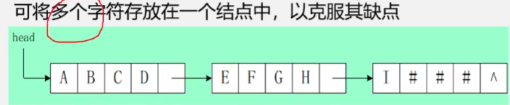

  为了便于进行串的操作，当以链表存储串值时，除头指针外，还可附设一个尾指针指示链表中的最后一个结点，并给出当前串的长度。称如此定义的串存储结构为`块链结构`，说明如下：

  ```c
  //－ － － － － 串的链式存储结构－ － － －
  #define CHUNKSIZE 8O //块大小
  typedef struct Chunk{
      char ch[CHUNKSIZE];
      struct Chunk *next;
  }Chunk;
  typedef struct{
  	Chunk *head,*tail; //串的头和尾指针
  	int length;  //串的当前长度
  ) LString;
  ```

- 一般写程序, 字符串的插入删除字符操作很少很少, 所以, 一般用顺序存储方式来处理.

### 4.3.3 串的橾式匹配算法

子串的定位运算通常称为串的模式匹配或串匹配.

串的模式匹配设有两个字符串S和T, 设S为主串，也称正文串；设T为子串，也称为模式。在主串S中查找与模式T相匹配的子串，如果匹配成功， 确定相匹配的子串中的第一个字符在主串S中出现的位置。

著名的模式匹配算法有BF 算法和KMP算法.

- **算法4.1 BF 算法 Brute-Force**

  模式匹配不一定是从主串的第一个位置开始， 可以指定主串中查找的起始位置pos。如果采用字符串顺序存储结构， 可以写出不依赖于其他串操作的匹配算法。

  【算法步骤】:

  - 分别利用计数指针`i`和`j` 指示主串S 和模式T 中当前正待比较的字符位置， `i`初值为`pos`, `j`初值为1。
  - 如果两个串均未比较到串尾， 即`i`和`j`均分别小于等于S和T的长度时， 则循环执行以下操作：
    - `S[i].ch`和`T[j].ch`比较，若相等，则`i`和`j`分别指示串中下个位置， 继续比较后续字符；
    - 若不等，指针后退重新开始匹配， 从主串的下一个字符(`i=i-j+2`) 起再重新和模式的第一个字符(j=1) 比较。
  - 如果`j>T.length`, 说明模式T中的每个字符依次和主串S中的一个连续的字符序列相等，则匹配成功，返回和模式T中第一个字符相等的字符在主串S中的序号(`i-T.length`); 否则称匹配不成功， 返回0。

  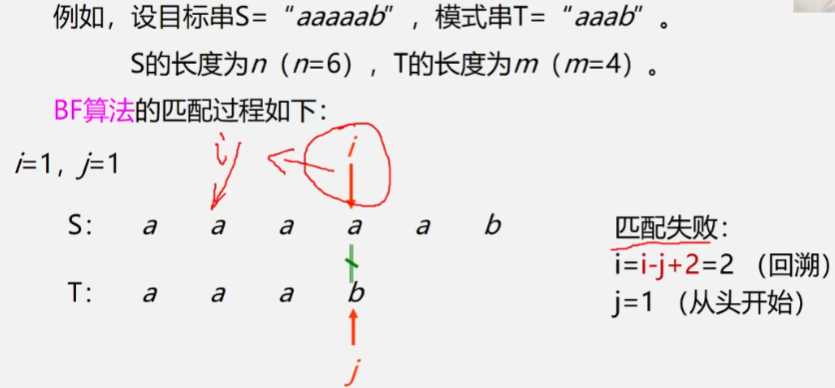

  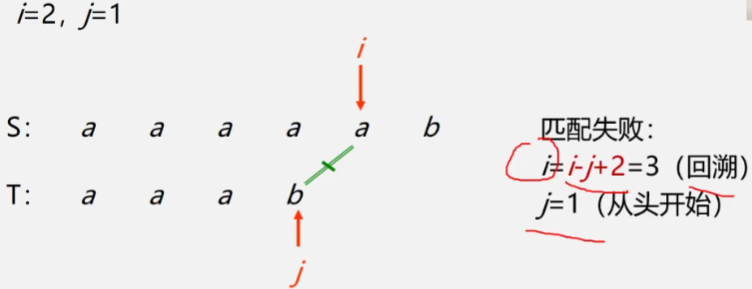

  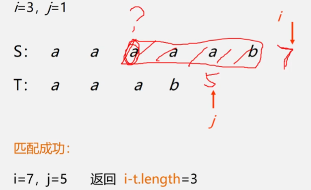

  总结一下:

  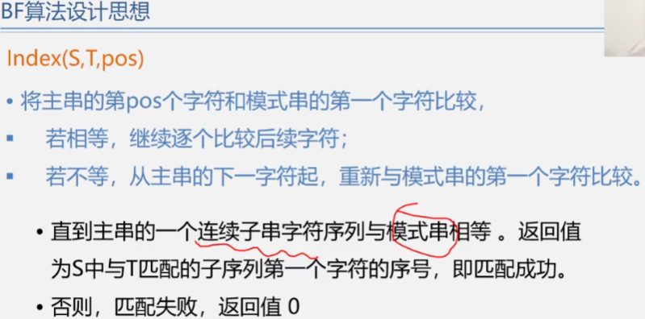

  ```c
  int Index_BF(SString *S, SString *T, int startpos) //传地址过来, 不然栈要爆了.
  {
      int i = startpos, j = 1; //下标为0的空闲不用. 从startpos位置开始找.
      while(i<=S->length && j<=T->length) //两个串均未比较到串尾
      {
          if(S->ch[i] == T->ch[j]) 
          {
              ++i;   //继续比较后继字符
              ++j;
          }
          else {
              i=i-j+2;   //指针后退重新开始匹配 因为是从1开始的, 不是0.
              j=1;
          }
      }
      if (j>=T->length) return (i - T.length);  //匹配成功
      else return 0;             //匹配失败
  }
  ```

  - ［算法分析］

    最好情况下，每趟不成功的匹配都发生在`模式串的第一个字符`与主串中相应字符的比较。

    设`主串的长度为n`, `子串的长度为m`, 假设从主串的第`i`个位置开始与模式串匹配成功，则在前`i-1` 趟匹配中字符总共比较了`i-1` 次；若第`i `趟成功的字符比较次数为m, 则总比较次数为`i-1+m`。对于成功匹配的主串, 其起始位置由1到`n-m+1`, 假定这`n-m+1`个起始位置上的匹配成功概率相等, 则最好的情况下匹配成功的平均比较次数为`(n+m)/2`.

    最好情况下的平均时间复杂度是O(n + m)。

    最坏情况下， 每趟不成功的匹配都发生在`模式串的最后一个字符`与主串中相应字符的比较。

    假设从主串的第`i`个位置开始与模式串匹配成功， 则在前`i-1` 趟匹配中字符总共比较了`(i-1)*m` 次；若第`i` 趟成功的字符比较次数为m,则总比较次数`i*m`。因此最坏情况下匹配成功的平均比较次数为:

    `m*(n-m+2)/2`

    最坏情况下的平均时间复杂度是O(n * m)。

- BF算法思路直观简明. 但当匹配失败时, 主串的指针z总是回溯到`i-j+2` 位置， 模式串的指针总是恢复到首字符位置`j=1`, 因此， 算法时间复杂度高。下面将介绍另一种改进的模式匹配算法。

- **KMP算法**

  这种改进算法是由Knuth 、Morris 和Pratt 同时设计实现的， 因此简称KMP 算法.

  此算法可以在O(n + m)的时间数量级上完成串的模式匹配操作。其改进在于: 每当一趟匹配过程中出现字符比较不等时, 不需回溯`i`指针, 而是利用已经得到的"部分匹配"的结果将`模式`向右"滑动"尽可能远的一段距离后，继续进行比较。

  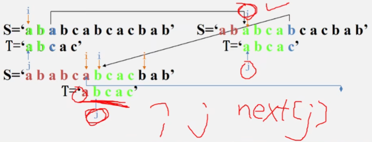

  KMP算法的关键在于 **利用已经得到的"部分匹配"的结果将`模式`向右"滑动"尽可能远的一段距离后**. 也就是子串怎么滑动, 主串的`i指针`不回溯, 那子串怎么滑, `用子串中的哪一个位置开始, 继续跟主串的当前位置比较.`

  - **子串怎么滑?**  

    [可以参考一下这文章](https://blog.csdn.net/weixin_52622200/article/details/110563434)

    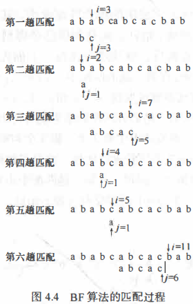

    回顾图4.4 中的匹配过程示例，在第三趟的匹配中，当`i=7、j=5` 字符比较不等时，又从`i=4、j=1` 重新开始比较。然后，经仔细观察可发现，`i=4和j=1`, `i=5和j=1`, 以及`i=6和j=1`**这3次比较都是不必进行的**。因为从第三趟部分匹配的结果就可得出，主串中第4个、第5个和第6个字符必然是"b"、"c"和"a"(即模式串中第2 个、第3个和第4个字符）。因为模式中的第一个字符是"a"'因此它无需再和这3 个字符进行比较，而**仅需将模式向右滑动3 个字符的位置**继续进行`i=7、j=2 `时的字符比较即可。同理，在第一趟匹配中出现字符不等时，仅需将模式向右移动两个字符的位置继续进行`i=3、j=1` 时的字符比较。

    由此，在整个匹配的过程中，`i指针`没有回溯，如图4.5 所示。

    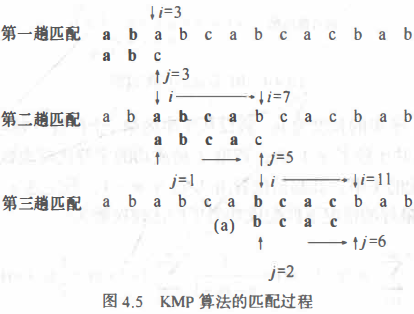

    > 举个例子第二趟相等的部分就是"abca" 4个字符,这4个在主串S, 跟子串T都有. 我现在要移动子串了, 是不是这"abca"中, "a"我是不用比的. 当然了, 因为主串跟子串都有, 而且相等, 为什么要浪费时间比.直接把T中的j=2拿去跟S中的i=7比就行了. 
    >
    > "a"怎么来的, "abca"中前部分子串, 跟后部分子串相等得到的. "abca"前部分子串有: "a", "ab", "abc";
    >
    > 后部分子串有"bca", "ca", "a".  只有"a"子串相等.  规律就在这里.

    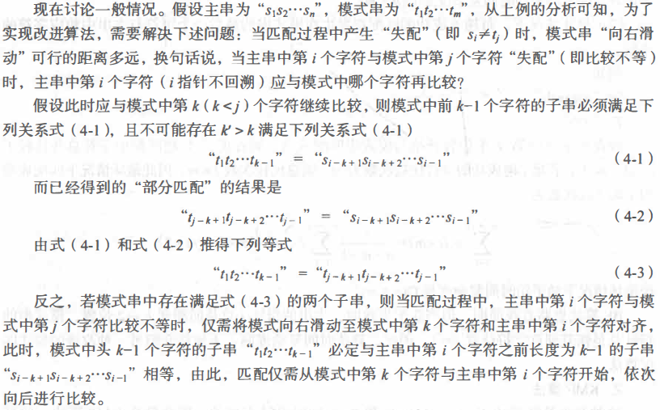

    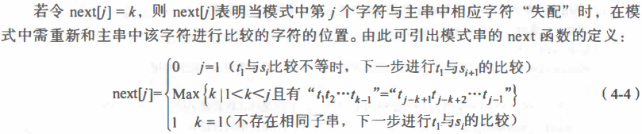

  > Max k的意思其实就是找到最长相等子串. t1与si不相等, 只能移动主串的指针.

  由此定义可推出模式串的next 函数值，如图4.6 所示。

  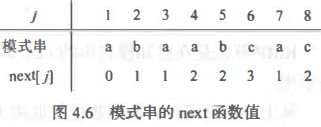

  在求得模式的next函数之后, 匹配可如下进行: 假设以指针i和j分别指示主串和模式中正待比较的字符, 令i的初值为pos, j的初值为1。若在匹配过程中Si = tj , 则i和j分别增1 否则，i不变，而j退到next [j]的位置再比较，若相等，则指针各自增1 , 否则j再退到下一个next值的位置，依次类推，直至下列两种可能： 一种是j 退到某个next 值(next [ next [ …next [j]…]])时字符比较相等，则指针各自增1, 继续进行匹配；另一种是j退到值为零（即模式的第一个字符"失配"), 则此时需将模式继续向右滑动一个位置，即从主串的下一个字符Si+1起和模式重新开始匹配。图4.7 所示正是上述匹配过程的一个例子。

  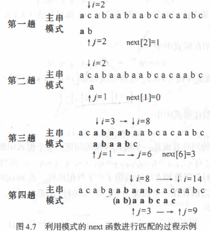

  KMP 算法如算法4.2 所示, 它在形式上和算法4.1极为相似. 不同之处仅在于：当匹配过程中产生“失配” 时，指针i不变, 指针j退回到next [j]所指示的位置上重新进行比较，并且当指针j 退至零时，指针i和指针j需同时增1。即若主串的第i个字符和模式的第1 个字符不等，应从主串的第i+1个字符起重新进行匹配。

  所以KMP算法的核心是next[j]这个数组的求法.

  从上述讨论可见, 此函数值仅取决于模式串本身, 而和相匹配的主串无关, 可从分析其定义出发用递推的方法求得next函数值. 由定义得知：`next[1] = 0`.

  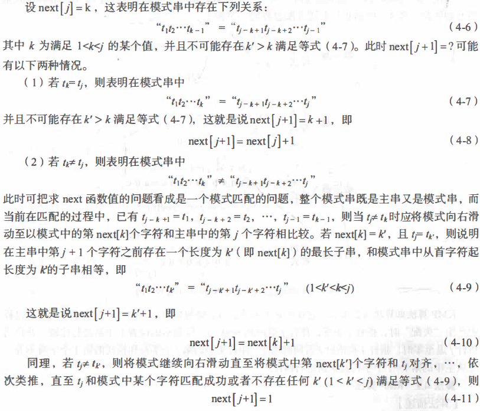

  > `next[j+1] = next[k] +1` --> `next[j+1] = next[next[j]] +1`

- 算法4.3 计算next函数值

  根据上面推导的公式可以写出下面这个程序:

  ```c
  void get_next(SString const *T,int next[])
  {//求模式串T 的next 函数值并存入数组next
      int i = 1, j = 0;
      next[1] = 0;   //本书从下标1 开始的,从0开始就next[0]=-1; 
      while(i<T->length)
      {
          if(0 == j|| T->ch[i] == T->ch[j]) //前缀跟后缀相等 或者第二指针j回到0
          {
              ++i;        //第一指针(后缀指针) 往后移
              ++j;        //第二指针(前缀指针) 往后移
              next[i] = j;
          }
          else
              j = next[j]; //不相等将j指针移回前面
      }
  }
  ```

  这里next[j] 还有点缺陷:

  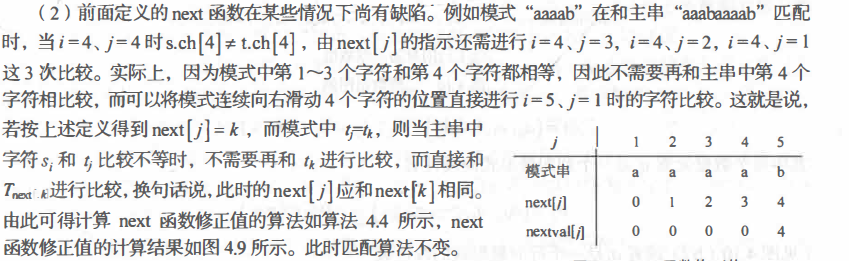

- **算法4.4 计算next 函数修正值**

  ```c
  //getnext 改进算法
  void get_nextval(SString const *T,int *nextval)
  {//求模式串T 的next 函数修正值并存入数组nextval
      int i = 1, j = 0;
      nextval[1] = 0;
      while(i < T->length)
      {
          if(0 == j|| T->ch[i] == T->ch[j]) //前缀跟后缀相等 或者第二指针j回到0
          {
              ++i;        //第一指针(后缀指针) 往后移
              ++j;        //第二指针(前缀指针) 往后移
              if (T->ch[i] == T->ch[j]) //继续比下一位了
                  nextval[i] = nextval[j]; //下一位相等, 直接把下一位的k值给下一位i
              else
              	nextval[i] = j;
          }
          else
              j = nextval[j]; //不相等将j指针移回前面
      }
  }
  ```

- 算法4.2 KMP算法

  根据BF暴力算法改进得来, 所以前面照抄.

  ```c
  int Index_KMP(SString *S, SString *T, int startpos) //传地址过来, 不然栈要爆了.
  {
      int i = startpos, j = 1; //下标为0的空闲不用. 从startpos位置开始找.i指主串 j指子串
      int nextval[T->length+1];
      get_nextval(T, nextval);
      while(i<=S->length && j<=T->length) //两个串均未比较到串尾 下标1不用但多申请一个元素
      {
          if( 0 == j || S->ch[i] == T->ch[j]) //子串指针值为0 主串移到下一个位置 子串为1
          {
              ++i;   //继续比较后继字符
              ++j;
          }
          else {
             j = nextval[j]; //前面得到的改进next
          }
      }
      if (j >= T->length) return (i - T.length);//匹配成功 j移到了T的最后一个或长度+1的位了
      else return 0;             //匹配失败
  }
  ```

虽然BF法的时间复杂度是O(n*m), 但在一般情况下，其实际的执行时间近似于O(n+m), 因此至今仍被采用。
KMP算法**仅当模式与主串之间存在许多 "部分匹配"的情况下，才显得比BF算法快得多**。
但是KMP算法的最大特点是**指示主串的指针不需回溯，整个匹配过程中，对主串仅需从头至尾扫描一遍，这对处理从外设输入的庞大文件很有效，可以边读入边匹配，而无需回头重读**。

当不出现模式串与主串之间存在许多部分匹配时, KMP跟BF差不多的.

## 4.4数组

数组: 按一定格式排列起来的, 具有相同类型的数据元素的集合.

一维数组: 若线性表中的数据元素为非结构的简单元素, 则成为一维数组.

一维数组的逻辑结构: 线性结构. 定长的线性表.

声明格式: 数据类型  变量名[长度]

> 数组可以看成是线性表的推广, 其特点是结构中的元素本身可以是具有某种结构的数据, 但属于同一数据类型.

一维数组可以看成是一个线性表，二维数组可以看成数据元素是线性表的线性表.

若一维数组中的数据元素又是一维数组结构, 则称为二维数组.

二维数组的逻辑结构: 

​	非线性结构: 每一个数据元素既在一个行表中, 又在一个列表中.

​	线性结构: 该线性表的每个数据元素也是一个定长的线性表.

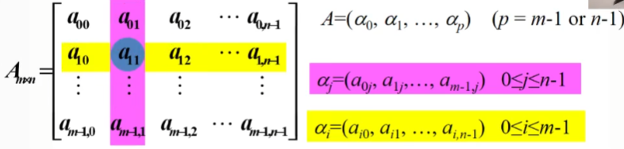

在C语言中，一个二维数组类型可以定义为其分量类型为一维数组类型的一维数组类型，也就是说.

typedef  ElemType Array2m][n];  

等价于: typedef  ElemType array1[n];  typedef  array1 array2[m];

数组的基本操作:

出了结构的初始化, 和销毁之外, 只有取元素和修改元素值的操作. 一般不插入删除.

### 4.4.1 数组的类型定义

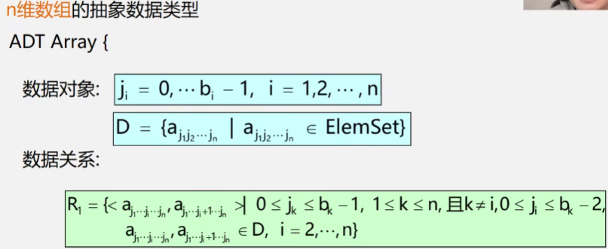

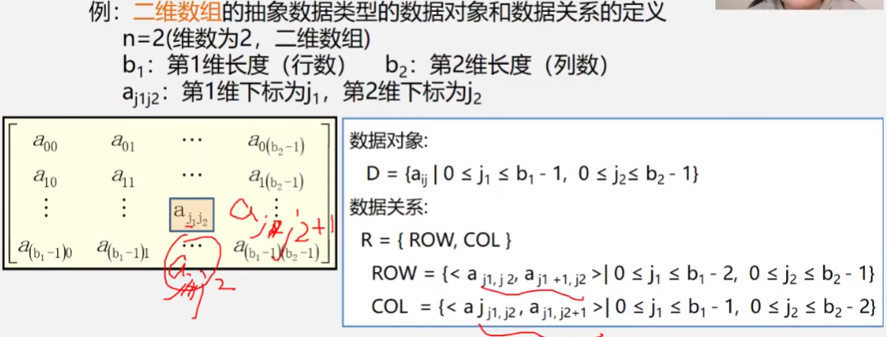

**基本操作：**
InitArray (&A, n, bound i, ···, boundn)
操作结果：若维数n和各维长度合法， 则构造相应的数组A, 并返回OK。
DestroyArray (&A)
操作结果：销毁数组A。
Value(A, &e, index1 , …，indexn)
初始条件：A是n维数组，e为元素变量，随后是n个下标值。
操作结果：若各下标不超界，则e赋值为所指定的A 的元素值， 并返回OK。
Assign(&A,e, index1, …，indexn)
初始条件：A是n 维数组， e 为元素变扯，随后是n 个下标值。
操作结果：若下标不超界，则将e 的值赋给所指定的A的元素， 并返回OK。

### 4.4.2 数组的顺序存储

由于数组一般不做插入或删除操作， 也就是说； 一旦建立了数组， 则结构中的数据元素个数和元素之间的关系就不再发生变动。因此， 采用顺序存储结构表示数组比较合适。

由于存储单元是一维的结构， 而数组可能是多维的结构， 则用一组连续存储单元存放数组的数据元素就有次序约定问题。

对应地，对二维数组可有两种存储方式： 一种是以列序为主序的存储方式， 如图4.11 (a)所示； 一种是以行序为主序的存储方式， 如图4.11(b) 所示。在扩展Basic 、Pascal 、Java 和C 语言中， 用的都是以行序为主序的存储结构， 而在FORTRAN 语言中， 用的是以列序为主序的存储结构。

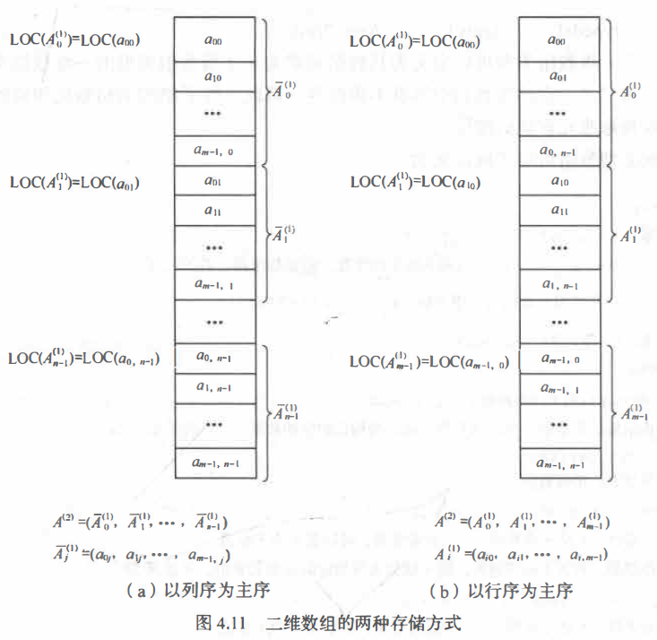

### 4.4.3 特殊矩阵的压缩存储

矩阵是很多科学与工程计算问题中研究的数学对象，矩阵用二维数组来表示是最自然的方法。但是，在数值分析中经常出现一些阶数很高的矩阵，同时在矩阵中有很多值相同的元素或者是零元素。有时为了节省存储空间，可以对这类矩阵进行压缩存储。

所谓压缩存储，是指为多个值相同的元只分配一个存储空间， 对零元不分配空间。

假若值相同的元素或者零元素在矩阵中的分布有一定规律， 则称此类矩阵为**特殊矩阵**。特殊矩阵主要包括对称矩阵、三角矩阵和对角矩阵等, 下面我们重点讨论这三种特殊矩阵的压缩存储。

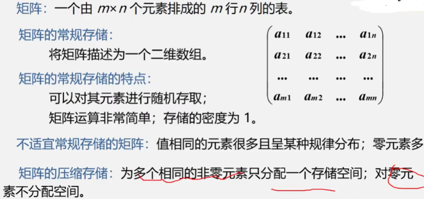

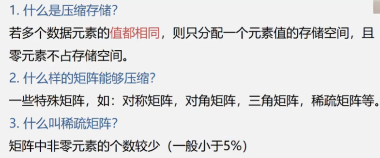

- 对称矩阵

  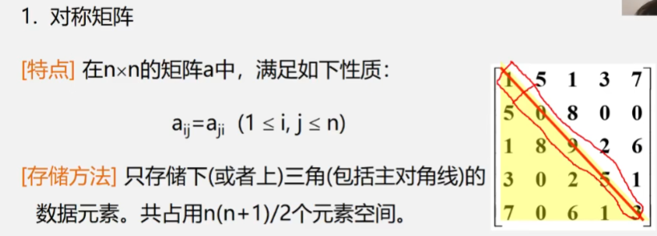

  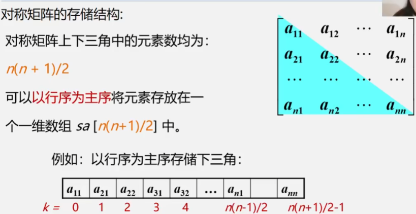

- 三角矩阵

  以主对角线划分，三角矩阵有上三角矩阵和下三角矩阵两种。上三角矩阵是指矩阵下三角（不包括对角线）中的元均为常数c或零的n阶矩阵， 下三角矩阵与之相反。对三角矩阵进行压缩存储时， 除了和对称矩阵一样， 只存储其上（下）兰角中的元素之外， 再加一个存储常数c的存储空间即可。

  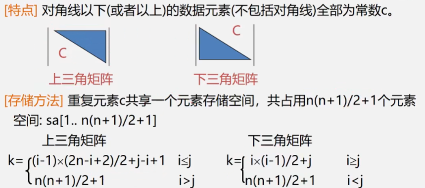

- 对角矩阵

  对角矩阵所有的非零元都集中在以主对角线为中心的带状区域中，即除了主对角线上和直接在对角线上、下方若干条对角线上的元之外，所有其他的元皆为零，如图4.13 所示。对这种矩阵，也可按某个原则（或以行为主，或以对角线的顺序）将其压缩存储到一维数组上。

  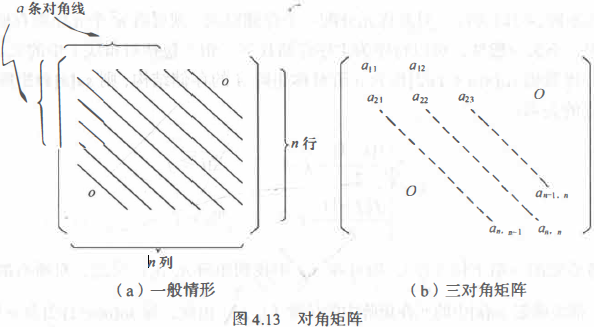

在上述这些特殊矩阵中，非零元的分布都有一个明显的规律，从而可将其压缩存储到一维数组中，并找到每个非零元在一维数组中的对应关系。然而，在实际应用中还经常会遇到另一类矩阵，其非零元较零元少，且分布没有一定规律，称之为稀疏矩阵.

- 稀疏矩阵

  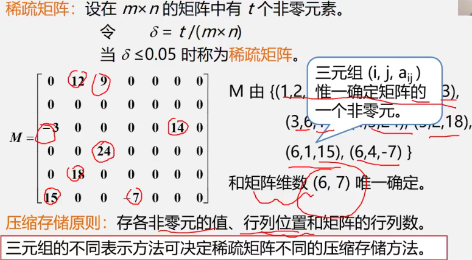

  三元组顺序表:

  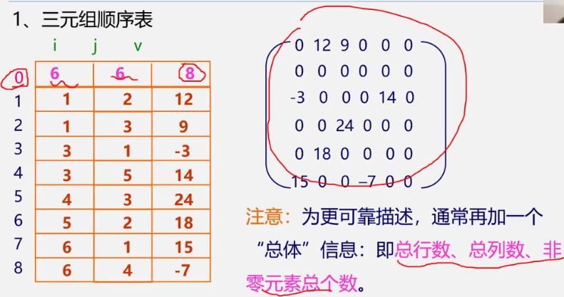

  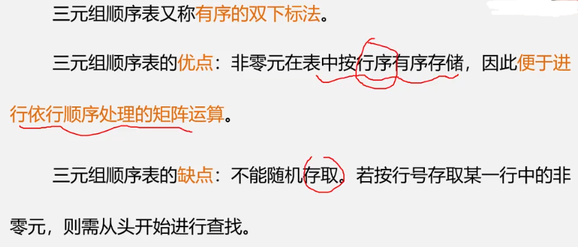

  链式存储结构: 十字链表:

  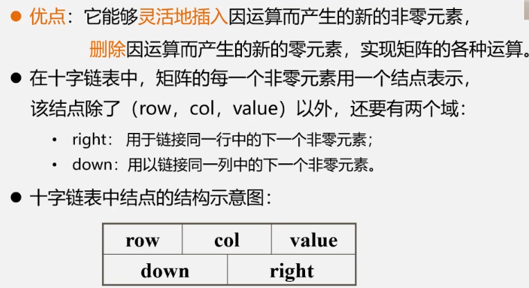

  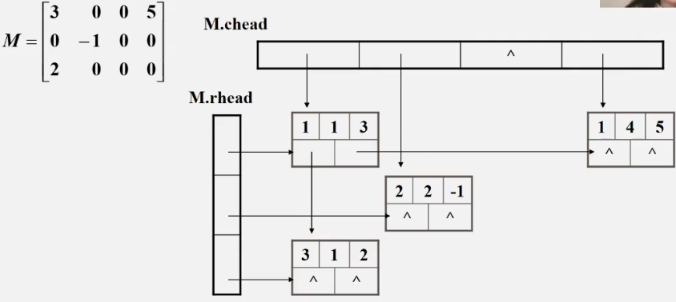

  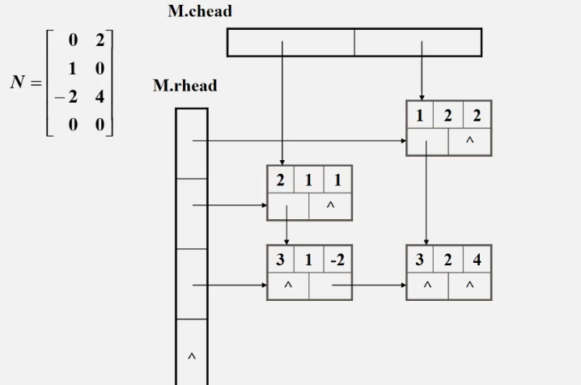

## 4.5 广义表

### 4.5.1 广义表的定义

广义表是线性表的推广，也称为列表.  广泛地用千人工智能等领域的表处理语言LISP语言，把广义表作为基本的数据结构，就连程序也表示为一系列的广义表。

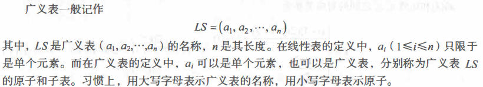

广义表的定义是一个递归的定义，因为在描述广义表时又用到了广义表的概念。

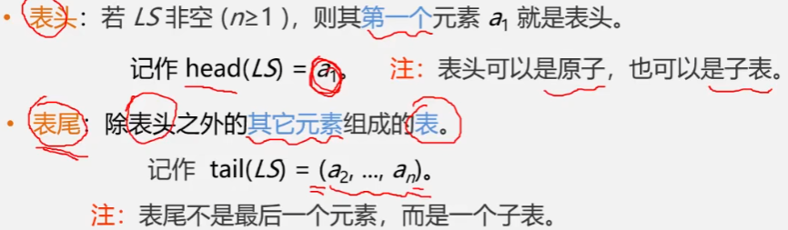

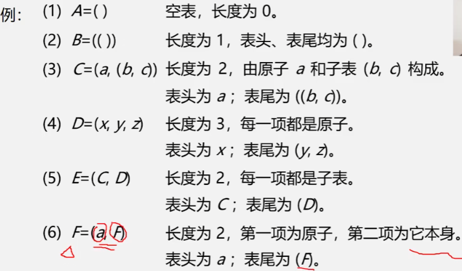

广义表的性质:

- 广义表中的数据元素有相对次序, 一个直接前驱和一个直接后继.
- 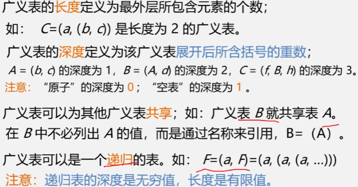

- 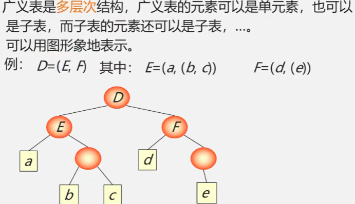

- 广义表跟线性表的区别:
- 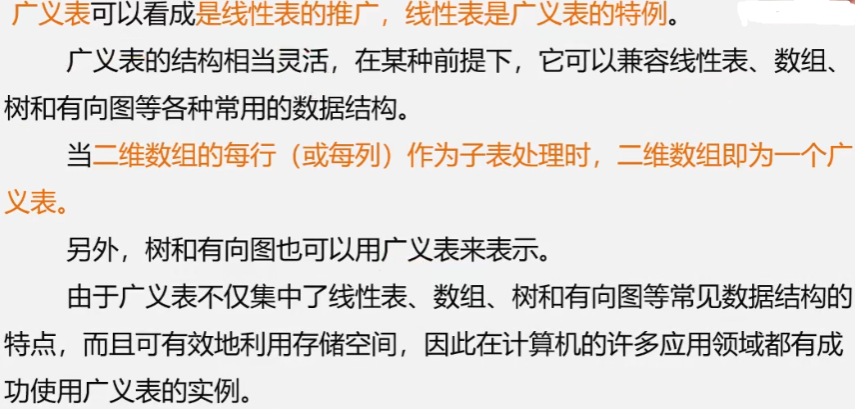

- 广义表的基本运算:

  (1) 取表头GetHead(LS): 取出的表头为非空广义表的第一个元素，它可以是一个单原子，也可以是一个子表。
  (2) 取表尾GetTail(LS): 取出的表尾为除去表头之外，由其余元素构成的表。即表尾一定是一个广义表。

  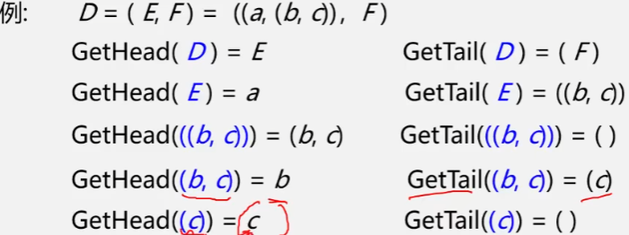

