# 第5章 树和二叉树

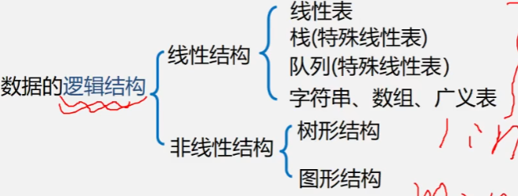

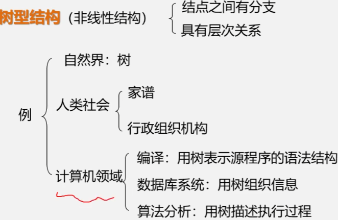

## 5.1 树和二叉树的定义

### 5.1.1 树的定义

树(Tree)是n(n>=0)个结点的有限集, 它或为空树(n= 0); 或为非空树，对于非空树T:

(1) 有且仅有一个称之为根的结点；
(2) 除根结点以外的其余结点可分为m(m>0)个互不相交的有限集T1, T2 , …, Tm, 其中每一个集合本身又是一棵树， 并且称为根的子树(SubTree)。

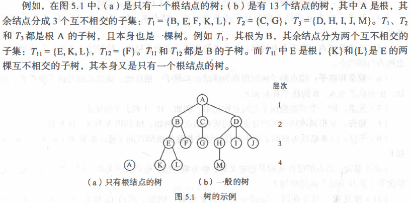

树的结构定义是一个递归的定义，即在树的定义中又用到树的定义，它道出了**树的固有特性**。

### 5.1.2 树的基本术语

(1) `结点`：树中的一个`独立单元`。包含一个`数据元素`及`若干指向其子树的分支`，如图5.1(b) 中的A , B, C, D等. (下面术语中均以图5.1 (b) 为例来说明). 根节点: 非空树中没有前驱结点的结点.

(2)`结点的度`：结点拥有的`子树数`称为结点的度。例如，A的度为3, C的度为1, F的度为0。

(3)`树的度`： 树的度是`树内各结点度的最大值`。图5.1 (b) 所示的树的度为3。

(4) `叶子`：`度为0的结点`称为叶子或`终端结点`。结点K 、L 、F 、G 、M 、I 、J都是树的叶子。

(5)` 非终端结点`：`度不为0的结点`称为非终端结点或`分支结点`。`除根结点之外`，非终端结点也称为`内部结点`。

(6)`双亲和孩子`：`结点的子树的根`称为该结点的孩子，相应地，该`结点称为孩子的双亲`。例如，B的双亲为A, B的孩子有E和F。

(7) `兄弟`：`同一个双亲的孩子之间`互称兄弟。例如，H 、I 和J互为兄弟。

(8) `祖先`：`从根到该结点所经分支上的所有结点`。例如， M 的祖先为A 、D 和H。

(9) `子孙`：`以某结点为根`的`子树中的任一结点`都称为该结点的子孙。如B的子孙为E 、K 、L和F。

(10) `层次`：结点的层次从根开始定义起，根为第一层，根的孩子为第二层。树中任一结点的层次等于其双亲结点的层次加1。

(11)`堂兄弟`：`双亲在同一层的结点`互为堂兄弟。例如，结点G 与E 、F、H 、I 、J互为堂兄弟。

(12)`树的深度`：`树中结点的最大层次`称为树的深度或高度。图5.1 (b)所示的树的深度为4。

(13)`有序树和无序树`：如果将树中结点的各子树看成从左至右是有次序的(即不能互换), 则称该树为有序树, 否则称为无序树。在有序树中最左边的子树的根称为第一个孩子，最右边的称为最后一个孩子.

(14)`森林`：是m (m>=0)棵互不相交的树的集合。对树中每个结点而言，其子树的集合即为森林。由此，也可以用森林和树相互递归的定义来描述树。B,C,D 为根的树, 组成一个森林.
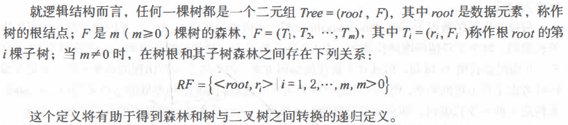

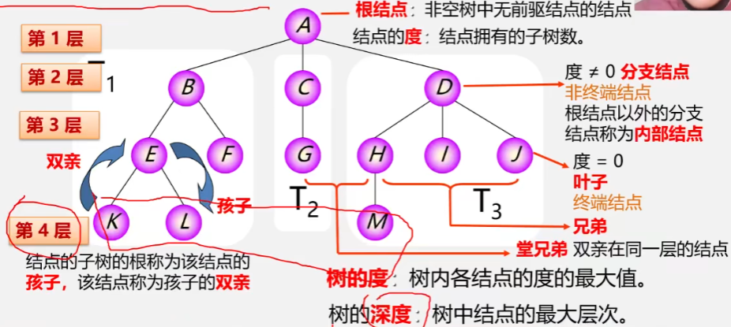

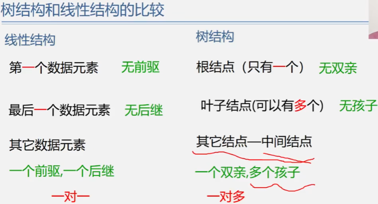

### 5.1.3 二叉树的定义

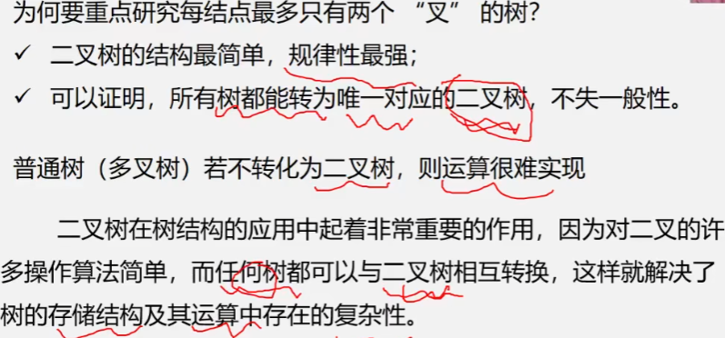

- 定义:

二叉树(Binary Tree)是n(n>=0)个结点所构成的有限集合, 它或为空树(n= 0); 或为非空树, 对于非空树T:

(1) 有且仅有一个称之为根的结点；
(2) 除根结点以外的其余结点分为两个互不相交的子集T1和T2, 分别称为T的左子树和右子树，且T1和T2本身又都是二叉树。

二叉树与树一样具有递归性质，二叉树与树的区别主要有以下两点：
(1) 二叉树每个结点至多只有两棵子树或两个孩子 (即二叉树中不存在度大于2 的结点)；
(2) 二叉树的子树有左右之分, 其次序不能任意颠倒。

二叉树的递归定义表明二叉树或为空，或是由一个根结点加上两棵分别称为左子树和右子树的、互不相交的二叉树组成。由于这两棵子树也是二叉树，则由二叉树的定义，它们也可以是空树。

注意:

- 二叉树不是树的特殊情况, 它们是两个不同的东西.
- 二叉树结点的子树, 要区分左子树与右子树, 即使只有一棵树, 也必须要区分, 说明它是左子树还是右子树.
- 树中当结点只有一个孩子时, 就不必区分左右的次序问题. 这也是树与二叉树的主要区别.

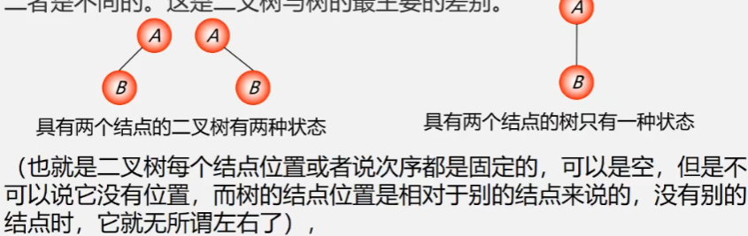

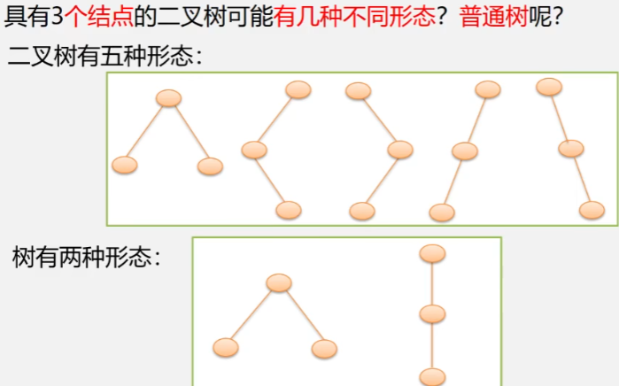

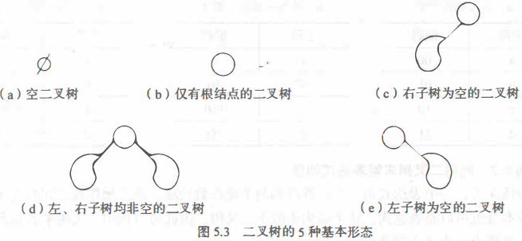

## 5.2 案例引入

随着大数据时代的到来， 如何采用有效的数据压缩技术， 来节省数据文件的存储空间和网络传输时间越来越引起人们的重视。

案例5.1: 数据压缩问题。

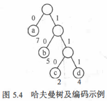

案例5.2: 利用二叉树求解表达式的值。

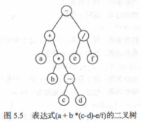

## 5.3 树和二叉树的抽象数据类型定义

- 树的ADT

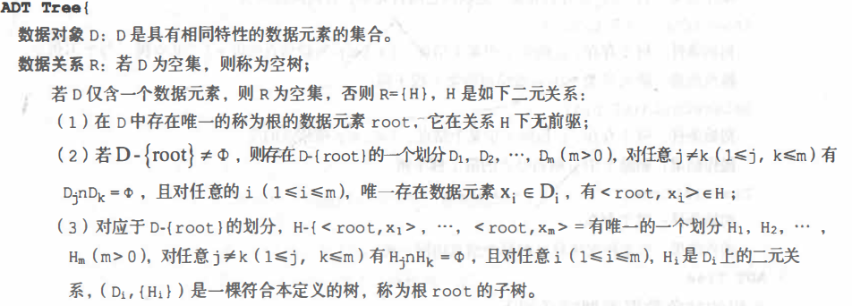

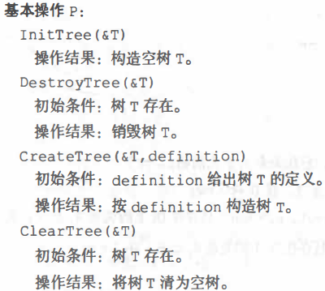

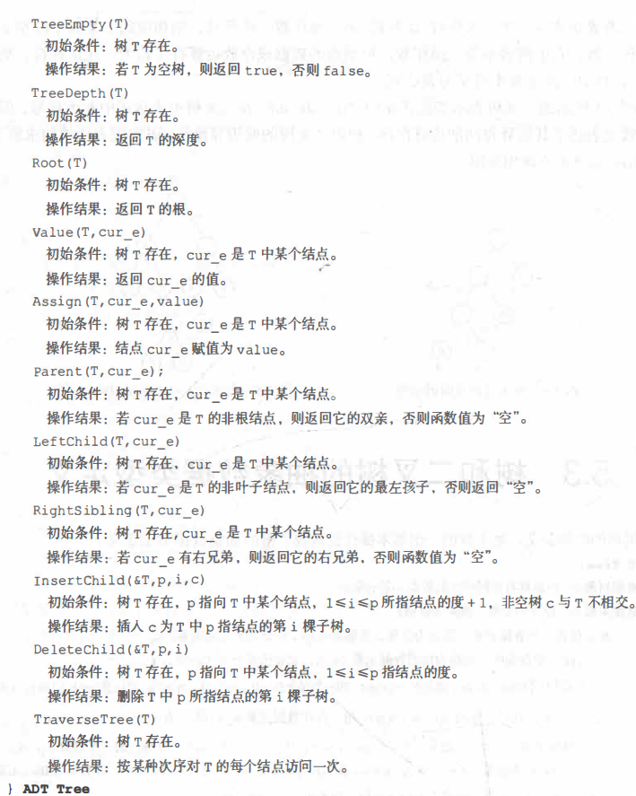

- 二叉树的ADT

> 二叉树是非常重要的一个数据结构, 跟前面链表, 顺序, 数组一样重要.

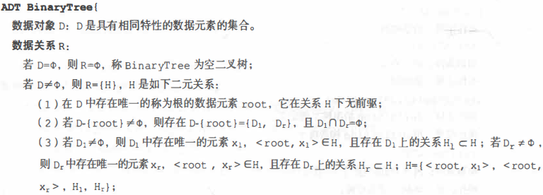
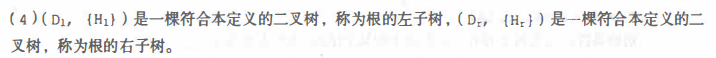

基本操作过多....

## 5.4 二叉树的性质和存储结构

### 5.4.1 二叉树的性质

**二叉树具有下列重要特性：**

- 性质1: 在二叉树的第`i`层上至多有`2^(i-1)` 个结点（`i >= 1`)。

- 性质2: 深度为k的二叉树至多有`2^k-1` 个结点(`k >= 1`)。

- 性质3: 对任何一棵二叉树T, 如果其终端结点数为n0, 度为2的结点数为`n2`, 则`n0 = n2+1`.(叶子结点比度为2的结点多一个)

  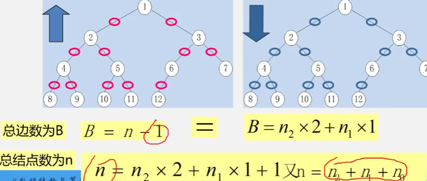

- **两种特殊二叉树**

  为什么要研究满二叉树, 完全二叉树, 因为它们在顺序存储方式下可以复原.

  - **满二叉树**

    一棵深度为k且有`2^k-1`个结点的二叉树称为满二叉树. 

    特点: 1. 每一层上的结点数都是最大结点数. 每一层都是满的

    2. 叶子结点全部在最底层.

    对满二叉树节点位置进行变编号

    1. 编号规则: 从根节点开始, 自上而下, 自左到右.

    2. 每个节点位置都有元素.

       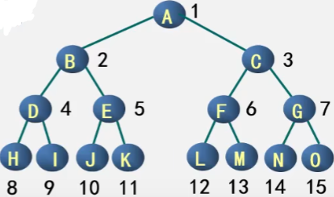

    满二叉树在同样深度的二叉树中, 结点数是最多的.

    满二叉树在同样深度的二叉树中, 叶子结点个数最多.

  - **完全二叉树**

    深度为k的, 有n个结点的二叉树, 当且仅当其每一个结点都与深度为k的满二叉树中编号从1至n的结点一一对应时， 称之为完全二叉树。

    > 编号编的跟满二叉树一样, 但不是满二叉树. 

    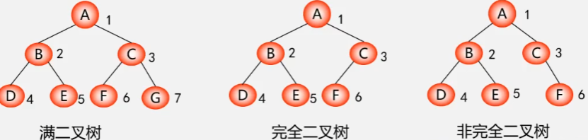

    从满二叉树的最后一个结点开始(从由往左), 连续去掉任意个结点, 即是一个完全二叉树.  一定是连续去掉.

    下面这个就不是完全二叉树.

    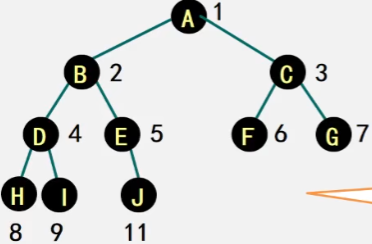

    完全二叉树的特点是：
    (1) 叶子结点只可能在层次最大的两层上出现；(叶子只能在最后两层.)
    (2) 对任一结点, 若其右分支下的子孙的最大层次为`l`, 则其左分支下的子孙的最大层次必为`l `或`l+1`( 因为这样就不是满二叉树的编号法了, 就不是完全二叉树了.)

    完全二叉树最多只能有一个度为1的结点, 即n1 = 0或1. 那n0 = n2 + 1决定了, n0+n2一定是奇数. 

    若完全二叉树有2k(偶数)个结点, 则必有你n1=1, n0=k, n2=k-1.

    若完全二叉树有2k-1(奇数)个结点, 则必有你n1=0, n0=k, n2=k-1.	

- 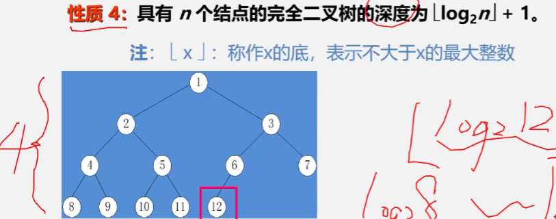

  知道完全二叉树的结点数, 就可以知道这个完全二叉树的深度了.

- 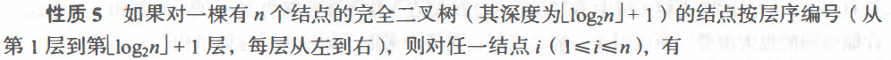

  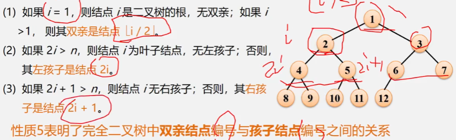

  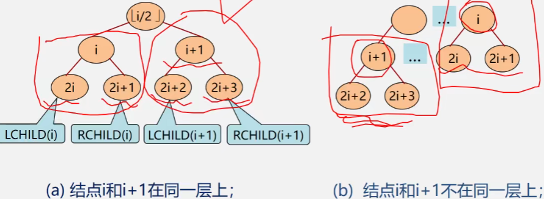

### 5.4.2 二叉树的存储结构

二叉树的存储结构也可采用顺序存储和链式存储两种方式。

- 顺序存储结构

  实现: **按照满二叉树的结点层次编号**, 依次存放二叉树中的数据元素. 对n个结点的二叉树.

  顺序存储结构使用一组地址连续的存储单元来存储数据元素，为了能够在存储结构中反映出结点之间的逻辑关系，必须将二叉树中的结点依照一定的规律安排在这组单元中。

  对于**完全二叉树**, 只要从根起按层序存储即可, 依次自上而下, 自左至右存储结点元素, 即将完全二叉树上编号为`i`的结点元素存储在如上定义的一维数组中下标为`i-1`的分量中。

  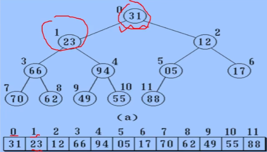

  ```c
  //-----二叉树的顺序存储表示－－－－－
  #define MAXTSIZE 100
  typedef TElemType SqBiTree[MAXTSIZE]; //二叉树的最大结点数
  SqBiTree bt;    //0号单元存储根结点3
  
  //王道的写法 数据结构是灵活的,不要学死了.
  #define MAXTSIZE 100
  typedef struct TreeNode{
      TElemType value;
      bool isEmpty;
  }TreeNode;
  TreeNode t[MAXTSIZE];
  ```

  那如果不是完全二叉树呢?

  对于一般二叉树，则应将其每个结点与完全二叉树上的结点相对照，存储在一维数组的相应分量中.

  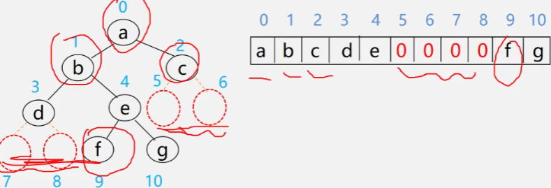

  空着的, 用0填充. 其实还是满二叉树的编号法.

  - 几个重要的基本操作

    i的左孩子 : 2i

    i的右孩子: 2i + 1

    i的父节点 : i/2 然后向下取整

    i所在的层次 log以2为底(n+1)  然后向上取整. n为结点总数.

由此可见, 这种顺序存储结构仅适用于完全二叉树. 因为, 在最坏的情况下, 一个深度为k且只有k个结点的`单支树`(树中不存在度为2的结点)却需要长度为`2^k-1`的一维数组. 这造成了存储空间的极大浪费, 所以对于一般二叉树, 更适合采取下面的链式存储结构.

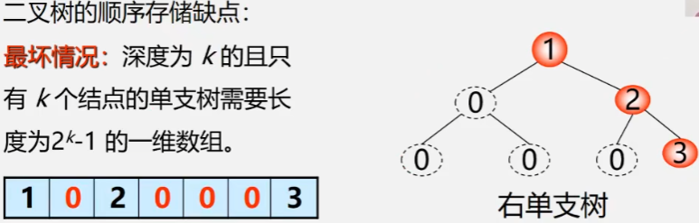

- 链式存储结构

  二叉树的结点由一个数据元素和分别指向其左、右子树的两个分支构成，则表示二叉树的链表中的结点至少包含3个域: 数据域和左, 右指针域. 有时, 为了便于找到结点的双亲, 还可在结点结构中增加一个指向其双亲结点的指针域.

  利用这两种结点结构所得二叉树的存储结构分别称之为二叉链表和三叉链表.

  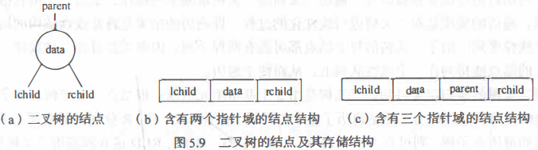

  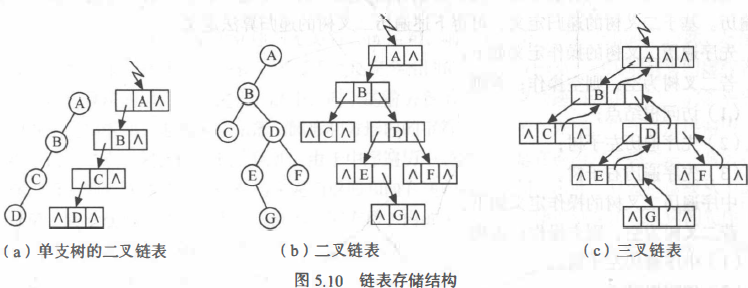

  ```c
  //-----二叉树的二叉链表存储表示－－－－－
  typedef struct BiTNode{
  	TElemType data;          //结点数据域
  	struct BiTNode *lchild, *rchild;   //左右孩子指针
  } BiTNode, *BiTree;
  ```

  n个结点一共2n个链(指针)域. 除了根节点, 其他每个结点有且仅有一个双亲, 所以只有n-1的结点的链域存放指针, 指向非空孩子结点. **那空指针数 = 2n- (n-1) = n+1.** 空指针有用.

  ```c
  //-----二叉树的三叉链表存储表示－－－－－
  typedef struct TriTNode{
  	TElemType data;          //结点数据域
  	struct TriTNode *lchild,*parent,*rchild;   //左右孩子指针 跟双亲指针
  } TriTNode, *TriTree;
  ```

### 5.4.3 特殊二叉树

- 二叉排序树

  一棵二叉树或者空二叉树, 具有如下性质:

  左子树上的所有结点的关键字均小于根结点的关键字.

  右子树上的所有结点的关键字均大于根结点的关键字.

  左子树和右子树又是一个二叉排序树.

  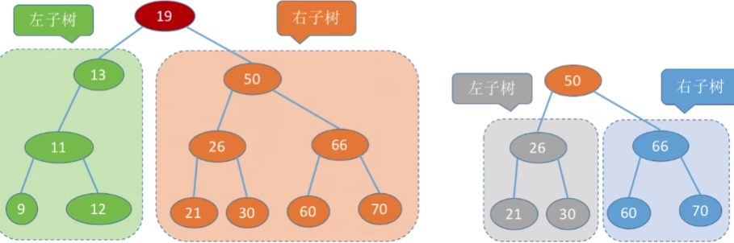

- 平衡二叉树

  树上任一结点的左子树和右子树的深度之差不超过1.

  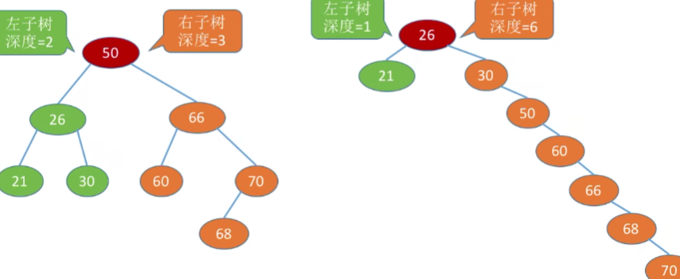

## 5.5 遍历二叉树和线索二叉树

在二叉树的一些应用中，常常要求在树中查找具有某种特征的结点，或者是对树中的全部结点逐一进行处理，这就提出了一个遍历二叉树的问题。线索二叉树是在第一次遍历时将结点的前驱、后继信息存储下来，便于再次遍历二叉树。

### 5.5.1 遍历二叉树

遍历二叉树(traversing binary tree)是指按某条搜索路径巡访树中每个结点, 使得每个结点均被访问一次, 而且仅被访问一次.

> 访间的含义很广，可以是对结点做各种处理，包括输出结点的信息，对结点进行运算和修改等。 但不能破坏原数据结构.

遍历的目的是, 得到树中所有结点的一个线性排列.

遍历用途, 它是树结构 增删改查和排序的前提. 是二叉树一切运算的基础与核心.

> 遍历二叉树是二叉树最基本的操作，也是二叉树其他各种操作的基础，遍历的实质是对二叉树进行线性化的过程，即遍历的结果是将非线性结构的树中结点排成一个线性序列。
>
> 由于二叉树的每个结点都可能有两棵子树，因而需要寻找一种规律，以便使二叉树上的结点能排列在一个线性队列上，从而便于遍历。

二叉树是由3个基本单元组成：根结点、左子树和右子树. 若能依次遍历这三部分，便是遍历了整个二叉树。

假如从L、D、R 分别表示遍历左子树、访问根结点和遍历右子树，则可有DLR、LDR 、L RD、DRL、RDL、RLD这6种遍历二叉树的方案。

若限定`先左后右`，则只有前3种情况，分别称之为`先(根)序遍历`、`中(根)序遍历`和`后(根)序遍历`.

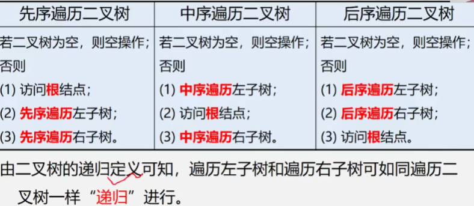

先序遍历二叉树的操作定义如下：

- 先序遍历

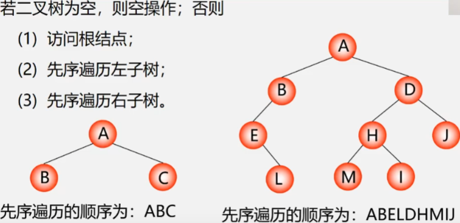

- 中序遍历

  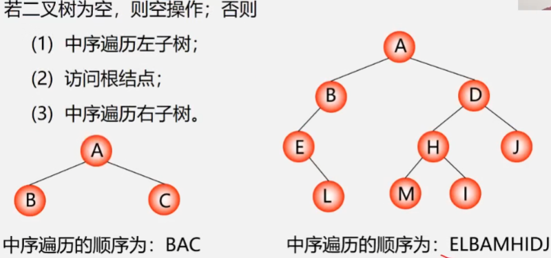

- 后序遍历

  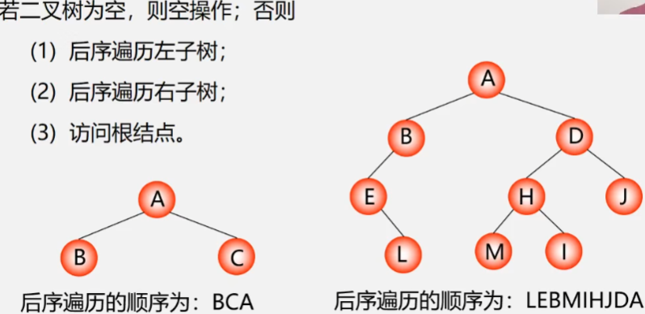

练习一下:

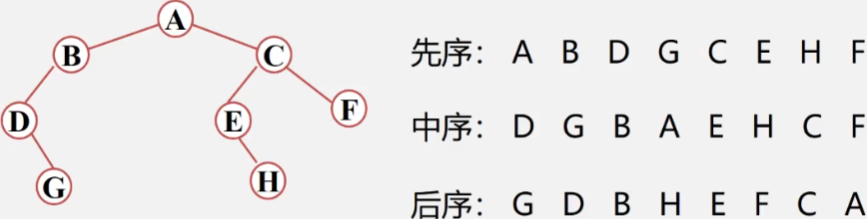

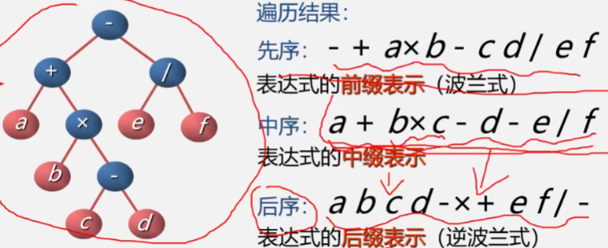

- > **根据遍历序列确定二叉树**

  若二叉树中各结点的值均不相同，任意一棵二叉树结点的先序序列、中序序列和后序序列都是唯一的。

  由二叉树的先序序列和中序序列，或由其后序序列和中序序列均能唯一地确定一棵二叉树。

  层序+中序也可以确定唯一的一个二叉树.

  **先序+中序**

  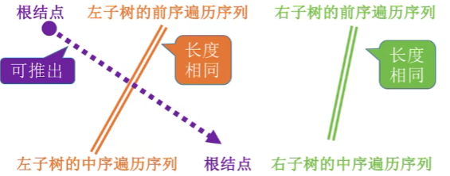

  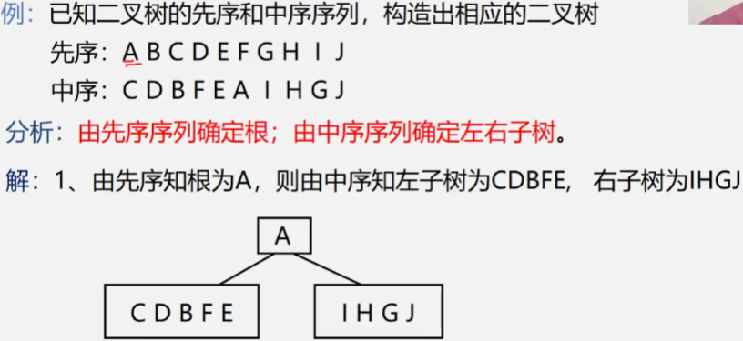

  先序可以初步确定, A是根, B是A的左子树的根. 中序的CDB可以确定, C是B的左子树的根, D是C的右孩子.

  先序ABCDEF + 中序CDBFEA 可以确定, E是B的右子树的根, F是E的左孩子. A的左子树结束.

  先序的GHIJ 跟中序的IHGJ 可以确定, G是A的右子树的根,  J是G的右孩子, H是G的左子树的根, I是H的左孩子.

  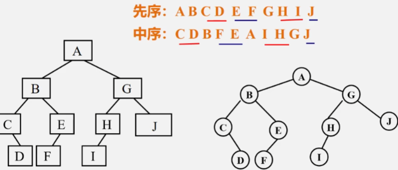

  **中序+后序**

  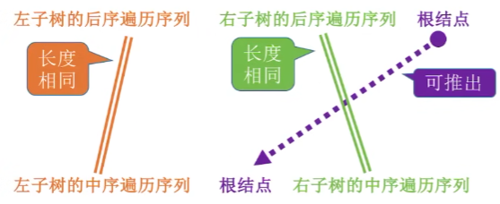

  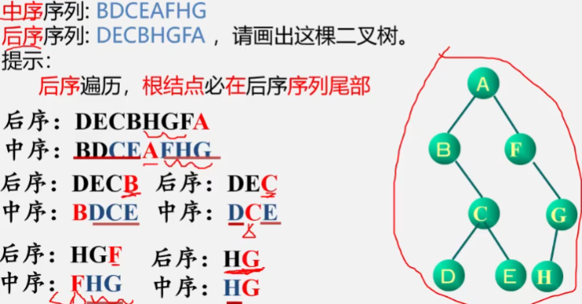

> 先序跟后序没法确定根.

​	**层序+中序**

​	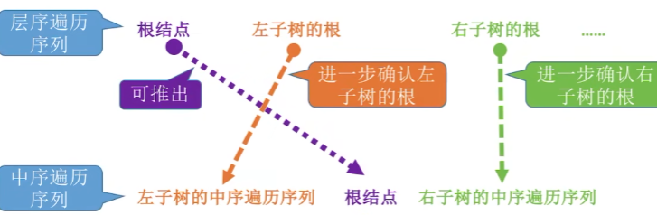

> 缺了中序就不能确定二叉树.
>
> 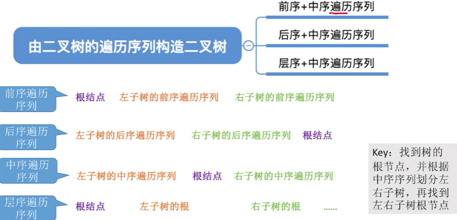

- 遍历的算法实现  先序遍历

  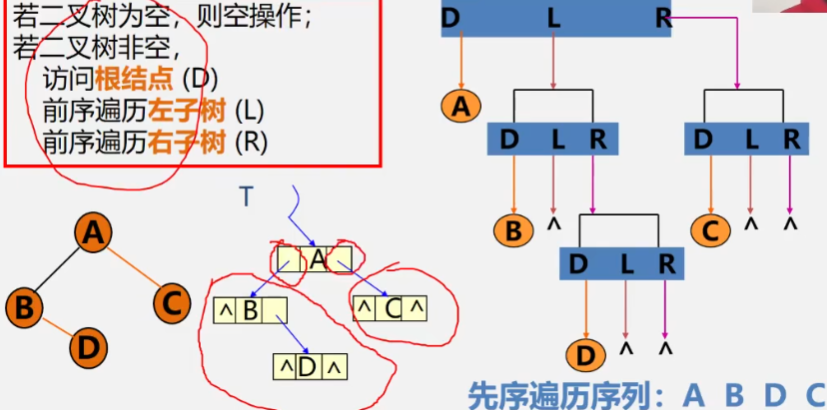

  ```c
  int PreOrderTraverse(BiTree T)   //递归算法.
  {
      if(T)  //不为空
      {
          visit(T);  //访问根节点 比如printf(T->data);访问函数, 具体根据需求写
          PreOrderTraverse(T->lchild); //递归遍历左子树
          PreOrderTraverse(T->rchild);  //递归遍历右子树
      }
  }
  ```

  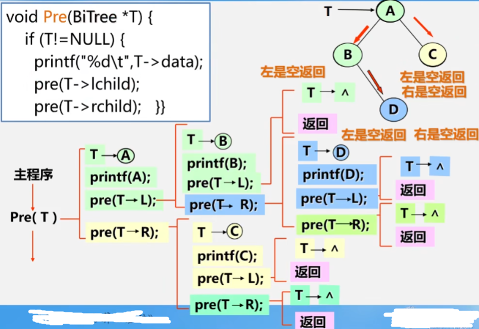

- 遍历的算法实现  中序遍历

  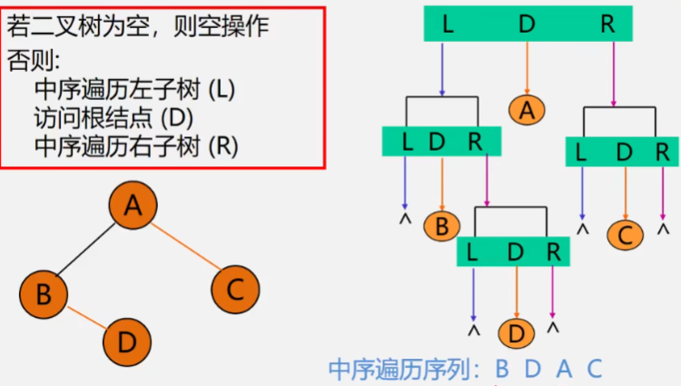

  ```c
  int InOrderTraverse(BiTree T)   //递归算法.
  {
      if(T) //不为空
      {
          InOrderTraverse(T->lchild); //递归遍历左子树
          visit(T);  //访问根节点 比如printf(T->data); 访问函数, 具体根据需求写
          InOrderTraverse(T->rchild);  //递归遍历右子树
      }
  }
  ```

- 遍历的算法实现 后序遍历

  ```c
  int PostOrderTraverse(BiTree T)   //递归算法.
  {
      if(T)  //不为空
      {
          PostOrderTraverse(T->lchild); //递归遍历左子树       
          PostOrderTraverse(T->rchild);  //递归遍历右子树
          visit(T);  //访问根节点 比如printf(T->data); 访问函数, 具体根据需求写
      }
  }
  ```

- 遍历算法分析

  从递归执行过程的角度来看先序、中序和后序遍历也是完全相同的。递归调用 , 每次新入调用的时候 ,都要开辟新的栈帧, 对于栈空间的开销, 以及时间上的开销是比较大的.
  时间复杂度, 跟空间复杂度都是O(n).

  前面讲递归的时候, 说到可利用栈将递归算法改写成非递归算法.

  例如, 
  从中序遍历递归算法执行过程中递归工作栈的状态可见：
  (1) 工作记录中包含两项, 其一是递归调用的语句编号, 其二是指向根结点的指针, 则当栈顶记录中的指针非空时, 应遍历左子树, 即指向左子树根的指针进栈;

  (2) 若栈顶记录中的指针值为空, 则应退至上一层, 若是从左子树返回, 则应访问当前层(即栈顶记录)中指针所指的根结点;

  (3) 若是从右子树返回, 则表明当前层的遍历结束, 应继续退栈. 从另一个角度看, 这意味着遍历右子树时不再需要保存当前层的根指针, 直接修改栈顶记录中的指针即可.

- **遍历二叉树的非递归算法**

  算法5.2 中序遍历的非递归算法

  基本思想: 

  1 先建立一个栈

  2 根节点入栈, 遍历左子树

  3 根节点出栈, 输出根节点, 遍历右子树

  【算法步骤】
  1 初始化一个空栈s, 指针p指向根结点。
  2 申请一个结点空间q, 用来存放栈顶弹出的元素。
  3 当p非空或者栈S非空时，循环执行以下操作：
  	如果p非空，则将p进栈，p指向该结点的左孩子；
  	如果p为空，则弹出栈顶元素并访间，将p指向该结点的右孩子。

  ```c
  void InOrderTraverse(BiTree T)
  {
      BiTree p = T;
      InitStack(S);
      BiTNode *q = malloc(sizeof(BiTNode));
      BiTNode *ff = q;
      while(p || !StackEmepy(S)) //p不为NULL 或者Stack里不是空的.
      {
          if(P)  //非NULL
          {
              Push(S,p); //根指针进栈
              p = p->lchild; //遍历左子树
          }
          else
          {
              Pop(S,q); //出栈 把值写进malloc的内存空间.
              printf("%c", q->data); //访问根结点
              p = q->rchild; //遍历右子树
          }
      }
      free(ff);
  }
  ```

- > **二叉树的层次遍历**

  按层次遍历二叉树的方式, 这种方式按照"从上到下, 从左到右"的顺序遍历二叉树, 即先遍历二叉树第一层的结点, 然后是第二层的结点, 直到最底层的结点, 对每一层的遍历按照从左到右的次序进行.

  算法设计思路:

  用队列.

  - 先将根结点进队,

  - 队不空时循环: 从队列中出队一个结点*p, 访问它.

    若它有左孩子结点, 将左孩子结点进队;

    若有右孩子结点, 将右孩子结点进队.

    > 就相当于, 先让一个结点入队, 比如是根节点, 然后队头元素根节点出队, 顺便把根节点的左右孩子结点入队. 然后每个结点出队的时候, 把它自己的孩子入队.

  ```c
  typedef struct{
      BTNode data[MAXSIZE]; //循环队列少用一个位置
      int front, rear;
  }SqQueue;
  //代码错的, 意思明白就行.
  void LevelOrder(BiTNode *b)
  {
      BTNode *p;
      SqQueue *qu;
      InitQueue(qu);  //初始化队列
      enQueue(qu, b);  //根节点入队
      while(!QueueEmpty(qu))   //队列不空时
      {
          deQueue(qu,p);   //出队
          printf("%c", p->data); //访问p
          if( p->lchild ) enQueue(qu, p->lchild); //左孩子不是NULL, 入队
          if( p->rchild ) enQueue(qu, p->rchild); //右孩子不是NULL, 入队
      }
  }
  ```

- > 二叉树遍历算法的应用 之二叉树的建立

  **算法5.3 先序遍历的顺序建立二叉链表**

  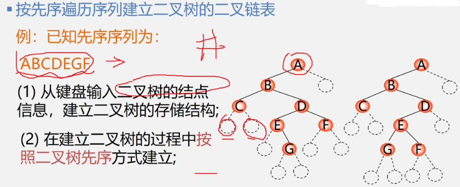

  只有一个先序序列的话, 是没有办法确定唯一的二叉树的. 所以需要添加空位.

  上面两课二叉树, 左边的就是: ABC##DE#G##F###

  【算法步骤】
  (1) 扫描字符序列, 读入字符ch。
  (2) 如果ch是一个"#" 字符,  则表明该二叉树为空树， 即T为NULL; 否则执行以下操作：
  • 申请一个结点空间T;
  • 将ch赋给T-> data;
  • 递归创建T的左子树；
  • 递归创建T的右子树；

  ```c
  //-----二叉树的二叉链表存储表示－－－－－
  typedef struct BiTNode{    
      TElemType data;          //结点数据域    
      struct BiTNode *lchild, *rchild;   //左右孩子指针
  } BiTNode, *BiTree;
  
  int CreateBiTree(BiTree *T) //二级指针, 因为要改实参指针的值
  {
      scanf(&ch); //表示输入个值.别计较具体语法
      if(ch == '#') *T = NULL;  //递归结束, 建空树
      else  //递归创建二叉树
      {
          *T = malloc(sizeof(BiTNode));  //创建根结点
          if(!*T)  exit(OVERFLOW);
          *T->data = ch;          //根节点数据域赋值
          CreateBiTree(&((*T)->lchild)); //给左孩子指针的地址,递归创建左子树
          CreateBiTree(&((*T)->rchild));
      }
      return 0;
  }
  ```

  **算法5.4 复制二叉树**

  复制二叉树就是利用巳有的一棵二叉树复制得到另外一棵与其完全相同的二叉树。根据二叉树的特点， 复制步骤如下：若二叉树不空， 则首先复制根结点， 这相当于二叉树先序遍历算法中访问根结点的语句；然后分别复制二叉树根结点的左子树和右子树， 这相当千先序遍历中递归遍历左子树和右子树的语句。因此， 复制函数的实现与二叉树先序遍历的实现非常类似。

  【算法步骤】
  如果是空树， 递归结束， 否则执行以下操作：
  • 申请一个新结点空间， 复制根结点；
  • 递归复制左子树；
  • 递归复制右子树。

  ```c
  int Copy(BiTree T, BiTree *NewT)
  {
      if( !T ) 
      {
          *NewT = NULL;
          return 0;
      }
      else
      {
          *NewT = malloc( sizeof(BiTNode) ); 
          (*NewT)->data = T->data;
          Copy( T->lchild, &((*NewT)->lchild) );
          Copy( T->rchild, &((*NewT)->rchild) );
      }
      return 1;
  }
  ```

  > 一般, 在嵌入式系统里, 递归要考量一下的. 因为栈空间比较紧张.

  **算法5.5 计算二叉树的深度**

  二叉树的深度为树中结点的最大层次, 二叉树的深度为左右子树深度的较大者加1.

  算法步骤:
  如果是空树, 递归结束, 深度为0, 否则执行以下操作：
  • 递归计算左子树的深度记为m; 
  • 递归计算右子树的深度记为n;
  • 如果m大于n, 二叉树的深度为m+1, 否则为n+1。

  ```c
  int Depth(BiTree T)
  {
      unsigned ldepth = 0, rdepth = 0; 
      if( !T ) return 0; //如果是空树，深度为0, 递归结束
      else
      {
          ldepth = Depth(T->lchild); //递归计算左子树的深度
          rdepth = Depth(T->rchild);  //递归计算右子树的深度
          if (ldepth > rdepth) return (ldepth+1); //较大者加1
          else return (rdepth+1);  //return ldepth>rdepth ? ldepth+1 : rdepth+1
         
      } 
  }
  ```

  **算法5.6 统计二叉树中结点的个数**

  如果是空树，则结点个数为0; 否则，结点个数为左子树的结点个数加上右子树的结点个数再加上1 。

  ```c
  int NodeCount(BiTree T)
  {//统计二叉树T中结点的个数
      if( !T ) return 0; //如果是空树，则结点个数为0, 递归结束
      else
          return (NodeCount(T->lchild) + NodeCount(T->rchild) + 1);
  } //否则结点个数为左子树的结点个数＋右子树的结点个数+1
  ```

  **算法补充: 求二叉树叶子结点的个数**

  若为空数, 则叶子结点个数为0.

  否则, 为左子树的叶子结点个数+右子树的叶子结点个数.

  ```c
  int LeafCount(BiTree T)
  {
      if ( !T ) return 0;
      if (T->lchild == NULL && T->rchild == NULL) //是叶子结点返回1
          return 1;
      else  //不是叶子结点, 再去递归计算子树的叶子.
          return LeafCount(T->lchild) + LeafCount(T->rchild);
  }
  ```

### 5.5.2 线索二叉树

- 线索二叉树的基本概念

  引入: **遍历二叉树是以一定规则将二叉树中的结点排列成一个`线性序列`**, 得到二叉树中结点的先序序列、中序序列或后序序列. **这实质上是`对一个非线性结构进行线性化操作`**, **使每个结点(除第一个和最后一个外) 在这些线性序列中`有且仅有一个`直接前驱和直接后继(**在不至于混淆的情况，后续描述中省去"直接"二字).

  但是，**当以二叉链表作为`存储结构`时**，只能找到结点的左、右孩子信息，而不能直接得到结点在任一序列中的前驱和后继信息，这种信息只有在遍历的动态过程中才能得到，为此引入线索二叉树来**保存这些在动态过程中得到的有关前驱和后继的信息**。

  虽然可以在每个结点中增加两个指针域来存放在遍历时得到的有关前驱和后继信息，但这样做使得结构的存储密度大大降低。由于**有n个结点的二叉链表中必定存在n+1个空链域**，因此可以**充分利用这些空链域**来存放结点的前驱和后继信息。

  试做如下规定：若结点有左子树，则其`lchild`域指示其左孩子，否则令`lchild`域指示其前驱；若结点有右子树，则其`rchild`域指示其右孩子，否则令`rchild`域指示其后继。为了避免混淆，尚需改变结点结构，增加两个`标志域`.

  这种改变指向的指针, 称为线索. 加了线索的二叉树, 就是线索二叉树.

  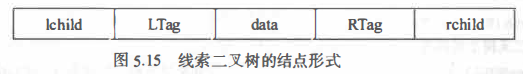

  > `LTag` 为0时, 指向`左孩子`, 为1时指向`前趋`. `RTag` 为0时指向`右孩子`, 为1时指向`后继`.
  >
  > 注意这里的前趋和后继, 不是二叉树意义上的前趋后继, 而是 二叉树以某个序列遍历, 出来一个线性顺序. 按着顺序排前趋后继.

  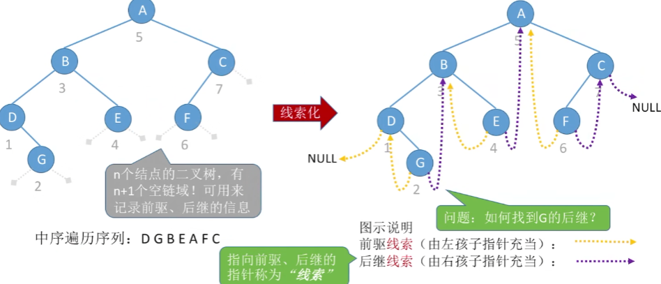

  ```c
  //-----二叉树的二叉线索存储表示-------
  typedef struct BiThrNode
  {
  	TElemType data;
  	struct BiThrNode *lchild,*rchild; //左右孩子指针
      int LTag, RTag;  //左右标志
  }BiThrNode, *BiThrTree;
  ```

  以这种结点结构构成的二叉链表作为二叉树的存储结构，叫做`线索链表`，其中指向结点前驱和后继的指针，叫做`线索`。加上线索的二叉树称之为`线索二叉树`(Threaded Binary Tree)。对二叉树以某种次序遍历使其变为线索二叉树的过程叫做`线索化`。

  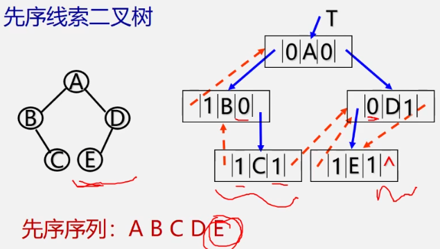

  > A的孩子是B和D, 但A的后继是B.

  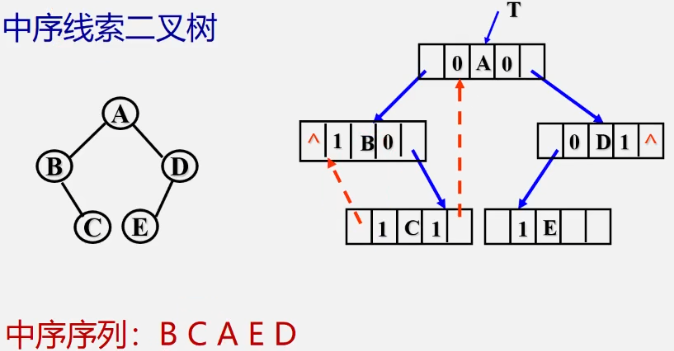

  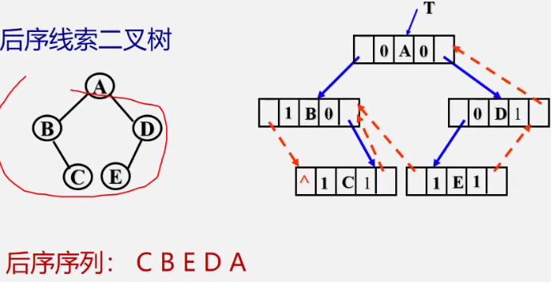

为了方便起见，仿照线性表的存储结构，在二叉树的线索链表上也添加一个`头结点`，并令其lchild 域的指针指向二叉树的根结点，其rchild 域的指针指向中序遍历时访问的最后一个结点；同时，令二叉树中序序列中第一个结点的lchild 域指针和最后一个结点rchild域的指针均指向头结点。这好比为二叉树建立了一个双向线索链表，既可从第一个结点起顺后继进行遍历，也可从最后一个结点起顺前驱进行遠历。

例如图5.16(a)所示为中序线索二叉树，与其对应的中序线索链表如图5.16(b)所示。其中实线为指针（指向左、右子树），虚线为线索（指向前驱和后继）。
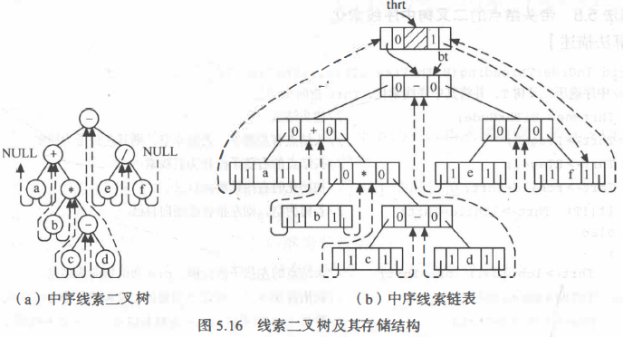

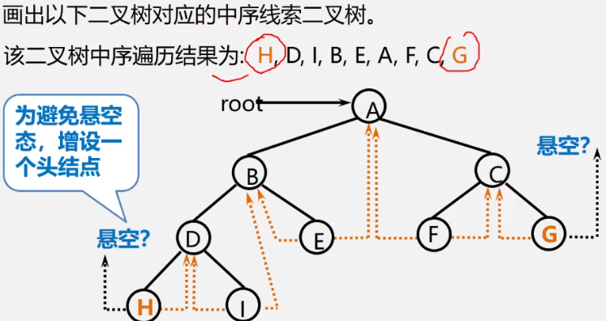

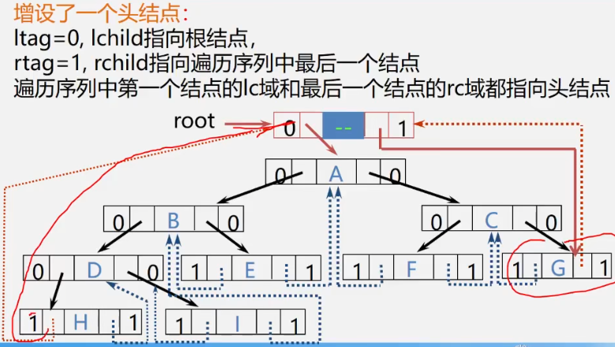

- **算法5.7 以结点p为根的子树各个序线索化**

  【算法步骤】

  - 如果p非空, 左子树递归线索化.

  - 如果p的左孩子为空，则给p加上左线索，将其LTag置为1, 让p的左孩子指针指向pre(前驱); 否则将p的LTag置为0.

  - 如果pre的右孩子为空, 则给pre加上右线索, 将其RTag置为1, 让pre的右孩子指针指向p(后继); 否则将pre的RTag置为0.

  - 将pre指向刚访问过的结点p, 即pre=p.

  - 右子树递归线索化。

    ```c
    void visit(BiThrNode *p)
    {
        if(!p->lchild)    //p的左孩子为空
        {
            p->LTag = 1;    //给p加上左线索
            p->lchild = pre; // p的左孩子指针指向pre (前驱）
        }
        else   p->LTag = 0;
        if(pre)
        {
            if(!pre->rchild)    //pre的右孩子为空
            {
                pre->RTag = 1;  //给pre加上右线索
                pre->rchild = p; //pre的右孩子指针指向p (后继）
            }
            else  pre->RTag = 0; 
        } //if(pre)
        pre = p;     //pre到p的位置.
    }
    //中序线索化
    void InThreading(BiThrTree p)   
    {//pre是全局变量,是前趋,初始化时其右孩子指针为空,便于在树的最左点开始建线索.也可以是局部变量传 参
    	if(p)
        {
            InThreading(p->lchild); //左子树递归线索化
            visit(p);  //处理函数
            InThrending(p->rchild);  //右子树递归线索化
        }//if(p)
    }
    void CreateInThread(BiThrTree T)
    {
        pre = NULL; //全局变量pre初始化.
        if(T)
        {
            InThreading(T);
            if(pre->rchild == NULL)
                pre->RTag = 1; //最后一个结点.
        }
    }
    
    //先序遍历线索化
    void PreThreading(BiThrTree T)
    {
        if(T)
        {
            visit(T);  //处理函数
            if(0 == T->LTag)  //防止先序无限打转.
                PreThreading(T->lchild); //左子树递归线索化
            PreThreading(T->rchild);  //右子树递归线索化
        }
    }
    void CreatePreThread(BiThrTree T)
    {
        pre = NULL; //全局变量pre初始化.
        if(T)
        {
            PreThreading(T);
            if(pre->rchild == NULL)
                pre->RTag = 1; //最后一个结点.
        }
    }
    //后序遍历线索化
    void PostThreading(BiThrTree T)
    {
        if(T)
        {
            PostThreading(T->lchild); //左子树递归线索化
            PostThreading(T->rchild);  //右子树递归线索化
            visit(T);  //处理函数
        }
    }
    void CreatePostThread(BiThrTree T)
    {
        pre = NULL; //全局变量pre初始化.
        if(T)
        {
            PostThreading(T);
            if(pre->rchild == NULL)
                pre->RTag = 1; //最后一个结点.
        }
    }
    ```


- **中序线索二叉树找中序后继**

  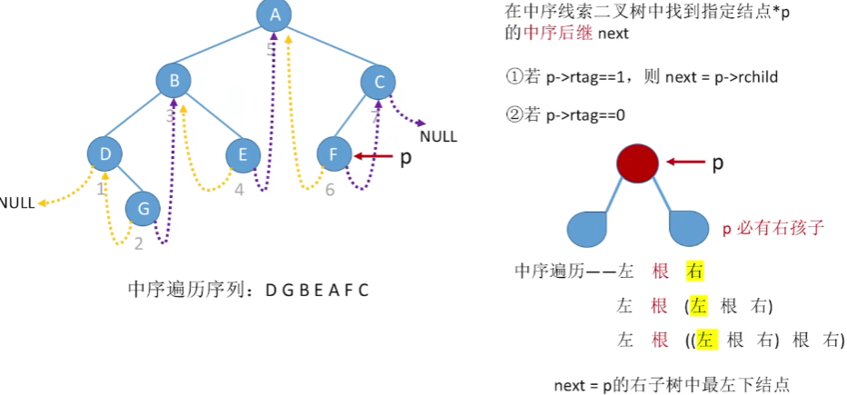

  ```c
  //找到以P为根的子树中, 第一个被中序遍历的结点
  BiThrNode *FirstNode(BiThrNode *p)
  {
      while(0 == p->LTag)  p = p->lchild;
      return p;
  }
  //在中序线索二叉树中找到结点p的后继结点
  BiThrNode *NextNode(BiThrNode *p)
  {
      if(0 == p->RTag) return FirstNode(p->rchild);
      else return p->rchild;
  }
  //对中序线索二叉树进行中序遍历
  void InOrder(BiThrNode *T)
  {
      for(BiThrNode *p=FirstNode(T); p; p=NextNode(p))
          visit(p);
  }
  ```

- 中序线索二叉树找中序前趋

  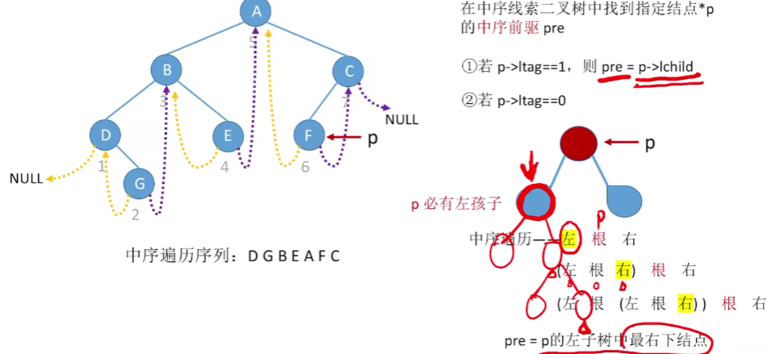

  ```c
  //找到以P为根的子树中, 最后一个被中序遍历的结点
  BiThrNode *LastNode(BiThrNode *p)
  {
      while(0 == p->RTag) p = p->rchild;
      return p;
  }
  //在中序线索二叉树中找到结点p的前趋结点
  BiThrNode *PreNode(BiThrNode *p)
  {
      if(0 == p->LTag) return LastNode(p->lchild);
      else return p->lchild;
  }
  //对中序线索二叉树进行逆向中序遍历
  void ReveInOrder(BiThrNode *T)
  {
      for(BiThrNode *p=LastNode(T); p; p=PreNode(p))
          visit(p);
  }
  ```

- 先序线索二叉树找先序后继

  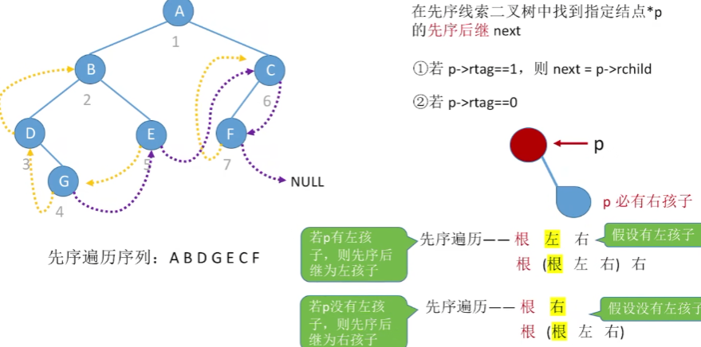

  ```c
  //找到以P为根的子树中, 第一个被先遍历的结点
  BiThrNode *FirstNode(BiThrNode *p)
  {
      if(p) return p;
  }
  //在先序线索二叉树中找到结点p的后继结点
  BiThrNode *NextNode(BiThrNode *p)
  {
      if(0 == p->LTag) return FirstNode(p->lchild);
      else if(0 == p->RTag) return FirstNode(p->rchild);
      else if(1 == p->RTag) return p->rchild;
  }
  //对先序线索二叉树进行先序遍历
  void InOrder(BiThrNode *T)
  {
      for(BiThrNode *p=FirstNode(T); p; p=NextNode(p))
          visit(p);
  }
  ```

- 二叉树的二叉链表找不到先序线索二叉树前趋.

  以下我们把二叉树的二叉链表改为三叉链表来讨论:

  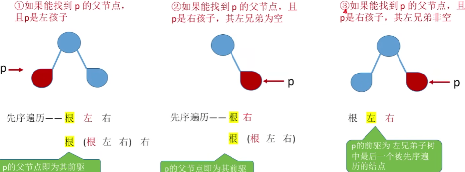

  假如P是根节点, 其父结点就是NULL, 没有前趋.

- 后序线索二叉树找后序前趋

  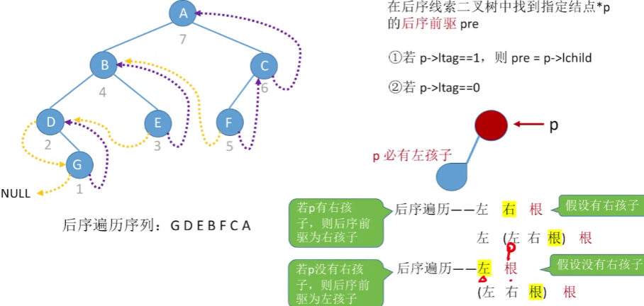

  ```c
  //找到以P为根的子树中, 最后一个被后序遍历的结点
  BiThrNode *LastNode(BiThrNode *p)
  {
     if(p) return p;
  }
  //在后序线索二叉树中找到结点p的前趋结点
  BiThrNode *PreNode(BiThrNode *p)
  {
      if(0 == p->RTag) return p->rchild; //若是有右孩子
      else return p->lchild;  //没有右孩子, 则左孩子不论有没有, 指针域都是前趋.
  }
  
  ```

- 后续线索二叉树若是二叉链表则找不到后序后继

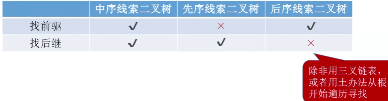

## 5.6 树和森林

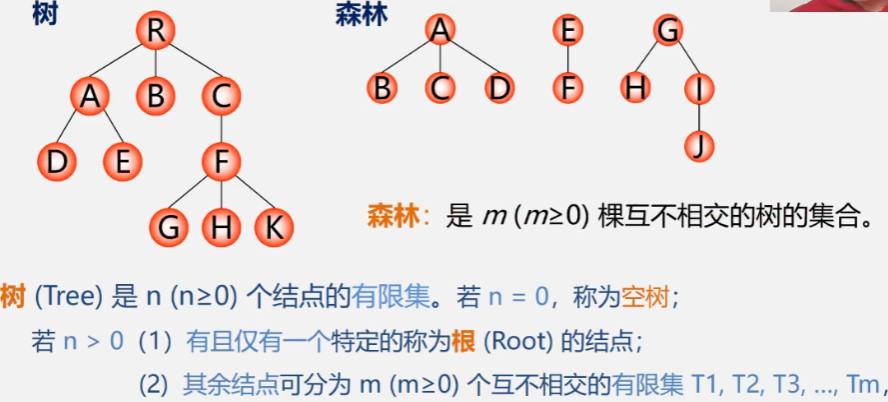

### 5.6.1 树的存储结构

- **双亲表示法**

这种表示方法中， 以一组连续的存储单元存储树的结点，每个结点除了数据域data外，还附设一个parent域用以指示其双亲结点的位置.

这种存储结构利用了每个结点（除根以外）只有唯一的双亲的性质。在这种存储结构下， **求结点的双亲十分方便， 也很容易求树的根，但求结点的孩子时需要遍历整个结构。**

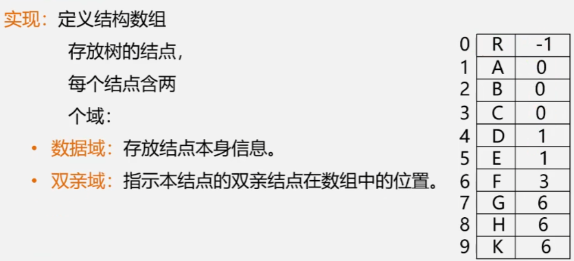

```c
#define MAXSIZE 100  //最大结点数
typedef struct{
    Elemtype data;  //数据域
    int parent;    //双亲域
}PTNode;
typedef struct{ 
    PTNode nodes[MAXSIZE]; //静态分配
    int n;   //记录结点个数.
}PTree;
```

> 注意区分它跟二叉树的顺序存储结构的区别.

- **孩子表示法**

孩子表示法是将每个结点的孩子结点都用单链表链接起来形成一个线性结构, 此时n个结点就有n个孩子链表.叶子结点的孩子链表为空表. n个头指针又组成一个线性表, 用顺序表(含n个元素的结构数组)存储.

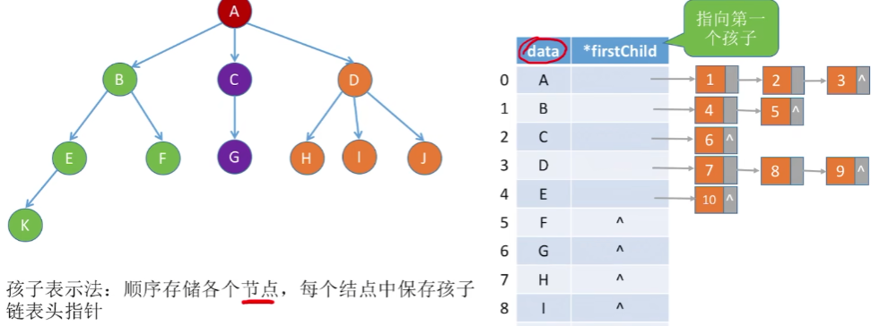

```c
struct CTNode{
    int child; //孩子结点在数组中的下标
    struct CTNode *next;
};
typedef struct {
    ElemType data;
    //int parent;    如有需要, 可以添加双亲域
    struct CTNode *firstChild; //存第一个孩子的地址
}CTBox;
typedef struct{
    CTBox nodes[MAXSIZE];
    int n, r;   //结点数和根的位置
}CTree;
```

- **孩子兄弟表示法**(重要)

又称二叉树表示法, 或二叉链表表示法, 即以二叉链表做树的存储结构. 链表中结点的两个链域分别指向该结点的第一个孩子结点和下一个兄弟结点, 分别命名为firstchild域和nextsibling域.

```c
typedef struct CSNode{
    ElemType data;
	struct CSNode *firstchild, *nextsibling;
}CSNode, *CSTree;
```

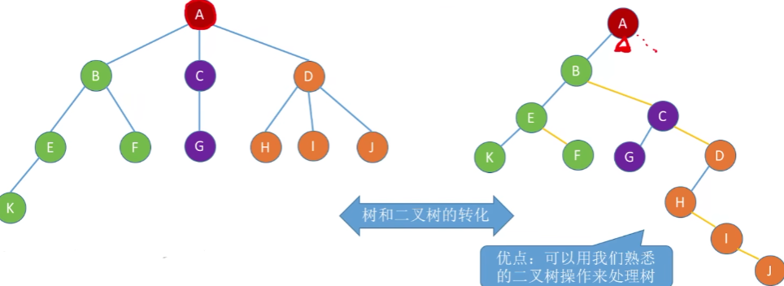

### 树与二叉树的转换

将树转化为二叉树处理, 利用二叉树的算法来实现对树的操作.

由于树与二叉树都可以用二叉链表作存储结构, 则以二叉链表作媒介, 可以导出树与二叉树之间的一个对应关系.

具体就是用孩子兄弟表示法.

树-->二叉树

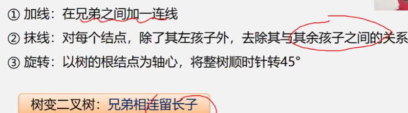

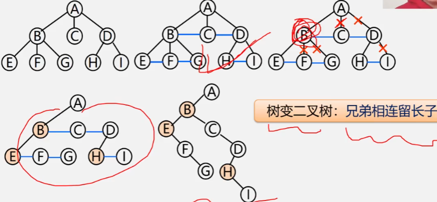

二叉树-->树

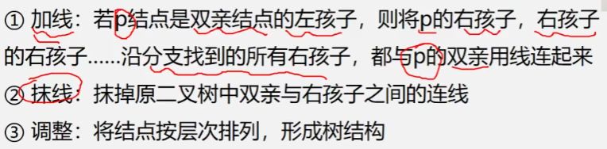

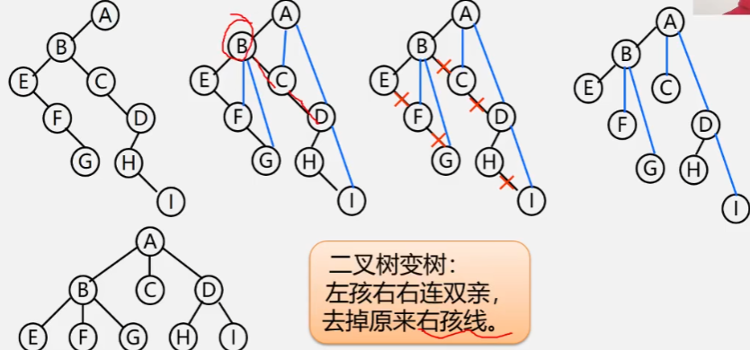

### 5.6.2 森林与二叉树的转换

- 森林转换成二叉树(二叉树与多棵树之间的关系)

  1-将各棵树分别转换成二叉树

  2-将每棵树的根结点用线相连

  3-以第一棵树的根结点为二叉树的根, 再以根结点为轴心, 顺时针旋转, 构成二叉树型结构.

  > 树变二叉 根相连

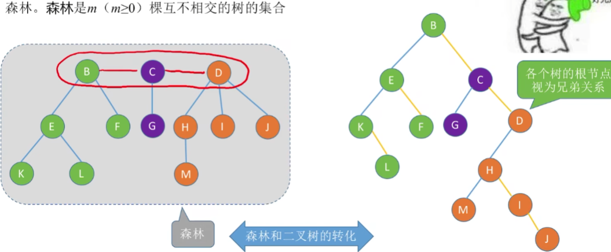

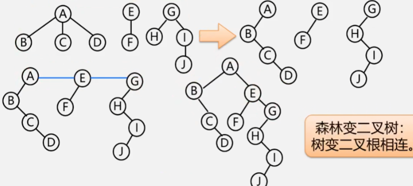

- 二叉树变回森林

  1-抹线: 将二叉树中根结点与其右孩子连线, 及沿右分支搜索到的所有右孩子连线全部抹掉, 使之变成孤立的二叉树.

  2-还原: 将孤立的二叉树还原成树.

  > 去掉全部右孩线, 孤立二叉再还原.

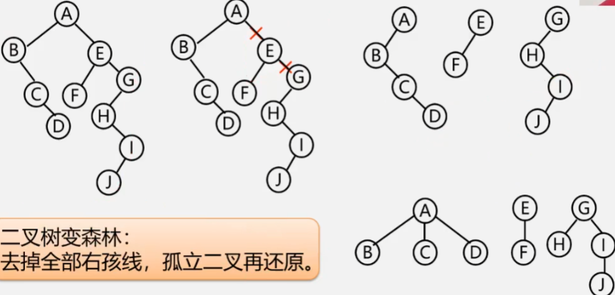

### 5.6.3 树和森林的遍历

- 树的遍历

  - 先根(次序)遍历

    若树不空, 则先访问根结点, 然后依次先根遍历各个子树.

  - 后根(次序)遍历

    若树不空, 则先依次后根遍历各科子树, 然后访问根结点.

  - 层次遍历

    若树不空, 则自上而下 自左到右访问树中每个结点.

  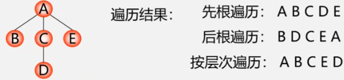

- 森林的遍历

  - 先序遍历森林
    若森林非空，则可按下述规则遍历：
    访问森林中第一棵树的根结点；
    先序遍历第一棵树的根结点的子树森林；
    先序遍历除去第一棵树之后剩余的树构成的森林。

    > 即: 依次从左到右对森林中的每一棵树进行先根遍历.

  - 中序遍历森林

    若森林非空，则可按下述规则遍历：
    中序遍历森林中第一棵树的根结点的子树森林；
    访问第一棵树的根结点；
    中序遍历除去第一棵树之后剩余的树构成的森林。

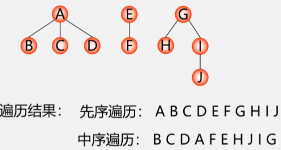

由森林与二叉树之间转换的规则可知，当森林转换成二叉树时，其第一棵树的子树森林转换成左子树，剩余树的森林转换成右子树，则上述森林的先序和中序遍历即为其对应的二叉树的先序和中序遍历。

由此可见， 当以二叉链表做树的存储结构时， 树的先根遍历和后根遍历可借用二叉树的先序遍历和中序遍历的算法实现。

## 5.7 哈夫曼树及其应用

引入:

如果按照顺序来写判断, 那可以要判很多次. 相反, 按照频率来排判断的前后顺序, 可以减少非常多的比较次数.而节省时钟周期数, 达到更快的效果.

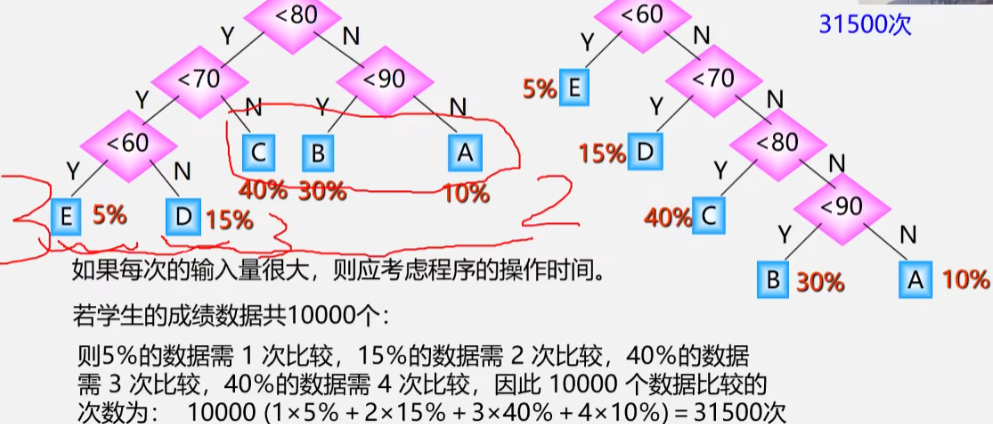

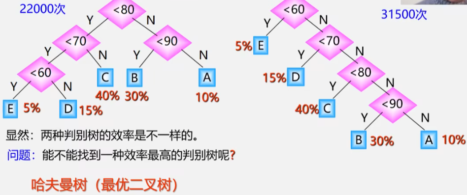

### 5.7.1 哈夫曼树的基本概念

哈夫曼(Huffman)树又称`最优树`, 是一类`带权路径长度最短的树`, 在实际中有广泛的用途.

(1 )`路径`：从树中一个结点到另一个结点之间的`分支`构成这两个结点之间的路径。
(2) `路径长度`：路径上的`分支数目`称作路径长度。
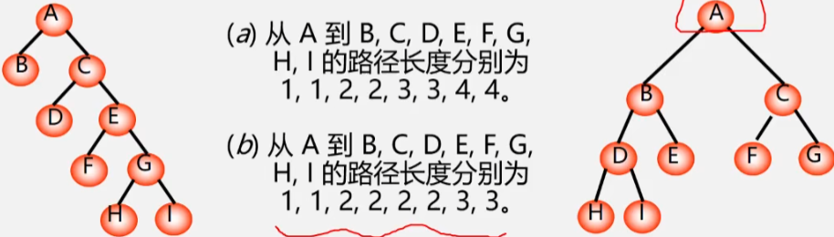

(3) `树的路径长度`：从树根到每一结点的路径长度之和。记作TL.
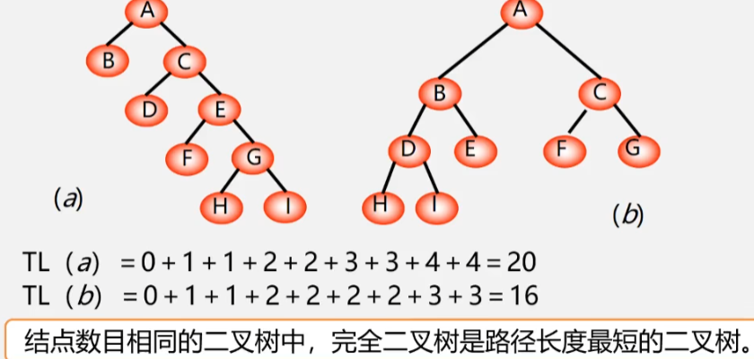

(4) `权`(weight): 赋予某个实体的一个量, 是对实体的某个或某些`属性`的数值化描述. 在数据结构中, 实体有结点(元素)和边(关系)两大类,  所以对应有结点权和边权. 结点权或边权具体代表什么意义, 由具体情况决定. 如果在一棵树中的结点上带有权值, 则对应的就有带权树等概念.
(5) `结点的带权路径长度`：从`该结点到树根之间`的`路径长度`与结点上`权`的`乘积`.
(6) `树的带权路径长度`：树中所有叶子结点的带权路径长度之和.
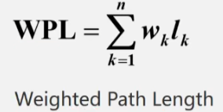
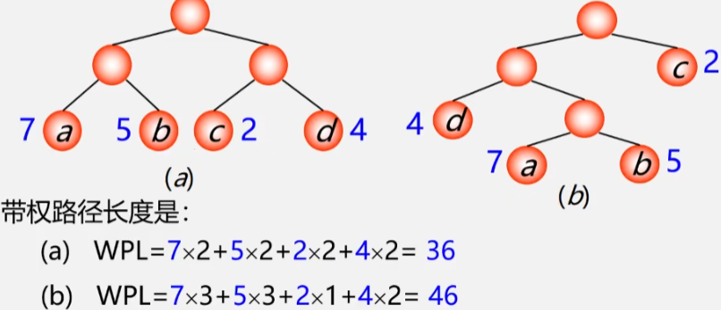
(7) `哈夫曼树`: 假设有m个权值, 可以构造一棵含n个叶子结点的`二叉树`, 每个叶子结点的权为Wi, 则其中带权路径长度`WPL最小的二叉树`称做`最优二叉树`或`哈夫曼树`.

> 带权路径长度最短 是在 度相同的树中比较而得到的结果. 因此有最优二叉树, 三叉树等.

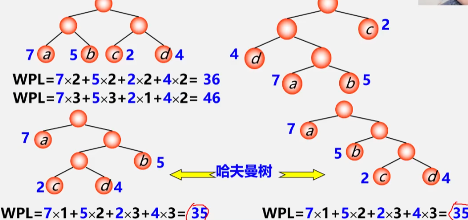

> 满二叉树不一定是哈夫曼树。具有相同带权结点的哈夫曼树并不唯一。
> 权值越大的结点离根结点越近。根据这个特点，哈夫曼最早给出了一个构造哈夫曼树的方法，称哈夫曼算法。

### 5.7.2 哈夫曼树的构造算法

1. **哈夫曼树的构造过程**

   哈夫曼树中权值越大的叶子离根越近. 这也是贪心算法的思想.

   (1) 根据给定的n个权值{W1, W2,…，Wn}, 构造n棵只有`根结点`的二叉树，这n棵二叉树构成一个森林F={T1,T2,..,Tn}, 其中Ti只有一个带权为Wi的根结点.
   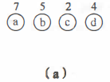**构造森林全是根**

   (2) 在森林F中选取两棵根结点的权值最小的树作为左右子树构造一棵新的二叉树, 且置新的二叉树的根结点的权值为其左, 右子树上根结点的权值之和.
   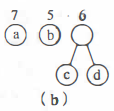**选用两小造新树**

   (3) 在森林F中删除这两棵树, 同时将新得到的二叉树加入F中.

   > 删除两小添新人

   (4) 重复(2)和(3), 直到F只含一棵树为止. 这棵树便是哈夫曼树.
   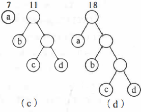**重复2 3剩单根**

> 在构造哈夫曼树时, 首先选择权小的, 这样保证权大的离根较近, 这样一来, 在计算树的带权路径长度时, 自然会得到最小带权路径长度, 这种生成算法是一种典型的贪心法.
>
> 哈夫曼树中, 只有度为2或0的结点, 没有度为1的结点. 
> 包含n个叶子结点的哈夫曼树中, 一共有`2n-1`个结点.
> 包含n棵树的森林要经过`n-1`次合并才能形成哈夫曼树, 产生`n-1`个新节点. 产生的`n-1`个新节点都有2个孩子.
> 那原来那n个结点都是叶子结点, 度为0.

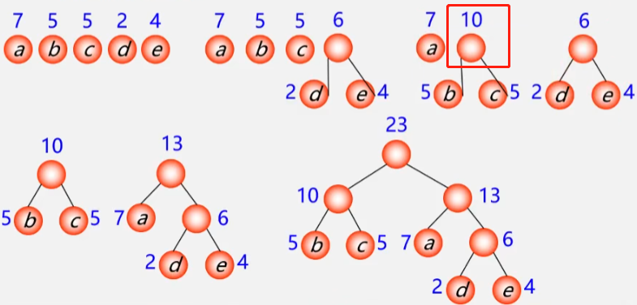

2. **哈夫曼算法的实现** 

哈夫曼树是一种二叉树, 当然可以采用前面介绍过的通用存储方法, 而由于哈夫曼树中没有度为1的结点, 则一棵有n个叶子结点的哈夫曼树共有2n-1个结点, 可以存储在一个大小为2n-1的一维数组中. 树中每个结点还要包含其双亲信息和孩子结点的信息, 由此, 每个结点的存储结构设计如图.
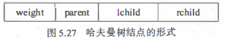

```c
//- - - - -哈夫曼树的存储表示－ － － － － －
typedef struct{
    int weight; //结点的权值
    int parent, lchild, rchild; //结点的双亲、左孩子、右孩子的下标
}HTNode, *HuffmanTree;
```

哈夫曼树的各结点存储在由HuffmanTree定义的动态分配的数组中, 为了实现方便, 数组的`0号单元不使用`, 从1号单元开始使用, 所以数组的大小为`2n`. 将叶子结点集中存储在前面部分`1~n `个位置, 而后面的n-1个位置存储其余非叶子结点.

- **算法5.10 构造哈夫曼树**

  【算法步骤】
  构造哈夫曼树算法的实现可以分成两大部分:

  - 初始化: 首先动态申请2n个单元; 然后循环2n-1次, 从1号单元开始, 依次将1至2n-1所有单元中的双亲, 左孩子, 右孩子的下标都初始化为0; 最后再循环n次, 输入前n个单元中叶子结点的权值.
  - 创建树: 循环n-1次, 通过n-1次的选择、删除与合并来创建哈夫曼树。选择是从当前森林中选择`双亲为0`且`权值最小`的两个树根结点s1和s2; `删除`是指将结点s1和s2 的`双亲改为非0`; 合并就是将s1 和s2 的权值和作为一个新结点的权值依次存入到数组的第n+1之后的单元中, 同时记录这个新结点左孩子的下标为s1, 右孩子的下标为s2.

  ```c
  void CreateHuffmanTree(HuffmanTree *HT, int n) //二级指针
  {
      if(n<=1) return;
      
      int m = 2*n-1;  //数组元素个数
      *HT = malloc((m+1)*sizeof(HTNode)); //0号单元不用 申请的地址给实参的指针
      for(int i = 1; i <= m; i++) //开始初始化
          (*HT)[i].lch = (*HT)[i].lch = (*HT)[i].parent = 0;//初始化 []优先级最高
      for(int i = 1; i <= n; i++)
      	scanf( "%d", &((*HT)[i].weight) );//初始化这n个结点的权值
      //开始创建哈夫曼树
      for(int i=n+1; i<=m; i++) //从n+1这个下标开始, 循环n-1次
      {
          select(*HT, i-1, s1, s2);//在HT[k](k是1~i-1)中选择两个其双亲域为0且权值最小的结
                               //点，并返回它们在HT中的序号sl 和s2
          (*HT)[s1].parent = (*HT)[s2].parent = i; //从森林F删除s1,s2
          (*HT)[i].lch = s1;      //置孩子下标
          (*HT)[i].rch = s2;      
          (*HT)[i].weight = (*HT)[s1].weight + (*HT)[s2].weight; //新树入森林 parent之前已经初始化为0了
      }
  }
  ```

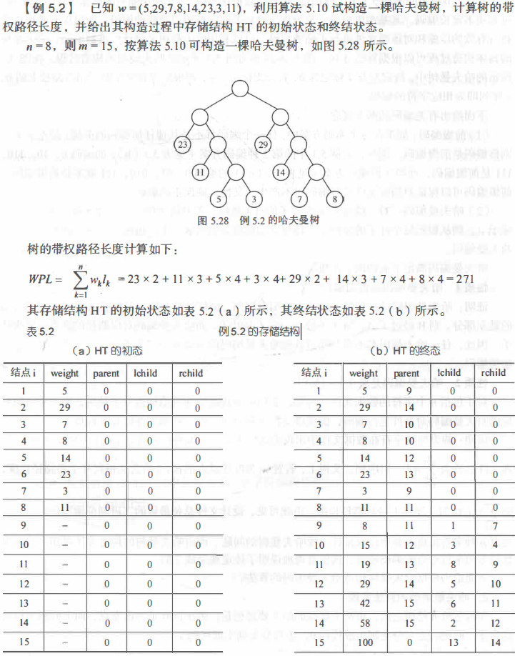

### 5.7.3 哈夫曼编码

哈夫曼树在`通信`, `编码`和`数据压缩`等技术领域有着广泛的应用, 下面讨论一个构造通信码的典型应用:`哈夫曼编码.`

1. **哈夫曼编码的主要思想**

   基本思想是: 为出现次数较多的字符编以较短的编码. 为确保对数据文件进行有效的压缩和对压缩文件进行正确的解码, 可以利用哈夫曼树来设计二进制编码.

   定长编码:
   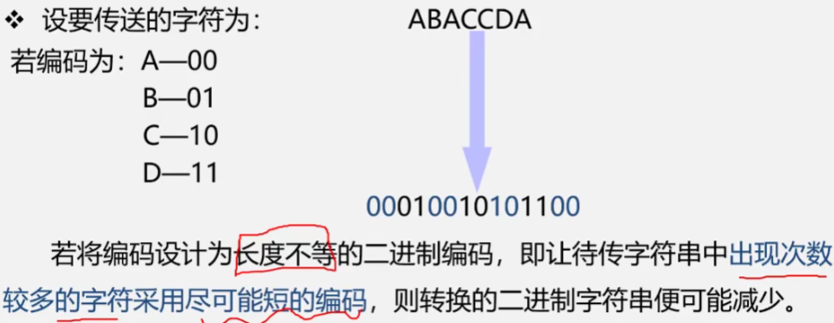

   不定长编码:
   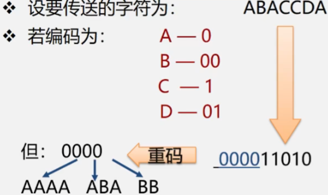

   **所以关键在于, 要设计长度不等的编码, 则必须使任一字符的编码都不是另一个字符的编码的前缀.** 这种编码就称为`前缀编码`.

   `哈夫曼编码`: 对一棵具有n个叶子的哈夫曼树, 若对树中的每个左分支赋予0, 右分支赋予1. 则从根到每个叶子的路径上, 各分支的赋值分别构成一个二进制串, 该二进制串就称为哈夫曼编码。
   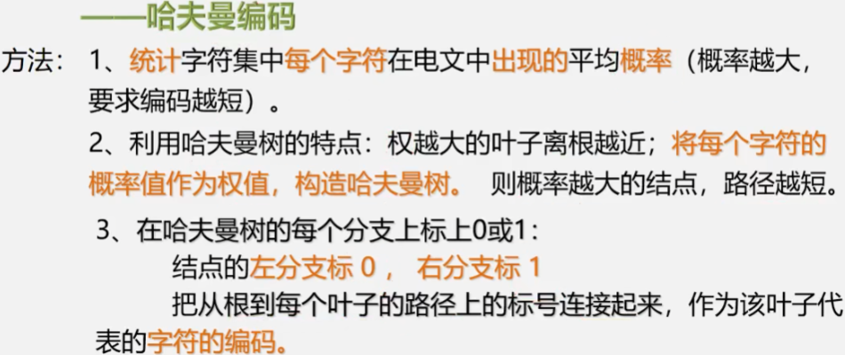

   看个例子:
   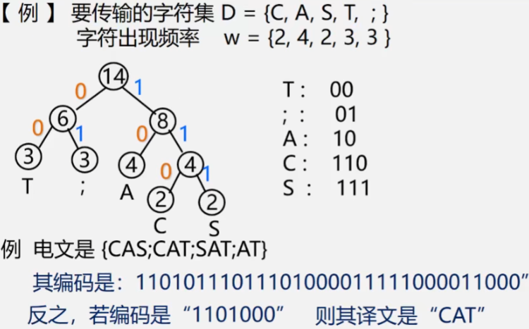 

   - **哈夫曼编码的两个特性**:

     一. **哈夫曼编码是前缀编码**:

     因为没有一片树叶是另一个树叶的祖先, 所以每个叶子结点的编码就不可能是其他叶子结点编码的前缀.

     二. **哈夫曼编码是最优前缀编码**:

     因为哈夫曼树的带权路径长度最短, 所以字符编码的总长最短.

   - **因为哈夫曼树不是唯一的, 所以哈夫曼编码也不是唯一的. 但都是最优前缀编码.**

   再看个例子:
   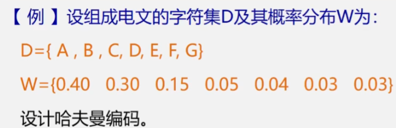

   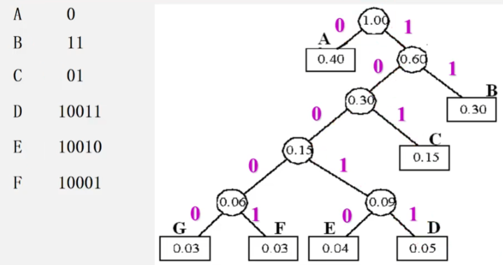

   > 写代码的时候可以乘以100, 把小数变成整数处理.

2. **哈夫曼编码的算法实现**

   在构造哈夫曼树之后，求哈夫曼编码的主要思想是：依次以叶子为出发点，向上回溯至根结点为止。回溯时走左分支则生成代码0, 走右分支则生成代码1.

   由于每个哈夫曼编码是变长编码，因此使用一个指针数组来存放每个字符编码串的首地址。

   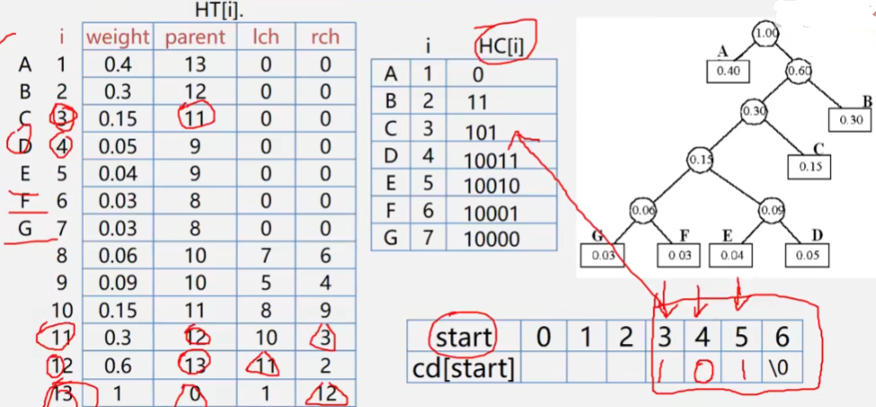

   由于每个哈夫曼编码是变长编码，因此使用一个指针数组来存放每个字符编码串的首地址。

   A到G 7个字符, 每个字符的哈夫曼编码路径长度不同.

   ```c
   //-------哈夫曼编码表的存储表示-------
   typedef char **HuffmanCode;  //动态分配数组存储哈夫曼编码表
   ```

   各字符的哈夫曼编码存储在由HuffmanCode定义的动态分配的数组HC中, 为了实现方便,数组的0号单元不使用, 从1号单元开始使用, 所以数组HC的大小为n+1, 即编码表HC包括n+1行.

   但因为每个字符编码的长度事先不能确定，所以不能预先为每个字符分配大小合适的存储空间。为不浪费存储空间，动态分配一个长度为n( 字符编码长度一定小于n)的一维数组cd, 用来临时存放当前正在求解的第i(1<=i<=n) 个字符的编码，当第i个字符的编码求解完毕后，根据数组cd的字符串长度分配HC[i]的空间，然后将数组cd中的编码复制到HC[i]中。

   因为求解编码时是从哈夫曼树的叶子出发, 向上回溯至根结点. 所以对于每个字符, 得到的编码顺序是从右向左的, 故将编码向数组cd存放的顺序也是从后向前的, 即每个字符的第1个编码存放在cd[n-2]中(cd[n-1]存放字符串结束标志'\0'), 第2个编码存放在cd[n-3]中, 依此类推, 直到全部编码存放完毕.

   - **算法5.11 根据哈夫曼树求哈夫曼编码**

     【算法步骤】

     (1) 分配存储n个字符编码的编码表空间HC, 长度为n+1; 分配临时存储每个字符编码的动态数组空间cd, cd[n-1]置为'\0'。

     (2) 逐个求解n个字符的编码, 循环n次, 执行以下操作:

     - 设置变量start用于记录编码在cd中存放的位置, start初始时指向最后, 即编码结束符位置n-1;

     - 设置变量c用于记录从叶子结点向上回溯至根结点所经过的结点下标, c初始时为当前待编码字符的下标i, f用于记录i的双亲结点的下标;

     - 从叶子结点向上回溯至根结点, 求得字符i的编码, 当f 没有到达根结点时, 循环执行以下操作:

       回溯一次start向前指一个位置，即`--start;`

       若结点c是f的左孩子, 则生成代码0, 否则生成代码1,  生成的代码0 或1保存在cd[start]中；

       继续向上回溯, 改变c和f的值.

     - 根据数组cd的字符串长度为第i个字符编码分配空间HC[i], 然后将数组cd中的编码复制到HC[i]中.

       (3)  释放临时空间cd.

     ```c
     void CreateHuffmanCode(HuffmanTree HT,HuffmanCode *HC,int n)
     {	//从叶子到根逆向求每个字符的哈夫曼编码,存储在编码表HC中
         
         //分配存储n个字符编码的编码表空间 
         //申请的数组地址给形参 三级指针HC 因为要把实参二级指针HC的值改变
     	*HC = malloc((n+1) * sizeof(char *)); //n+1个指针
         char *cd = malloc(n*sizeof(char)); //分配临时存放每个字符编码的动态数组空间
         cd[n-1] = '\0';  //编码结束符
         for(int i = 1; i <= n; ++i) //逐个字符求哈夫曼编码
         {
             int start = n-1; //start开始时指向最后,即编码结束符位置
             int c = i;    
             int f = HT[i].parent; //f指向结点c的双亲结点
             while(f != 0) //从叶子结点开始向上回溯， 直到根结点
             {
                 --start;       //回溯一次 向前指一个位置
                 if( HT[f].lchild == c ) cd[start] = '0'; //c是f的左孩子则生成代码0
                 else cd[start] = '1';    //c是f的右孩子则生成代码1
                 c = f;
                 f = HT[f].parent;  //继续向上回溯
             }  //求出第l.个字符的编码
             (*HC)[i] = malloc((n-start)*sizeof(char)); //为第i个字符编码分配空间
             strcpy((*HC)[i], &cd[start]); //将求得的编码从临时空间cd复制到HC的当前行中
         }  //for
         free(cd); //结束, 释放cd
     }
     ```

     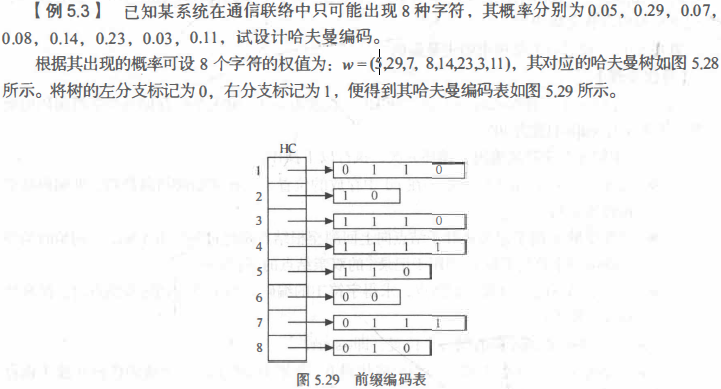

3. **文件的编码和译码**

   (1) 编码
   有了字符集的`哈夫曼编码表`之后，对数据文件的编码过程是：依次读入文件中的字符c, 在哈夫曼编码表HC中找到此字符，将字符c转换为编码表中存放的编码串。
   步骤: 
   一. 输入各字符和其权值
   二. 构造哈夫曼树--HT[i]
   三. 进行哈夫曼编码 --- HC[i]
   四. 查找HC[i], 得到各字符的哈夫曼编码

   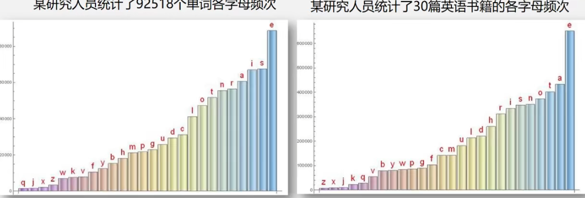

   (2) 译码
   对编码后的文件进行译码的过程必须借助哈夫曼树。具体过程是：依次读入文件的二进制码，从哈夫曼树的根结点(即HT[m])出发, 若当前读入0, 则走向左孩子, 否则走向右孩子.一旦到达某一叶子HT[i]时便译出相应的字符编码HC[i].然后重新从根出发继续译码, 直至文件结束.
   一. 构造哈夫曼树
   二. 依次读入二进制码
   三. 读入0, 则走左孩子, 读1则走右孩子.
   四. 一旦到达某叶子时, 即是译出的字符
   五. 然后再从根出发继续译码. 直到结束

   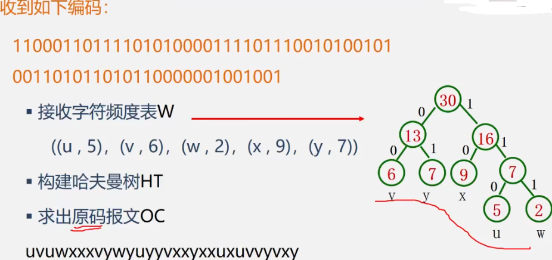

   > 代码就不在这里写了.