# 第6章 图

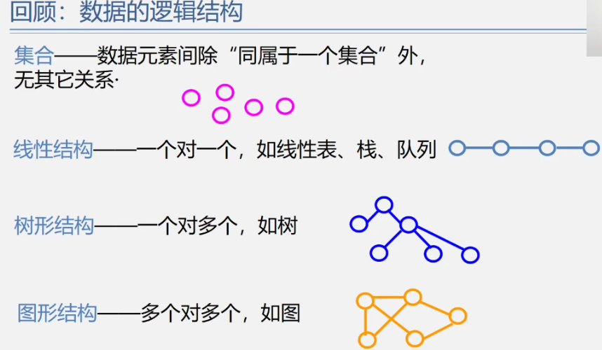
图是一种比线性表和树更为复杂的数据结构。
在线性表中，数据元素之间仅有线性关系，每个数据元素只有一个直接前驱和一个直接后继；
在树形结构中，数据元素之间有着明显的层次关系，并且每一层中的数据元素可能和下一层中的多个元素(即其孩子结点)相关，但只能和上一层中一个元素(即其双亲结点)相关；
而在图结构中，结点之间的关系可以是任意的，图中任意两个数据元素之间都可能相关。

在离散数学中，图论是专门研究图的性质的数学分支，而在数据结构中，则应用图论的知识讨论如何在计算机上实现图的操作，因此主要学习图的存储结构，以及若于图的操作的实现。

## 6.1 图的定义和基本术语

### 6.1.1 图的定义和基本术语

图(Graph) G由两个集合V(Vertex)和E(Edge)组成，记为G=(V,E) , 其中V是顶点(数据元素)的`有穷非空集合`，E是边的`有穷集合`。V(G)和E(G)通常分别表示图G的顶点集合和边集合，E(G)可以为空集。若E(G)为空，则图G只有顶点而没有边。	

对于图G, 若边集E(G)为有向边的集合，则称该图为有向图；若边集E(G)为无向边的集合，则称该图为无向图。

在有向图中，顶点对`<x, y>`是有序的，它称为从`顶点x到顶点y`的一条有向边。因此`<x,y>与<y, x>`是不同的两条边。顶点对用一对尖括号括起来，x是有向边的`始点`，y是有向边的`终点`。<x, y>也称作一条`弧`，则x为`弧尾`， y为`弧头`。

在无向图中, 顶点对(x, y)是`无序`的, 它`称为`与顶点x和顶点y相关联的一条`边`. 这条边没有特定的方向, `(x,y)与 (y,x)`是同一条边. 为了有区别于有向图, 无向图的顶点对用一对圆括号括起来.
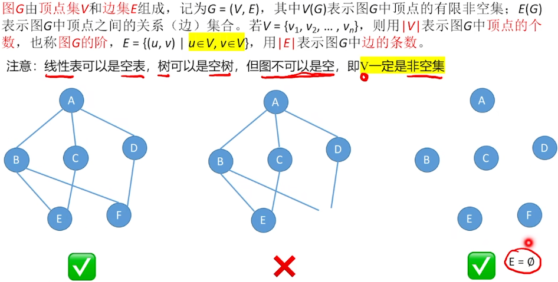

- 相关概念

`完全图`: 任意两个顶点都有一条边相连.
`无向完全图和有向完全图`: 对于无向图， 若具有`n(n-1)/2 `条边，则称为无向完全图。
对于有向图， 若具有`n(n-1)`条弧，则称为有向完全图。
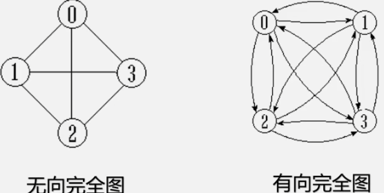

`稀疏图和稠密图`：有很少条边或弧(如e<nlog~2~n) 的图称为`稀疏图`, 反之称为`稠密图`。

`权和网`：在实际应用中,每条边可以标上`具有某种含义的数值`, 该数值称为该边上的`权`. 这些权可以表示从一个顶点到另一个顶点的`距离`或`耗费`. 这种带权的图通常称为`网`. 

`邻接`: 有`边/弧相连的两个顶点`之间的关系. 存在边(Vi,Vj), 则称Vi和Vj互为邻接点. 存在<Vi,Vj>则称Vi邻接到Vj, Vj邻接于Vi.

`关联(依附)` : `边/弧与顶点之间`的关系. 存在(Vi,Vj)/<Vi,Vj>, 则称该边/弧关联(依附)于Vi和Vj.
`顶点的度, 入度与出度`: 顶点v 的度为TD(v) = ID(v) + OD(v).
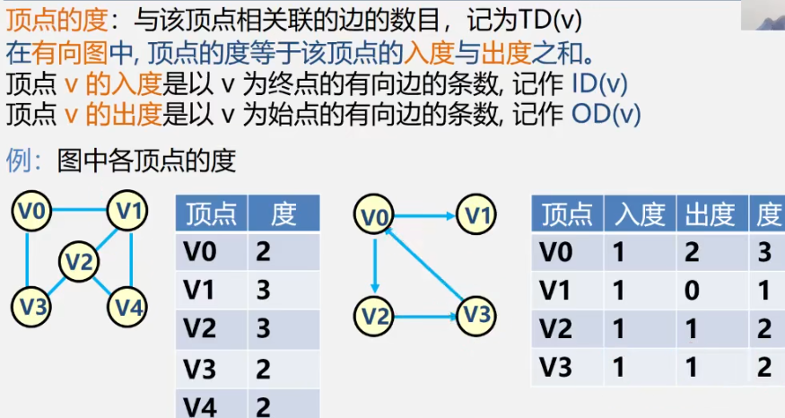

`有向树`: 有一个顶点的入度为0, 其余顶点的入度均为1的有向图称为有向树。
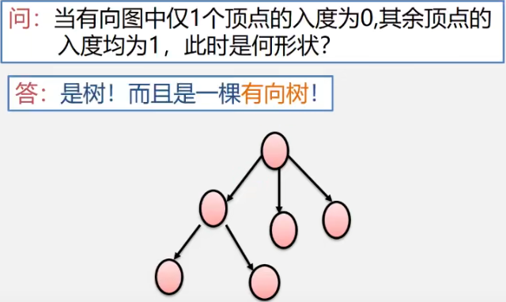

`路径`: `接续`的 边 构成的`顶点序列`. V1,V3,V4 这个路径就是2条边, 三个顶点

`路径长度`: 路径上 `边或弧的数目/权值之和`.

`回路`或`环`：第一个顶点和最后一个顶点相同的路径称为回路或环。

`简单路径`: 序列中顶点不重复出现的路径称为简单路径. 路径起点和终点是可以相同的.

`简单回路`或`简单环`: 除了第一个顶点和最后一个顶点之外, 其余顶点不重复出现的回路, 称为简单回路或简单环.
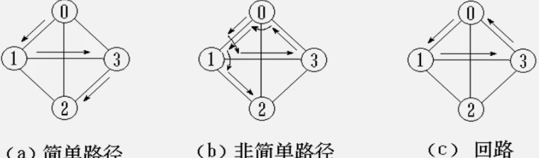

`连通`,`连通图`：在无向图G 中, 如果从顶点`v`到顶点`v'有路径`, 则称`v` 和`v'`是连通的. 如果对于图中`任意两个`顶点`Vi, Vj`, `Vi 和Vj `都是连通的, 则称G是连通图.  

`强连通图`: 在有向图G中, 如果对于图中每一对`Vi,Vj`, `Vi不等于Vj`, 从`Vi到Vj` 和`从Vj到Vi`都存在`路径`, 则称G是强连通图。
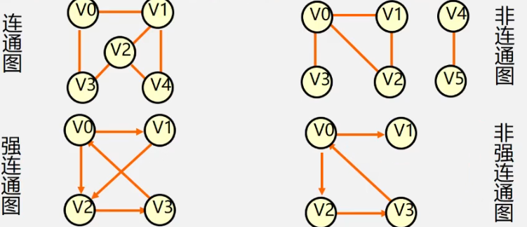

`子图`:
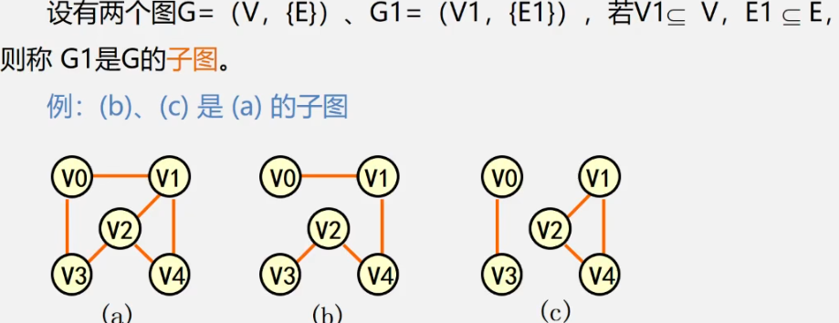

`连通分量`和`强连通分量`: 所谓连通分量, 指的是`无向图`中的极大连通子图. 有`向图中`的极大强连通子图称作有向图的强连通分量。
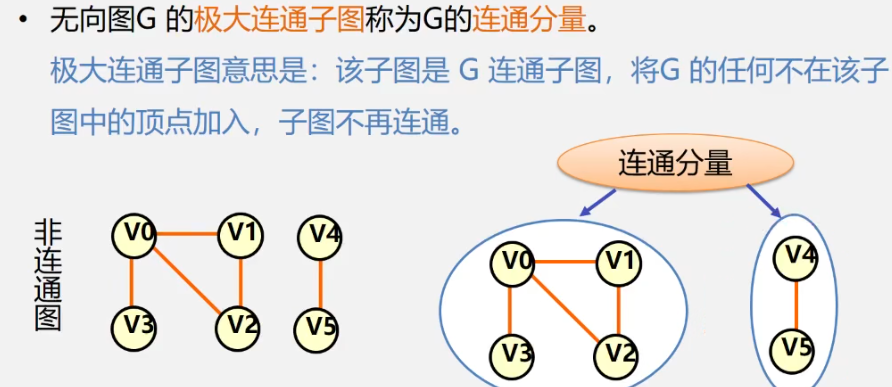
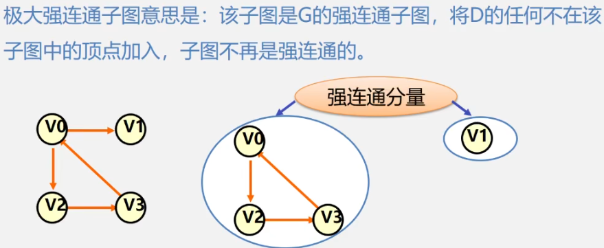

`极小连通子图` : 该子图是G的连通子图, 在该子图中删除任何一条边, 该子图不再连通.

连通图的`生成树`： 一个`极小连通子图`,它`含有图中全部顶点`, 但只有足以构成一棵树的`n-1`条边, 这样的连通子图称为连通图的生成树.

> 一棵有n个顶点的`生成树`有且仅有n-1条边。如果一个图有n个顶点和小于n-1条边，则是非连通图。如果它多于`n-1`条边, 则一定有环. 但是, 有`n-1`条边的图不一定是生成树。

`生成森林`: 一个有向图的生成森林是由若干棵有向树组成, 含有图中全部顶点, 但只有足以构成若干棵不相交的有向树的弧。

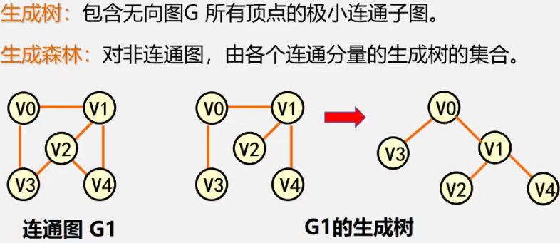

## 6.2 案例引入

案例6.1: 六度空间理论

六度空间理论是一个数学领域的猜想, 又称为六度分割理论(Six Degrees of Separation). 六度空间理论是20 世纪60 年代由美国的心理学家米格兰姆(Stanley Milgram) 提出的, 理论指出: 你和任何一个陌生人之间所间隔的人不会超过6个, 也就是说, 最多通过6个中间人你就能够认识任何一个陌生人.


## 6.3 图的类型定义

图是一种数据结构，加上一组基本操作，就构成了抽象数据类型。抽象数据类型图的定义如下：
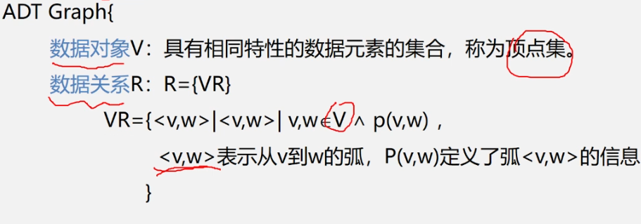

基本操作：
**CreateGraph(&G, V, VR)**
初始条件：V是图的顶点集，VR是图中弧的集合。
操作结果：按V和VR的定义构造图G。
DestroyGraph (&G)
初始条件：图G存在。
操作结果：销毁图G。
LocateVex(G,u)
初始条件：图G存在，u和G中顶点有相同特征。
操作结果：若G中存在顶点u, 则返回该顶点在图中的位置；否则返回其他信息。
GetVex(G,v)
初始条件：图G存在，v是G中某个顶点。
操作结果：返回v的值。
PutVex(&G,v,value);
初始条件：图G存在，v是G中某个顶点。
操作结果：对v赋值value。
FirstAdjVex(G,v);
初始条件：图G存在，v是G中某个顶点。
操作结果：返回v的第一个邻接顶点。若v在G中没有邻接顶点，则返回“空” 。
NextAdjVex(G,v,w);
初始条件：图G存在，v是G中某个顶点，w是v的邻接顶点。
操作结果：返回v的（相对千w的）下一个邻接顶点。若w是v的最后一个邻接点，则返回“空” 。
InsertVex(&G,v)
初始条件：图G存在，v和图中顶点有相同特征。
操作结果：在图G中增添新顶点v。
DeleteVex(&G,v)
初始条件：图G存在，v是G中某个顶点。
操作结果：删除G中顶点v及其相关的弧。
InsertArc(&G,v,w)
初始条件：图G存在，v和w是G中两个顶点。
操作结果：在G中增添弧<v, w>, 若G是无向图，则还增添对称弧<w, v>。
Dele七eArc(&G,v,w)
初始条件：图G存在，v和w是G中两个顶点。
操作结果：在G中删除弧<v, w>, 若G是无向图，则还删除对称弧<w, v>。
**DFSTraverse(G)**
初始条件：图G存在。
操作结果：对图进行**深度优先遍历**，在遍历过程中对每个顶点访问一次。
**BFSTraverse(G)**
初始条件：图G存在。
操作结果：对图进行**广度优先遍历**，在遍历过程中对每个顶点访问一次。

## 6.4 图的存储结构

> 由于图的结构比较复杂, 任意两个顶点之间都可能存在联系, 因此无法以数据元素在存储区中的物理位置来表示元素之间的关系, 即图没有顺序存储结构, 但可以借助`二维数组来表示元素之间的关系`, 即`邻接矩阵表示法`。另一方面, 由于图的任意两个顶点间都可能存在关系, 因此, 用`链式存储`表示图是很自然的事, 图的链式存储有多种, 有`邻接表,` `十字链表`和`邻接多重表`, 应根据实际需要的不同选择不同的存储结构.

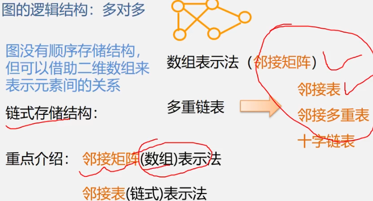

### 6.4.1 邻接矩阵

1. **邻接矩阵表示法**

   邻接矩阵(Adjacency Matrix)是表示顶点之间相邻关系的矩阵.设G(V, E)是具有n个顶点的图, 则G的邻接矩阵是具有如下性质的n阶方阵:
   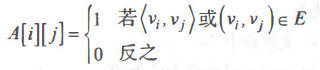

   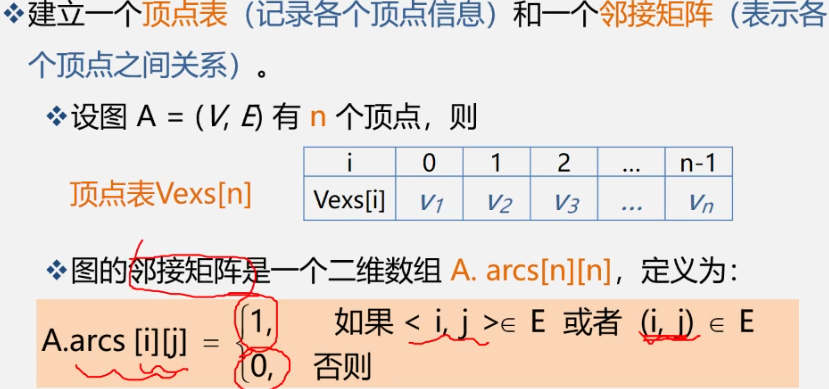

   - **举个栗子:**

   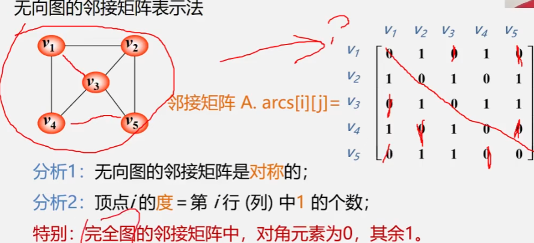

   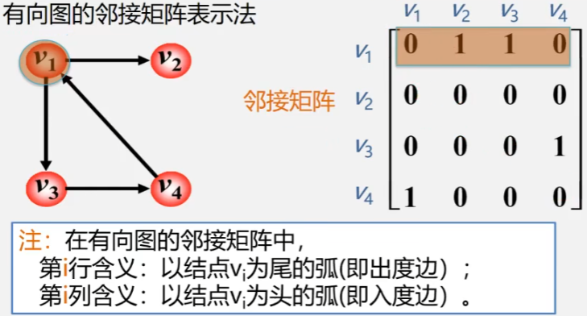

   > 有向图邻接矩阵, 用二维数组的话, 就是1维下标指向2维下边

   分析1: 有向图的邻接矩阵可能是`不对称的`.

   分析2: 顶点的出度= `第i行`元素之和

   ​	    顶点的入度= `第i列`元素之和

   ​	    顶点的度 =  `第i行`元素之和 + `第i列`元素之和

2. **网的邻接矩阵表示法**

   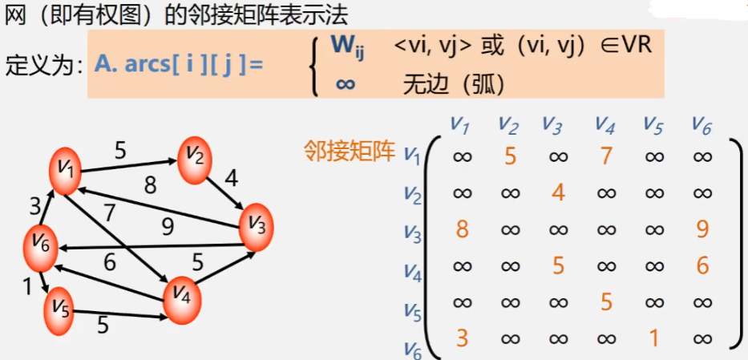

3. **邻接矩阵的存储表示**

   用邻接矩阵表示法表示图, 除了一个用来存储邻接矩阵的二维数组外, 还需要用一个一维数组来存储顶点信息.

   ```c
   //-----图的邻接矩阵存储表示－－－－－
   #define MaxInt  32767    //表示无穷大值, 即∞
   #define MVNum 100       //顶点最大数
   
   typedef char VerTexType; //假设顶点的数据类型为字符型
   typedef int ArcType;   //假设边的权值类型为整型
   
   typedef struct {
       VerTexType vexs[MVNum]; //顶点表
       ArcType arcs[MVNum][MVNum];  //邻接矩阵
       int vexnum, arcnum;  //图的当前点数和边数
   } AMGraph; //Adjacency Matrix Graph
   ```

4. **采用邻接矩阵表示法创建无向网**

   算法6.1 采用邻接矩阵表示法创建无向网

   【算法步骤】：

   1. 输入总顶点数和总边数。
   2. 依次输入点的信息存入顶点表中。
   3. 初始化邻接矩阵， 使每个权值初始化为极大值。
   4. 构造邻接矩阵。依次输入每条边依附的顶点和其权值，确定两个顶点在图中的位置之后，使相应边赋予相应的权值，同时使其对称边赋予相同的权值。

   ```c
   /*创建邻接矩阵图
     参数 AMGraph *G 指针类型, 把变量AMGraph G地址传进来.
     返回状态值.
   */
   int CreateUDN(AMGraph *G)
   {    //采用邻接矩阵表示法，创建无向网G
       scanf("%d %d", &G->vexnum, &G->arcnum); //输入总顶点和总边数
       for(int i = 0; i < G->vexnum; i++)
           scanf("%c", &(G->vexs[i]));  //依次输入顶点的信息
       for(int i = O; i < G->vexnum; ++i)
   		for (int j =0; j < G->vexnum; ++j)
   			G->arcs[i][j]= MaxInt;  //初始化成极大值 无向图的话 =0
       for(int k = 0; k < G->arcnum; k++)
       {
           VerTexType v1, v2;  //两个顶点
           ArcType w;  //两个顶点的边的权
           scanf("%c %c %d", &v1, &v2, &w); //输人一条边依附的顶点及权值
           int i = LocateVex(G, v1);
           int j = LocateVex(G, v2); //确定v1和v2在G中的位置，即顶点数组的下标
           G->arcs[i][j] = w; //边<v1, v2>的权值置为w 无向图的话 =1
           G->arcs[j][i] = G->arcs[i][j]; //无向网 置<v1, v2>的对称边<v2, v1>的权值为w
       } //for
       return 1;
   } //CreateUDN 
   ```

   若要建立无向图, 只需对上述算法做两处小的改动: 一是初始化邻接矩阵时, 将边的权值均初始化为0; 二是构造邻接矩阵时, 将权值w改为常量值1即可. 

   创建有向网时, 邻接矩阵是非对称的. 只需要为`G->arcs[i][j]` 赋值, 不用给对称点赋值.

   创建有向图把上面两个结合就行了.

5. **邻接矩阵表示法的优缺点**

   (1)优点:

   - 便于判断两个顶点之间是否有边， 即根据`A[i][j]` = 0或1来判断。
   - 便于计算各个顶点的度. 对无向图, 邻接矩阵第i行元素之和就是顶点i的度; 对于有向图, 第i行元素之和就是顶点i的出度, 第i列元素之和就是顶点i的入度.
   - 方便找任一顶点的所有"邻接点"(有边直接相连的顶点)

   (2) 缺点:

   - 不便于增加和删除顶点。

   - 不便于统计边的数目，需要扫描邻接矩阵所有元素才能统计完毕(尤其稀疏图)，时间复杂度为`O(n^2)`.

   - 空间复杂度高:

     如果是有向图, n个顶点需要`n^2`个单元存储边. 如果是无向图, 因其邻接矩阵是对称的, 所以对规模较大的邻接矩阵可以采用压缩存储的方法, 仅存储下三角(或上三角)的元素, 这样需要`n(n-1)/2`个单元即可. 但无论以何种方式存储, 邻接矩阵表示法的空间复杂度均为`O(n^2)`, 这对稀疏图而言尤其浪费空间.

### 6.4.2 邻接表

邻接表将邻接矩阵的n行改成n个单链表, 适合表示稀疏图.

1. **邻接表表示法**

   邻接表(Adjacency List) 是图的一种链式存储结构. 在邻接表中, 对图中每个顶点`Vi`建立一个单链表,把与`Vi `相邻接的顶点放在这个链表中. 邻接表中每个单链表的第一个结点存放有关顶点的信息, 把这一结点看成链表的表头, 其余结点存放有关边的信息, 这样邻接表便由两部分组成: 表头结点表和边表.

   (1) `表头结点表`: 由所有表头结点以顺序结构的形式存储, 以便可以随机访问任一顶点的边链表. 表头结点包括数据域(data)和链域(firstarc)两部分, 其中, 数据域用于存储顶点Vi的名称或其他有关信息; 链域用于指向链表中第一个结点(即与顶点`Vi`邻接的第一个邻接点).

   (2) `边表`: 由表示图中顶点间关系的2n个边链表组成. 边链表中边结点包括邻接点域(adjvex), 数据域(info) 和链域(nextarc) 三部分, 其中, `邻接点域`指示与顶点Vi邻接的点在`图中的位置`; 数据域存储和边相关的信息, 如权值等; 链域指示与顶点Vi邻接的下一条边的结点.

   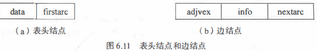

   举例: 无向图

   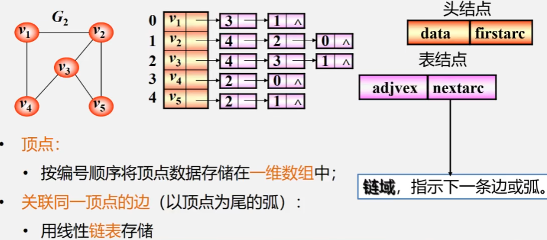

   特点: 

   - 邻接表不唯一
   - 若无向图中有n个顶点, e条边, 则其邻接表需要n个头结点, 2e个边结点. 适合存稀疏图. 空间复杂度O(n+2e)
   - 无向图中的顶点Vi的度为x, 则第i个单链表的结点数是x.

   举例 有向图:  **出度邻接表  入度邻接表**

   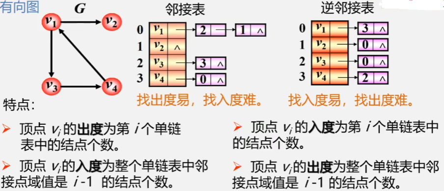

   - **图的邻接表 存储表示:**

   要定义一个邻接表, 需要先定义其存放顶点的头结点和表示边的边结点. 图的邻接表存储结构说明如下：

   ```c
   //-----图的邻接表存储表示－－－－－
   #define MVNum 100    //最大顶点数
   
   typedef struct ArcNode  //边结点
   {
   	int adjvex;   //该边所指向的顶点的位置
   	struct ArcNode * nextarc; //指向下一条边的指针
   	Otherinfo info;  //和边相关的信息 比如权
   }ArcNode;
   
   typedef struct VNode{  //头结点
       VerTexType data;    //顶点信息
       ArcNode *firstarc;  //指向第一条依附该顶点的边的指针
   }VNode, AdjList[MVNum];
   
   typedef struct {  //邻接表
   	AdjList vertices;   //结点 数组
   	int vexnum,arcnum;  //图的当前顶点数和边数
   }ALGraph;
   ```

   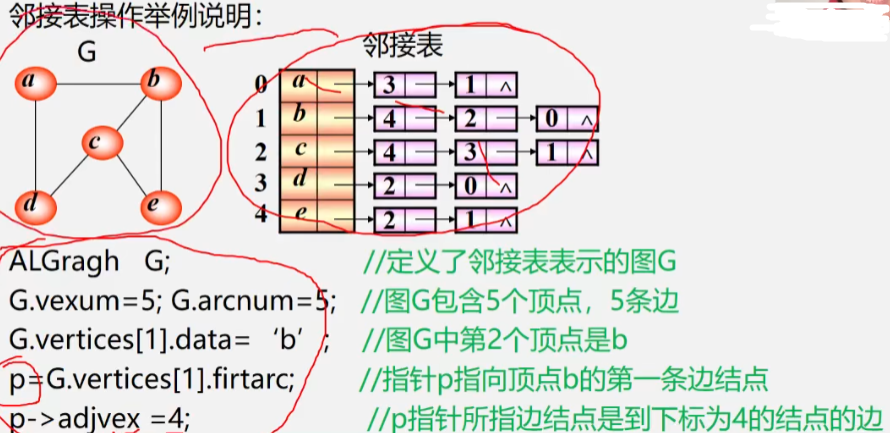

2. **采用邻接表表示法创建无向图**

   基于上述的邻接表表示法, 要创建一个图则需要创建其相应的顶点表和边表. 下面以一个无向图为例来说明采用邻接表表示法创建无向图的算法.

   **算法6.2 采用邻接表表示法创建无向图**

   【算法步骤】

   - 输入总顶点数和总边数。
   - 依次输入点的信息存入顶点表中, 使每个表头结点的指针域初始化为NULL.
   - 创建邻接表. 依次输入每条边依附的两个顶点, 确定这两个顶点的序号i和j之后, 将此边结点分别插入Vi和Vj对应的两个边链表的头部.

   ```c
   /*
   	创建邻接表 无向图G
   	参数: 指针, 把实参 ALGraph类型变量的地址传过来.
   */
   int CreateUDG(ALGraph *G)
   {  //采用邻接表表示法， 创建无向图G
       scanf("%d %d", &G->vexnum, &G->arcnum); //输入总顶点和总边数
       
       for(int i=0;i<G->vexnum;i++)  //输入各点，构造表头结点表
       {
           scanf("%c", &(G->vertices[i].data)); //输入顶点值
           G->vertices[i].firstarc = NULL;  //初始化表头结点的指针域为NULL
       }
       for(int k = 0;k<G->arcnum; k++)
       {
           VerTexType v1, v2;  //两个顶点
           scanf("%c %c", &v1, &v2); //输人一条边依附的顶点
           
           //确定vl和v2在G中位置， 即顶点在G.vertices中的序号
           int i = LocateVex(G,v1);
           int j = LocateVex(G,v2);
           ArcNode *p1 = malloc(sizeof(ArcNode));
           
           if(!p1) return -1;
           p1->adjvex = j; //邻接点序号为j
           p1->ArcNode = G->vertices[i].firstarc; 
           G->vertices[i].firstarc = p1; //头插法将新结点*p1插入顶点Vi的边表头部
           
           ArcNode *p2 = malloc(sizeof(ArcNode));
           p2->adjvex = i; //邻接点序号为i  无向图嘛
           p2->ArcNode = G->vertices[j].firstarc;
           G->vertices[j].firstarc = p2;//头插将新结点*p2插入顶点Vj的边表头部
       }
       return 1;
   }
   ```

   该算法的时间复杂度是O(n + e)。

   建立有向图的邻接表与此类似, 只是更加简单, 每读入一个顶点对序号`<i,j>`仅需生成一个邻接点序号为`j`的边表结点,  并将其插入到`Vi`的边链表头部即可. 若要创建`网`的邻接表, 可以将边的权值存储在info域中.

   > 一个图的邻接矩阵表示是唯一的, 但其邻接表表示不唯一, 这是因为邻接表表示中, 各边表结点的链接次序取决于建立邻接表的算法, 以及边的轮入次序.

   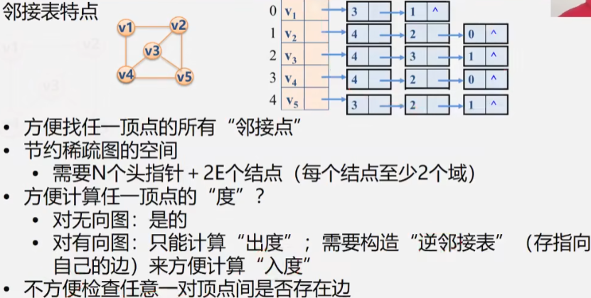

- **邻接矩阵与邻接表**

  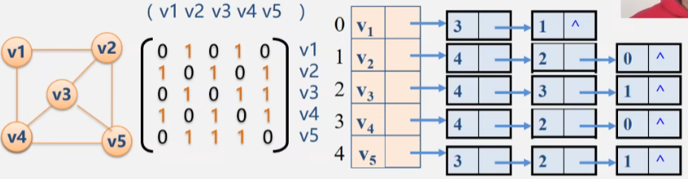

  - 联系:

    邻接表中的每个链表对应于邻接矩阵中的一行, 链表中结点个数等于一行中非零元素的个数.

  - 区别:

    对于任一确定的`无向图`, 邻接矩阵是唯一的.(行列号与顶点编号一致). 但邻接表 不唯一.(链接次序与顶点编号无关). 头插 尾插, 就不一样.

    邻接矩阵的空间复杂度必为O(n^2). 邻接表的空间复杂度为O(n+e).

    **邻接矩阵多用于稠密图`(n>=nlog2 n)`. 邻接表多用于稀疏图.**

- 邻接表表示法的优缺点

  优点: 

  (1)便于增加和删除顶点。

  (2)便于统计边的数目, 按顶点表顺序扫描所有边表可得到边的数目, 时间复杂度为O(n + e) .

  (3)空间效率高. 对于一个具有n个顶点e条边的图G, 若G 是无向图，则在其邻接表表示中有n 个顶点表结点和  2e 个边表结点；若G 是有向图，则在它的邻接表表示或逆邻接表表示中均有 n 个顶点表结点和e个边表结点。因此，邻接表或逆邻接表表示的空间复杂度为 O(n +e ),适合表示稀疏图。对于稠密图，考虑到邻接表中要附加链域，因此常采取邻接矩阵表示法。

  缺点:
  (1)不便于判断顶点之间是否有边，要判定V; 和v丿之间是否有边，就需扫描第！个边表，最坏情况下要耗费O(n)时间。

  (2)不便于计算有向图各个顶点的度。对于无向图，在邻接表表示中顶点V;的度是第i个边表中的结点个数。在有向图的邻接表中，第i个边表上的结点个数是顶点Vi的出度，但求Vi的入度较困难，需遍历各顶点的边表。若有向图采用逆邻接表表示，则与邻接表表示相反，求顶点的入度容易，而求顶点的出度较难。

  十字链表便于求得顶点的入度和出度。

### 6.4.3 十字链表

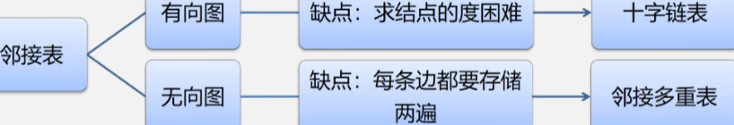

十字链表(Orthogonal List) 是**`有向图`**的另一种链式存储结构.可以看成是将`有向图的邻接表`和`逆邻接表`结合起来得到的一种链表. 在十字链表中, 对应于有向图中每一条弧有一个结点, 对应于每个顶点也有一个结点.
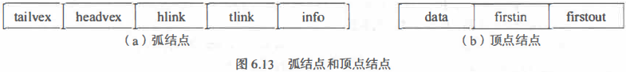

在弧结点中有5 个域：其中尾域(tailvex) 和头域(headvex)分别指示弧尾和弧头这两个顶点在图中的位置, 链域hlink 指向弧头相同的下一条弧, 而链域tlink指向弧尾相同的下一条弧, info域指向该弧的相关信息. 弧头相同的弧在同一链表上, 弧尾相同的弧也在同一链表上.

它们的头结点即为顶点结点，它由3个域组成：其中data 域存储和顶点相关的信息, 如顶点的名称等; firstin 和firstout为两个链域, 分别指向以该顶点为弧头或弧尾的第一个弧结点.
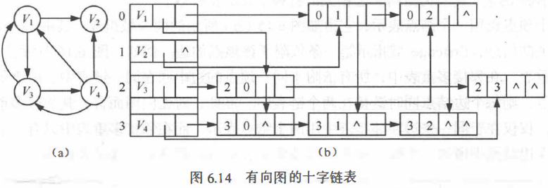

```c
//- - - - -有向图的十字链表存储表示－ － － － －
#define MAX_VERTEX_NUM 20
typedef strut ArcBox
{   //弧结点
	int tailvext,headvex;  //该弧的尾和头顶点的位置
	struct ArcBox *hlink, *tlink; //分别为弧头相同和弧尾相同的弧的链域
	InfoType *info;  //该弧相关信息的指针
}ArcBox;

typedef struct VexNode
{
    VertexType data;
    ArcBox *firstin,*firstout; //分别指向该顶点第一条人弧和出弧
}VexNode;

typedef struct
{
    VexNode xlist [MAX_VERTEX_NUM]; //表头向扯
    int vexnnm, arcnum; //有向图的当前顶点数和弧数
}OLGraph;
```

在十字链表中既容易找到以`Vi`为尾的弧, 也容易找到以`Vi`为头的弧, 因而容易求得顶点的出度和入度(或需要, 可在建立十字链表的同时求出).

### 6.4.4 邻接多重表

邻接多重表(Adjacency Multilist)是无向图的另一种链式存储结构. 虽然邻接表是无向图的一种很有效的存储结构, 在邻接表中容易求得顶点和边的各种信息. 但是, 在邻接表中每一条边`(Vi,Vj)`有两个结点, 分别在第i个和第j个链表中, 这给某些图的操作带来不便.
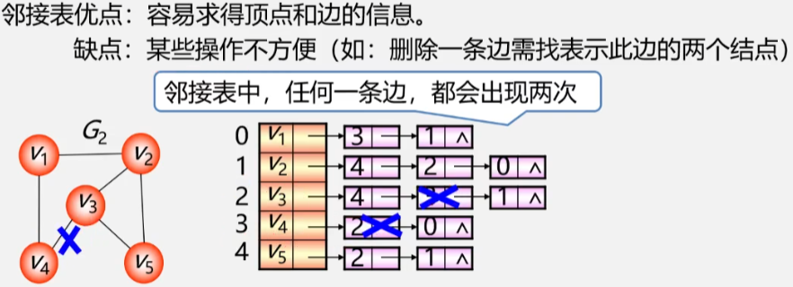

邻接多重表的结构和十字链表类似. 在邻接多重表中, 每一条边用一个结点表示.

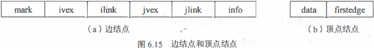

​	`mark`: 为标志域, 可用以标记该条边是否被搜索过;
​	`ivex` 和`jvex` 为该边依附的两个顶点在图中的位置	
​	`ilink` 指向下一条依附于顶点`ivex` 的边
​	`jlink` 指向下一条依附于顶点`jvex`的边
​	`info`  为指向和边相关的各种信息的指针域

每一个顶点也用一个结点表示:

​	data域存储和该顶点相关的信息, firstedge域指示第一条依附于该顶点的边. 

在邻接多重表中，所有依附于同一顶点的边串联在同一链表中，由于每条边依附于两个顶点，则每个边结点同时链接在两个链表中。可见，对无向图而言，其邻接多重表和邻接表的差别，仅仅在于同一条边在邻接表中用两个结点表示，而在邻接多重表中只有一个结点。因此，除了在边结点中增加一个标志域外，邻接多重表所需的存储量和邻接表相同。

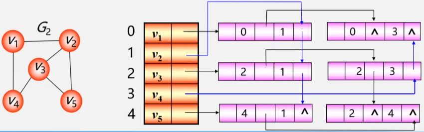

```c
#define MAX_VERTEX_NUM 20
typedef enum{unvisited,visited} VisitIf;
typedef struct EBox
{
    Visitlf mark;   //访问标记
    int ivex, jvex;  //该边依附的两个顶点的位置
    struct EBox *ilink, *jlink;  //分别指向依附这两个顶点的下一条边
    InfoType *info;  //该边信息指针
}Ebox;

typedef struct VexBox
{
    VertexType data;
    EBox *firstedge;  //指向第一条依附该顶点的边
}VexBox;

typedef struct{
    VexBox adjmulist [MAX_VERTEX_NUM];
    int vexnum, edgenum; //无向图的当前顶点数和边数
}AMLGraph;
```

## 6.5 图的遍历

和树的遍历类似, 图的遍历也是从图中某一顶点出发, 按照某种方法对图中所有顶点访问且仅访问一次. 图的遍历算法是求解图的连通性问题, 拓扑排序和关键路径等算法的基础.

然而, 图的遍历要比树的遍历复杂得多. 因为图的任一顶点都可能和其余的顶点相邻接. 所以在访问了某个顶点之后,  可能沿着某条路径搜索之后, 又回到该顶点上. 

为了避免同一顶点被访问多次, 在遍历图的过程中, 必须记下每个已访问过的顶点. 为此, 设一个辅助数组`visited[n] `, 其初始值置为"false"或者0, 一旦访问了顶点`Vi`, 便置`visited[i]`为"true"或者1.

根据搜索路径的方向, 通常有两条遍历图的路径: 深度优先搜索和广度优先搜索. 它们对无向图和有向图都适用.

### 6.5.1 深度优先搜索

1. **深度优先搜索遍历的过程**

   深度优先搜索(DepthFirst Search, DFS)遍历类似树的先序遍历, 是`树的先序遍历`的推广.

   对于一个连通图, 深度优先搜索遍历的过程如下:

   (1)从图中某个顶点v出发, 访问v。
   (2)找出刚访问过的顶点的第一个未被访问的邻接点， 访问该顶点。以该顶点为新顶点，重
   复此步骤， 直至刚访问过的顶点没有未被访问的邻接点为止。
   (3)返回前一个访问过的且仍有未被访问的邻接点的顶点，找出该顶点的下一个未被访问的
   邻接点， 访问该顶点。
   (4)重复步骤(2) 和(3), 直至图中所有顶点都被访问过，搜索结束。

   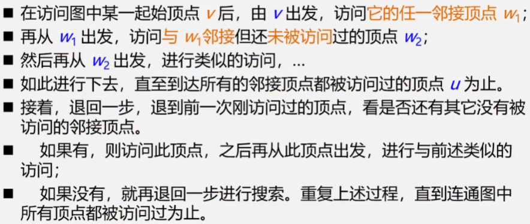

   例子:

   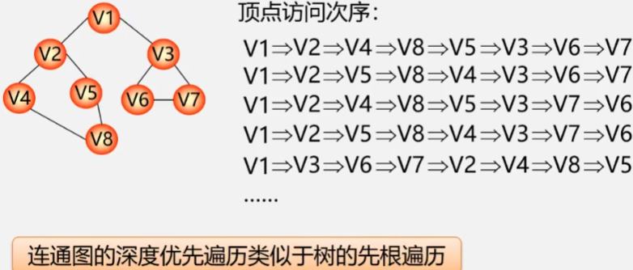
   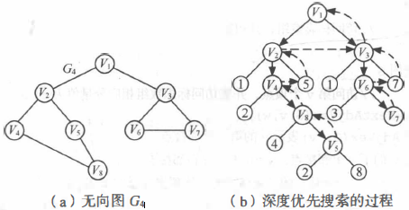
   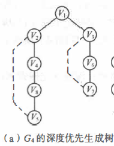

   2. **深度优先搜索遍历的算法实现**

      深度优先搜索遍历连通图是一个递归的过程。为了在遍历过程中便千区分顶点是否已被访问，需附设访问标志数组visited[n], 其初值为"false", 一旦某个顶点被访问, 则其相应的分量置为"true".

      **算法6.3 深度优先搜索遍历连通图**

      `邻接矩阵`表示的无向图深度遍历实现:

      算法步骤: 
      (1) 从图中某个顶点v出发, 访问v, 并置visited[v]的值为true.
      (2) 依次检查v的所有邻接点w, 如果visited[w]的值为false, 再从w出发进行递归遍历, 直到图中所有顶点都被访问过.

      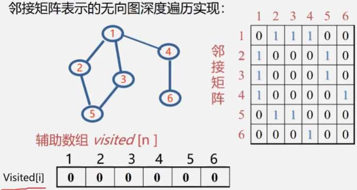

      ```c
      bool visited [MVNum];   //访问标志数组， 其初值为"false"
      void DFS(AMGraph *G,int v)
      {
          if(!G || v < 0 || v > G->vexnum) return; //检查参数
          
          printf("%d\n", v);
          visited[v] = true;       //访问第v个顶点
          for(int w = 0; w < G->vexnum; w++)  //依次检查邻接矩阵v所在行
          	if( (G->arcs[v][w] != 0) &&(!visited[w]))
                  DFS(G, w);  //w是v的邻接点, 若w未访问, 递归调用DFS
      }
      ```

      **算法6.4 深度优先搜索遍历非连通图**

      若是非连通图, 上述遍历过程执行之后, 图中一定还有顶点未被访间, 需要从图中`另选一个未被访问`的顶点作为起始点, 重复上述深度优先搜索过程, 直到图中所有顶点均被访问过为止. 这样,  要实现对非连通图的遍历, 需要循环调用算法6.3.

      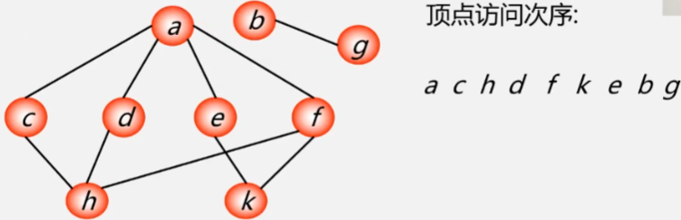

      ```c
      void DFSTraverse(Graph *G)
      {	//对非连通图G做深度优先遍历
      	for(int v= 0; v < G->vexnum; ++v) 
              visited[v]=false; //访问标志数组初始化
      	for(int v= 0;v< G->vexnum;++v) //循环调用算法6.3
      		if(!visited[v]) DFS(G,v);  //对尚未访问的顶点调用DFS
      }
      ```

      **算法6.5 采用`邻接表`表示图的深度优先搜索遍历**

      ```c
      void DFS_AL(ALGraph *G,int v)
      {//图G为邻接表类型， 从第v个顶点出发深度优先搜索遍历图G
          printf("%d\n",v); visited[v]=true;//访问第v个顶点,并置访问标志数组相应分量值为true
          ArcNode *p = G->vertices[v].firstarc; //p指向v的边链表的第一个边结点
          while( p != NULL )
          {
              int w = p->adjvex; //表示w是v的邻接点
              if(!visited[w]) DFS_AL(G,w); //如果口未访问,则递归调用DFS
              p = p->nextarc;  // p指向下一个边结点
          }
      }
      ```

   3. 深度优先搜索遍历的算法分析

      分析上述算法, 在遍历图时, 对图中每个顶点至多调用一次DFS 函数, 因为一旦某个顶点被标志成已被访问, 就不再从它出发进行搜索. 因此, 遍历图的过程实质上是对每个顶点查找其邻接点的过程, 其耗费的时间则取决千所采用的存储结构. 当用邻接矩阵表示图时, 查找每个顶点的邻接点的时间复杂度为`O(n^2)`, 其中n为图中顶点数. 而当以邻接表做图的存储结构时, 查找邻接点的时间复杂度为`O(e)`, 其中e为图中边数. 由此, 当以邻接表做存储结构时, 深度优先搜索遍历图的时间复杂度为`O(n + e)`.

### 6.5.2 广度优先搜索

1. 广度优先搜索遍历的过程

   广度优先搜索(Breadth First Search, BFS)遍历类似于树的按层次遍历的过程. 所以需要借助队列.

   广度优先搜索遍历的过程如下:

   (1) 从图中某个顶点v出发, 访问v。
   (2) 依次访问v的各个未曾访问过的邻接点。
   (3) 分别从这些邻接点出发依次访问它们的邻接点, 并使"先被访问的顶点的邻接点" 先于"后被访问的顶点的邻接点"被访问. 重复步骤(3), 直至图中所有已被访问的顶点的邻接点都被访问到。

   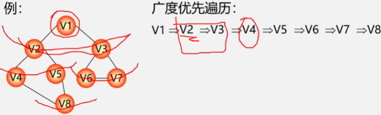

   若是`非连通图`, 上述遍历过程执行之后, 图中一定还有顶点未被访问, 需要从图中另选一个未被访问的顶点作为起始点, 重复上述广度优先搜索过程, 直到图中所有顶点均被访问过为止.
   对于非连通图的遍历, 实现算法类似于算法6.4, 仅需将原算法中的DFS函数调用改为BFS函数调用.

2. 广度优先搜索遍历的算法实现

   广度优先搜索遍历的特点是: 尽可能先对横向进行搜索. 设x 和y是两个相继被访间过的顶点, 若当前是以x为出发点进行搜索, 则在访问x的所有未曾被访问过的邻接点之后, 紧接着是以y为出发点进行横向搜索, 并对搜索到的y的邻接点中尚未被访问的顶点进行访问. 也就是说,  先访问的顶点其邻接点亦先被访问. 为此, 算法实现时需引进队列保存已被访问过的顶点.

   和深度优先搜索类似, 广度优先搜索在遍历的过程中也需要一个访问标志数组。

   **算法6.7 广度优先搜索遍历连通图**

   【算法步骤】
   (1) 从图中某个顶点v 出发,  访问v, 并置visited[v]的值为true, 然后将v进队。
   (2) 只要队列不空, 则重复下述操作：
   • 队头顶点u 出队；
   • 依次检查u 的所有邻接点w, 如果visited[w]的值为false, 则访问w, 并置visited[w]的值为true, 然后将w进队.

   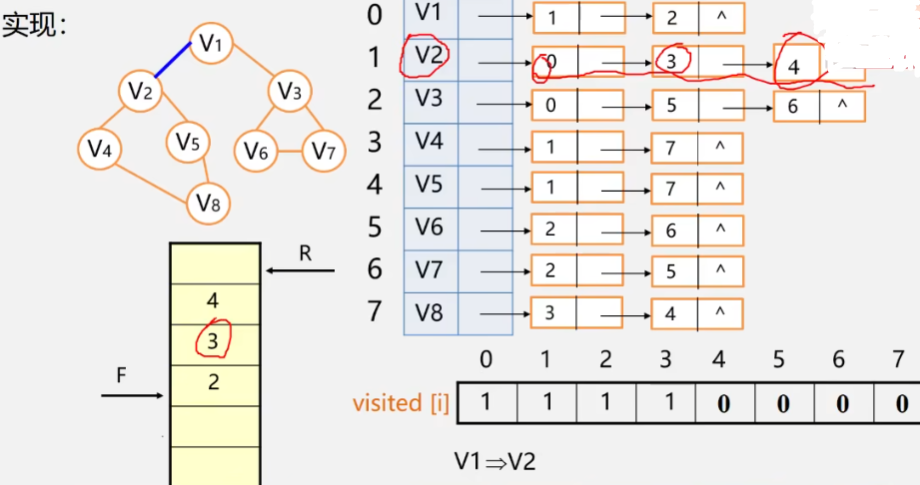

   ```c
   void BFS(Graph *G,int v)
   {//按广度优先非递归遍历连通图G
       printf("%d\n",v); visited[v]=true; //访问第v个顶点，并置访问标志数组相应分址值为true
       InitQueue(Q); //辅助队列Q初始化,置空
       EnQueue(Q,v);  //第v个顶点进队
       while(!QueueEmpty(Q)) //队列非空
       {
           DeQueue(Q, u); //队头元素出队并置为u
           //依次检查u的所有邻接点w, FirstAdjVex(G,u)表示u的第一个邻接点
           for(w=FirstAdjVex(G,u); w>=0; w=NextAdjVex(G,u,w))
               if ( !visited[w]) //w为u的尚未访问的邻接顶点
               {
                   printf("%d\n",w); 
                   visited[w]=true; //访问w,并置访问标志数组相应分扯值为true
                   EnQueue(Q, w);//w进队
               }
       }
   }
   ```

3. 广度优先搜索遍历的算法分析

   分析上述算法, 每个顶点至多进一次队列. 遍历图的过程实质上是通过边找邻接点的过程, 因此广度优先搜索遍历图的时间复杂度和深度优先搜索遍历相同, 即当用邻接矩阵存储时, 时间复杂度为`O(n^2)`; 用邻接表存储时, 时间复杂度为`O(n+e)`. 两种遍历方法的不同之处仅仅在于对顶点访问的顺序不同.

## 6.6 图的应用

### 6.6.1 最小生成树

- 回顾生成树:

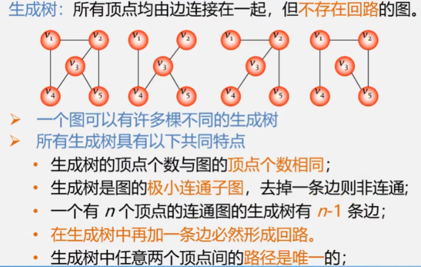

> 含n个顶点, n-1条边的图不一定是生成树 , 因为不一定是连通图

- 无向图的生成树

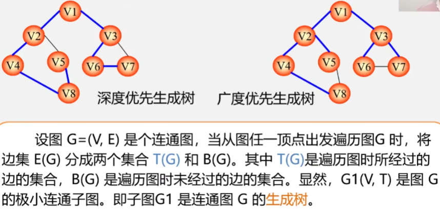

- 最小生成树

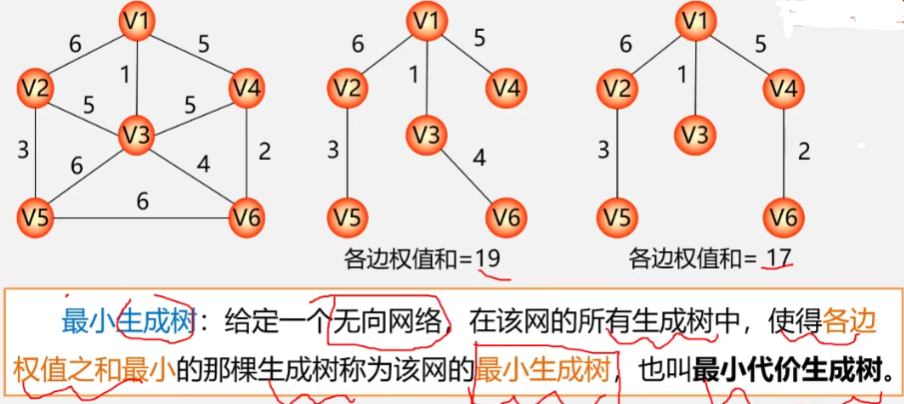

> 必须是个连通图, 且网的权值是所有可能里最小的.

- 最小生成树的典型应用

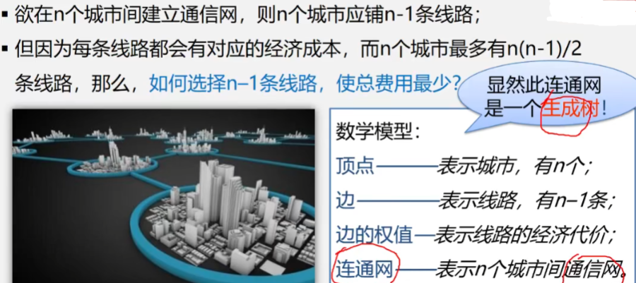

- 构造最小生成树 Minimum Spanning Tree

**MST性质:**

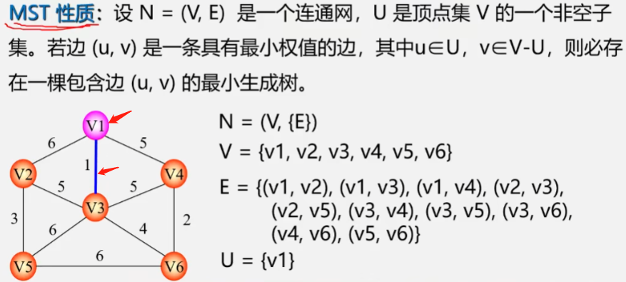

MST性质解释:

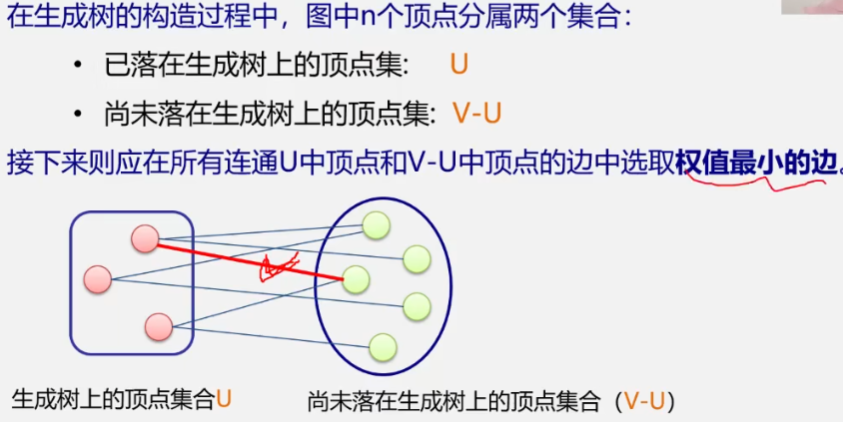

1. 普里姆算法 Prim

   - 算法思想:

   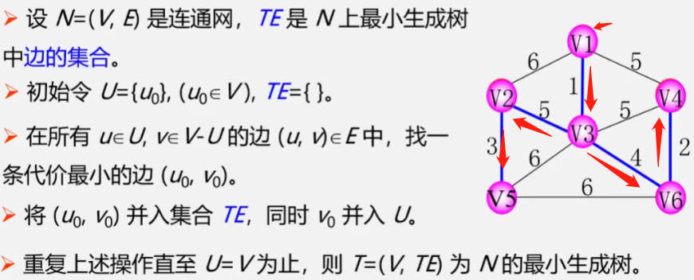

   此时TE 中必有n-1 条边, 则T= (V, TE)为N 的最小生成树.

   普里姆算法逐步增加U中的顶点, 可称为"加点法".

   - 普里姆算法的实现:

   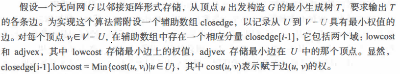

   ```c
   //辅助数组的定义, 用来记录从顶点集u到v-u的权值最小的边
   struct {
       VerTexType adjvex; //最小边在U中的那个顶点
       ArcType lowcost;  //最小边上的权值
   }closedge[MVNum];
   ```

   **算法6.8 普里姆算法**

   步骤:

   (1) 首先将初始顶点u加入U中, 对其余的每一个顶点Vj, 将closedge[j]均初始化为到u的边信息。
   (2) 循环`n-1`次, 做如下处理：
   • 从各组边closedge中选出最小边closedge[k], 输出此边；
   • 将k加入U中；
   • 更新剩余的每组最小边信息closedge[j], 对于V-U中的边, 新增加了一条从k到j的边, 如果新边的权值比closedge[j].lowcost 小, 则将closedge[j].lowcost更新为新边的权值.

   ```c
   void MiniSpanTree_Prim(AMGraph *G,VerTexType u)
   {
      //无向网G以邻接矩阵形式存储,从顶点u出发构造G的最小生成树T,输出T的各条边
       int k = LocateVex(G,u); //拿到顶点u的下标
       //对v-u 的每一个顶点Vj, 初始化closedge[j]
       for(int j = 0; j < G->vexnum; ++j)
           if(j!=k) closedge[j]={u,G->arcs[k][j]};
       
       closedge[k].lowcost = O; //初始  U={u} u到u的最小值是0
       for(int i = 1; i < G->vexnum; ++i)
       {//选择其余n-1个顶点，生成n-1条边(n=G->vexnum)
           int k = Min(closedge);
           //求出T的下一个结点：第K个顶点, closedge[k]中存有当前最小边
           VerTexType u0 = closedge[k].adjvex; //u0为最小边的一个顶点，u0属于U
           VerTexType v0 = G->vexs[k]; //v0为最小边的另一个顶点,v0属于V-U
           printf("%c %c\n", u0,v0); //输出当前的最小边(u0, v0)
           closedge[k].lowcost=0; //第k个顶点并入u集
           
           for(int j=0; j<G->vexnum; ++j)
           {
               if(G->arcs[k][j] < closedge[j].lowcost) //新顶点并入u后重新选择最小边
                   closedge [j] = {G->vexs[k],G->arcs[k][j]}
           }
       }
   }
   ```

   普里姆算法的时间复杂度为`O(n^2)`, 与网中的边数无关,  因此适用求`稠密网`的最小生成树.

   2. 克鲁斯卡尔算法 Kruskal

      算法思想:

      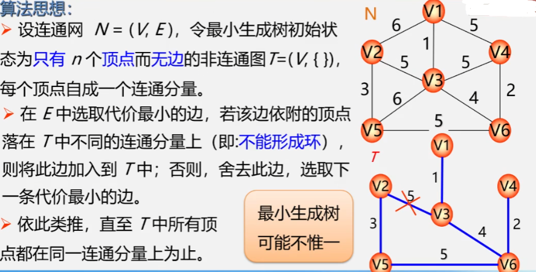

      具体实现看课本.

