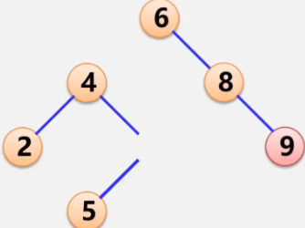

# 第7章 查找


## 7.1 查找的基本概念

(1) 查找表
查找表是由`同一类型的数据元素(或记录)`构成的集合. 由于"集合"中的数据元素之间存在着完全松散的关系, 因此查找表是一种非常灵便的数据结构, 可以利用其他的数据结构来实现, 比如本章将要介绍的线性表, 树表及散列表等.

(2) 关键字
关键字是数据元素(或记录) 中某个数据项的值, 用它可以标识一个数据元素(或记录). 若此关键字可以`唯一地标识一个记录`, 则称此关键字为`主关键字`(对不同的记录, 其主关键字均不同). 反之, 称用以识别`若干记录`的关键字为`次关键字`. 当数据元素只有一个数据项时, 其关键字即为该数据元素的值.

(3) 查找
查找是指根据给定的某个值, 在查找表中确定一个其关键字等于给定值的记录或数据元素. 若表中存在这样的一个记录, 则称查找成功, 此时查找的结果可给出整个记录的信息, 或指示该记录在查找表中的位置; 若表中不存在关键字等于给定值的记录, 则称查找不成功, 此时查找的结果可给出一个"空"记录或"空"指针.

(4) 动态查找表和静态查找表
若在查找的同时对表做修改操作(如插入和删除), 则相应的表称之为动态查找表, 否则称之为静态查找表. 换句话说, 动态查找表的表结构本身是在查找过程中动态生成的, 即在创建表时, 对于给定值, 若表中存在其关键字等于给定值的记录, 则查找成功返回; 否则插入关键字等于给定值的记录.

(5) 平均查找长度
为确定记录在查找表中的位置，需和给定值进行比较的关键字个数的期望值， 称为查找算法在查找成功时的平均查找长度(Average Search Length, ASL).


查找的方法 取决于查找表的结构, 即表中数据元素是依何种关系组织在一起的.

对于查找表来说, 在集合中查询或检索一个"特定的"数据元素时, 若无规律可循, 则只能对集合中的元素逐一辨认直到找到为止.

而这样的"查询"或"检索"是任何计算机应用系统中使用频度都很高的操作, 因此设法提高查找表的查找效率, 是本章讨论的出发点.

为了提高查找效率, 一个办法是在构造查找表时, 在集合中的数据元素之间人为的加上某种确定的约束关系.

## 7.2 线性表的查找

在查找表的组织方式中, 线性表是最简单的一种. 分三种 : 顺序查找、折半查找和分块查找.

### 7.2.1 顺序查找

顺序查找(Sequential Search)的查找过程为: 从表的一端开始, 依次将记录的关键字和给定值进行比较, 若某个记录的关键字和给定值相等, 则查找成功; 反之, 若扫描整个表后, 仍未找到关键字和给定值相等的记录, 则查找失败.

顺序查找方法既适用于线性表的`顺序存储结构`，又适用于线性表的`链式存储结构`. 静态查找表, 表内元素直接无序.

下面以顺序表为例:

数据元素类型定义如下：

```c
typedef struct {
	KeyType key;   //关键字域
	InfoType otherinfo; //其他域
} ElemType;
```

顺序表定义:

```c
typedef struct{ 
	ElemType *R;  //存储空间基地址
	int length;   //当前长度
}SSTable;
SSTable ST;
```


- 算法7.1 顺序查找

```c
int Search_Seq(SSTable ST,KeyType key)
{
    //在顺序表ST中顺序查找其关键字等千key的数据元素. 若找到,则函数值为该元素在表中的位置,否则为0
    for(int i = ST.length; i>=1; --i)
        if( key == ST.R[i].key ) return i;
    return 0;
}
//或者:
int Search_Seq(SSTable ST,KeyType key)
{
    int i = -1;
    for(i = ST.length; ST.R[i].key != key && i>0; --i);   
    if(i > 0)	return i;
    else return 0;
 }
```

改进方法是查找之前先对ST.R[0]的关键字赋值key, 在此, ST.R[0]起到了监视哨的作用,  如算法7.2所示。

- **算法7.2 设置监视哨的顺序查找**

  

```c
int Search_Seq(SSTable ST, KeyType key)
{
    //在顺序表ST中顺序查找其关键字等千key的数据元素. 若找到,则函数值为该元素在表中的位置,否则为0
    ST.R[0].key = key;
    int i = -1;
    for(i = ST.length; ST.R[i].key != key; --i);   
    return i;
}
```

通过设置监视哨, 免去查找过程中每一步都要检测整个表是否查找完毕. 然而实践证明, 这个改进能使顺序查找在ST.length >= 1000时, 进行一次查找所需的平均时间几乎减少一半.

算法7.2 和算法7.1 的时间复杂度一样为O(n). 空间复杂度O(1).

顺序查找的优点是: 算法简单, 对表结构无任何要求, 既适用于顺序结构, 也适用千链式结构, 无论记录是否按关键字有序均可应用. 其缺点是: 平均查找长度较大, 查找效率较低, 所以当n很大时, 不宜采用顺序查找.


### 7.2.2 折半查找

折半查找(BinarySearhc )也称二分查找, 它是一种效率较高的查找方法. 但是, 折半查找要求线性表`必须采用顺序存储结构`, 而且`表中元素按关键字有序排列`。

折半查找的查找过程为: 从表的中间记录开始, 如果给定值和中间记录的关键字相等， 则查找成功；如果给定值大于或者小于中间记录的关键字, 则在表中大于或小于中间记录的那一半中查找，这样重复操作， 直到查找成功，或者在某一步中查找区间为空， 则代表查找失败。

折半查找每一次查找比较都使查找范围缩小一半，与顺序查找相比，很显然会提高查找效率。为了标记查找过程中每一次的查找区间，下面分别用low和high来表示当前查找区间的下界和上界，mid为区间的中间位置。


\[算法步骤]:


```c
int Search_Bin(SSTable ST, KeyType key)
{
    //在有序表ST中折半查找其关键字等于key的数据元素.若找到,则函数值为该元素在表中的位置,否则为0
    int low = 1, high = ST.length;  //置区间初值
    while(low <= high)  //注意是<=
    {
        int mid = (low+high)>>1; //移位比除法快
        if(ST.R[mid].key == key) return mid; //找到
        else if(key < ST.R[mid].key)  //缩小查找区间
            high = mid-1;              //在前半区查
        else
            low = mid+1;              //在后半区查
    }
    return 0;
}
//递归写法:
int Search_Bin(SSTable ST, KeyType key, int low, int high)
{
    if(low > high) return 0;
    
    int mid = (low + high) >> 1;
    if(key == ST.R[mid].key) return mid;
    else if(key < ST.R[mid].key)
    {
        Search_Bin(ST, key, low, mid-1);
    }
    else
        Search_Bin(ST, key, mid+1, high);
}
```

因为二分法查找期望是`2^x <= n` 所以, 折半查找的时间复杂度为O(log2 n). 可见, 二分法查找的效率比顺序查找高，但折半查找只适用于有序表,且限于顺序存储结构(链表无效).

折半查找的优点是：比较次数少，查找效率高。其缺点是：对表结构要求高，只能用于顺序存储的有序表。查找前需要排序，而排序本身是一种费时的运算。同时为了保持顺序表的有序性，对有序表进行插入和删除时，平均比较和移动表中一半元素，这也是一种费时的运算。因此，折半查找不适用于数据元素经常变动的线性表。

### 7.2.3 分块查找

分块查找(Blocking Search) 又称索引顺序查找，这是一种性能介于顺序查找和折半查找之间的一种查找方法。在此查找法中，除表本身以外，尚需建立一个“索引表”。如图:


上图就是一个表及其索引表，表中含有18 个记录， 可分成3 个子表对每个子表（或称块）建立一个索引项，其中包括两项内容：`关键字项`（其值为该子表内的最大关键字） 和`指针项`（指示该子表的第一个记录在表中位置）。索引表按`关键字有序`，则表或者有序或者分块有序。

所谓“ 分块有序” 指的是第二个子表中所有记录的关键字均大于第一个子表中的最大关键字，第三个子表中的所有关键字均大于第二个子表中的最大关键字，……，依次类推。


- 查询过程

  先确定待查记录所在哪个块(顺序或二分法查找), 再于块内查找(顺序查找).

由于由索引项组成的索引表按关键字有序，则确定块的查找可以用顺序查找，亦可用折半查找，而块中记录是任意排列的，则在块中只能是顺序查找。
由此， 分块查找的算法为顺序查找和折半查找两种算法的简单合成。

分块查找的优点是：在表中插入和删除数据元素时，只要找到该元素对应的块，就可以在该块内进行插入和删除运算。由于块内是无序的，故插入和删除比较容易，无需进行大量移动。如果线性表既要快速查找又经常动态变化，则可采用分块查找。其缺点是：要增加一个索引表的存储空间并对初始索引表进行排序运算。

> 分块查找比顺序查找快, 但比二分法要慢.

- 三种查找的比较

  

## 7.3 树表的查找

折半查找效率较高, 但由于折半查找要求表中记录按关键字有序排列, 且不能用链表做存储结构, 因此, 当表的插入或删除操作频繁时, 为维护表的有序性, 需要移动表中很多记录. 这种由移动记录引起的额外时间开销, 就会抵消折半查找的优点. 所以, 线性表的查找更适用于`静态查找表`, 若要对动态查找表进行高效率的查找, 可采用几种`特殊的二叉树`作为查找表的组织形式, 在此将它们统称为树表.


### 7.3.1 二叉排序树

二叉排序树(Binary Sort Tree) 又称`二叉查找树`, 或二叉搜索树, 它是一种对`排序`和`查找`都很有用的特殊二叉树.

1. **二叉排序树的定义**

   二叉排序树或者是一棵空树, 或者是具有下列性质的二叉树: 

   (1) 若它的左子树不空，则左子树上所有结点的值均小千它的根结点的值；
   (2) 若它的右子树不空，则右子树上所有结点的值均大千它的根结点的值；
   (3) 它的左, 右子树也分别为二叉排序树。

   二叉排序树是递归定义的. 由定义可以得出二叉排序树的一个`重要性质`: 
   中序遍历一棵二叉树时可以得到一个结点值`递增`的有序序列.

   

   因为二叉排序树的操作要根据结点的关键字域来进行, 所以下面给出了每个结点的数据域的类型定义(包括关键字项和其他数据项):

   ```c
   //-----二叉排序树的二叉链表存储表示------
   typedef struct
   {
       KeyType key;  //关键字项
       InfoType otherinfo; //其他数据项   
   }ElemType;  //每个结点的数据域的类型
   
   typedef struct BSTNode{
       ElemType data;   //每个结点的数据域包括关键字项和其他数据项
       struct BSTNode *lchild,*rchild;  //左右孩子指针
   }BSTNode, *BSTree;
   BSTree T;  //定义
   ```


2. **二叉排序树的查找**

   因为二叉排序树可以看成是一个有序表, 所以在二叉排序树上进行查找和折半查找类似, 也是一个逐步缩小查找范围的过程。

   

   > 先和根节点相比, 决定往左子树走还是往右子树走.

   **算法7.4 二叉排序树的递归查找**

   算法步骤:

   - 若二叉排序树为空, 则查找失败，返回空指针.
   - 若二叉排序树非空, 将给定值key与根结点的关键字`T->data.key`进行比较:
     - 若key等于`T->data.key`, 则查找成功, 返回根结点地址:
     - 若key`小于`T->data.key, 则`递归`查找`左子树`;
     - 若key`大于`T->data.key, 则`递归`查找`右子树`.

   ```c
   BSTree SearchBST(BSTree T, KeyType key)
   {//在根指针T所指二叉排序树中递归地查找某关键字等于key的数据元素
       if( !T || key == T->data.key) return T;
       else if(key < T->data.key) 
           return SearchBST(T->lchild, key);  //递归查找左子树
       else 
           return SearchBST(T->rchild, key);  //递归查找右子树
   }
   //非递归
   BSTree SearchBST(BSTree T, KeyType key)
   {
       while(T!=NULL && key != T->data.key)
       {
           if(key < T->data.key) T = T->lchild;
           else T = T->rchild;
       }
       return T;
   }// 空间复杂度O(1) 比递归好
   ```

   二叉排序树上的查找和折半查找相差不大. 但就维护表的有序性而言, 二叉排序树更加有效, 因为无需移动记录, 只需修改指针即可完成对结点的插入和删除操作. 因此, 对于需要经常进行插入, 删除和查找运算的表, 采用二叉排序树比较好.

   

   > 所以, 想提高形态不平衡的二叉排序树的查找效率, 就得对它做平衡化处理.

3. **二叉排序树的插入**

      二叉排序树的插入操作是以查找为基础的. 要将一个关键字值为key 的结点`*S` 插入到二叉排序树中, 则需要从根结点向下查找, 当树中不存在关键字等于key的结点时才进行插入. 新插入的结点一定是一个新添加的叶子结点, 并且是查找不成功时查找路径上访问的最后一个结点的左孩子或右孩子结点.

      

      **算法7.5 二叉排序树的插入**

      算法步骤:

      - 若二叉排序树为空, 则待插入结点`*S`作为根结点插入到空树中.

      - 若二叉排序树非空, 则将key与根结点的关键字T->data.key进行比较:

        - 若树中已有不插入. 否则才插入.

        - 若key小于T->data.key, 则将`*S`插入左子树;
        - 若key大于T->data.key, 则将`*S` 插入右子树.

      ```c
      void InsertBST(BSTree *T, ElemType e)
      {
          if( !*T )   //找到插入位置， 递归结束
          { 
              BSTNode *s = malloc(sizeof(BSTNode));
              if(!s) return;
              s->data = e;
              s->lchild = s->rchild = NULL;
              *T = s;
          }
          else if(e.key < (*T)->data.key)
              InsertBST(&((*T)->lchild), e);
          else if(e.key > (*T)->data.key)
              InsertBST(&((*T)->rchild), e);
      }
      
      //非递归
      BSTNode *CreatNode(KeyType e)
      {
          BSTNode *s = malloc(sizeof(BSTNode));
          if(!s) return NULL;
          s->data.key = e;
          s->lchild = s->rchild = NULL;
          return s;
      }
      void InsertBST(BSTree *T, KeyType key)
      {
          BSTNode *parent = NULL;
          BSTNode *cur = *T;
          
          if(NULL == *T)
          {
             *T = CreatNode(key);
             return;
          }
          while(cur)
          {
              parent = cur;
              
              if(key < cur->data.key)
                  cur = cur->lchild;
              else if(key > cur->data.key)
                  cur = cur->rchild;
              else  return;
          }
          if(key < parent->data.key)
              parent->lchild = CreatNode(key);
          else
              parent->rchild = CreatNode(key);
      
      }// 空间复杂度O(1) 比递归好
      ```

      二叉排序树插入的基本过程是查找，所以时间复杂度同查找一样，是`O(log2 n）`.

4. **二叉排序树的创建**

   二叉排序树的创建是从空的二叉排序树开始的, 每输入一个结点, 经过查找操作, 将新结点插入到当前二叉排序树的合适位置.

   

   **算法7.6 二叉排序树的创建**

   【算法步骤】

   - 将二叉排序树T初始化为空树。
   - 读入一个关键字为key的结点。
   - 如果读入的关键字key不是输入结束标志，则循环执行以下操作：
     - 将此结点插入二叉排序树T中；
     - 读入一个关键字为key 的结点。

   ```c
   void CreatBST(BSTree *T)
   {
       //依次读人一个关键字为key的结点, 将此结点插人二叉排序树T中
       *T = NULL;
       ElemType e;
       scanf("..", &e);
       while(e.key != ENDFLAG);
       {
           InsertBST(T, e);
           scanf("..", &e);
       }
   }
   ```

   假设有n 个结点, 则需要n 次插入操作, 而插入一个结点的算法时间复杂度为`O(log2 n）`, 所以创建二叉排序树算法的时间复杂度为`O(nlog2 n)`.

   **一个无序序列可以通过构造一棵二叉排序树而变成一个有序序列, 构造树的过程即为对无序序列进行排序的过程.  每次插入的新结点都是二叉排序树上新的叶子结点, 则在进行插入操作时, 不必移动其他结点, 仅需改动某个结点的指针, 由空变为非空即可. 这就相当于在一个有序序列上插入一个记录而不需要移动其他记录.**

   

5. **二叉排序树的删除**

   被删除的结点可能是二叉排序树中的任何结点, 删除结点后, 要根据其位置不同修改其双亲结点及相关结点的指, 以保持二叉排序树的特性.

   - 如果删除的是叶子结点 直接删结点

     其双亲结点中的相应指针域的值改为空

     

   - 被删除的结点只有左子树或右子树

     用其左子树或右子树替换它:

     其双亲结点的相应指针域的值改为 "指向被删结点的左子树或者右子树".

     

   - 被删结点既有左子树, 又有右子树.
     
     
     
### 7.3.2 平衡二叉树


树的高度越小, 查找速度越快.

1. **平衡二叉树的定义**

   Balance d Binary Tree 或 Height-Balanced·Tree. 因由前苏联数学家Adelson-Velskii和Landis提出, 所以又称`AVL树`.

   平衡二叉树或者是空树, 或者是具有如下特征的二叉排序树:

   - 左子树和右子树的深度之差的绝对值不超过1;
   - 左子树和右子树也是平衡二叉树.

   `平衡因子`Balance Factor: 结点左子树与右子树的高度差. 

   则平衡二叉树上所有结点的平衡因子只可能是-1,0和1. 只要二叉树上有一个结点的平衡因子的绝对值大于1 , 则该二叉树就是不平衡的.

   

2. **平衡二叉树的平衡调整方法**

   

   `调整方法`是: 找到离插入结点最近且平衡因子绝对值超过1的祖先结点, 以该结点为根的子树称为最小不平衡子树, 可将重新平衡的范围局限于这棵子树.

   - **四种不平衡情况**

   一般情况下, 假设最小不平衡子树的根结点为A, 则失去平衡后进行调整的规律可归纳为下列4种情况:

   

   LL 型：由于在A 左子树根结点的左子树上插入结点,A 的平衡因子由1增至2, 致使以A为根的子树失去平衡, 则需进行一次向右的顺时针旋转操作.

   RR 型：由于在A 的右子树根结点的右子树上插入结点, A的平衡因子由-1变为-2, 致使以A为根结点的子树失去平衡, 则需进行一次向左的逆时针旋转操作.

   LR型：由于在A的左子树根结点的右子树上插入结点, A的平衡因子由1增至2,致使以A为根结点的子树失去平衡, 则需进行两次旋转操作. 第一次对B及其右子树进行逆时针旋转, C转上去成为B的根, 这时变成了LL型, 所以第二次进行LL型的顺时针旋转即可恢复平衡.

   RL 型：由于在A 的右子树根结点的左子树上插入结点, A 的平衡因子由-1 变为-2, 致使以A 为根结点的子树失去平衡, 则旋转方法和LR 型相对称, 也需进行两次旋转, 先顺时针右旋, 再逆时针左旋.
   
   > 调整原子: 降低高度.  保持二叉排序树性质 . 不用管什么转不转的.

   - 调整过程:
   **LL型调整过程:**
   
   
   

   **RR型调整过程:**
   
   
   
   **LR型调整过程:**
   
   
   
   **RL型调整过程:**
   跟LR型类似:
   
   例子:
   
   

例子:

输入关键字序列(16, 3, 7, 11,9,26,18,14,15 ), 给出构造一颗AVL数的步骤:


​

结束. 上面的过程所有的4种调整都有了. 当平衡的二叉排序树因插入结点而失去平衡时, 仅需对最小不平衡子树
进行平衡旋转处理即可.

3. **平衡二叉树的插入**
   

## 7.4 散列表的查找

### 7.4.1 散列表的基本概念
前面讨论了基于线性表, 树表结构的查找方法, 这类查找方法都是以关键字的比较为基础的. 在查找过程中`只考虑各元素关键字之间的相对大小`, 记录`在存储结构中的位置`和其`关键字`无直接关系, 其查找时间与表的长度有关, 特别是当结点个数很多时, 查找时要`大量地与无效结点的关键字`进行`比较`, 致使查找速度很慢. 如果能**在元素的存储位置和其关键字之间建立某种直接关系**, 那么在进行查找时, 就无需做比较或做很少次的比较, 按照这种关系直接由关键字找到相应的记录. 这就是散列查找法 (Hash Search)的思想, 它**通过对元素的关键字值进行某种运算, 直接求出元素的地址, 即: 使用关键字到地址的直接转换方法, 而不需要反复比较**. 因此, 散列查找法又叫杂凑法或散列法。


下面给出散列法中常用的几个术语:
(1) `散列函数`和`散列地址`: 在记录的`存储位置p`和其`关键字key`之间建立`一个确定`的`对应关系H`, 使`p=H(key)`, 称这个对应关系H为`散列函数`，p为`散列地址`。

(2)` 散列表`:一个`有限连续的地址空间`, 用以`存储按散列函数`计算得到相应`散列地址的数据`记录. 通常散列表的存储空间是一个一维数组, 散列地址是数组的下标.

( 3) `冲突`和`同义词`: 对`不同的关键字`可能得到`同一散列地址`, 即key1不等于key2 ,而`H(key1) == H(key2)`, 这种现象称为冲突. 具有`相同函数值的关键字`对该散列函数来说称作同义词，key1与key2互称为同义词.

例子:


例子:


根据哈希函数H(key) = k 查找key = 9, H(9) = 9; 找到地址直接访问.
若找不到, 返回一个特殊值, 比如空, -1等.  
**快是真的快, 但占空间也是真的占空间. 典型的空间换时间.**

通常，散列函数是一个多对一的映射, 所以冲突是不可避免的, 只能通过选择一个"好"的散列函数使得在一定程度上减少冲突. 而一旦发生冲突, 就必须采取相应措施及时予以解决. 
综上所述, 散列查找法主要研究以下两方面的问题:
(1) 如何构造散列函数;
(2) 如何处理冲突. 

### 7.4.2 散列函数的构造方法

构造散列函数的方法很多，一般来说，应根据具体问题选用不同的散列函数，通常要考虑以下因素：
(1) 散列表的大小;
(2) 关键字的长度;
(3) 关键字的分布情况;
(4) 计算散列函数所需的时间;
(5) 记录的查找频率.

- 构造一个“好” 的散列函数应遵循以下两条原则：
	(1) 函数计算要简单, 每一关键字只能有一个散列地址与之对应; 提高转换速度.
	(2) 函数的值域需在表长的范围内, 计算出的散列地址的分布应均匀, 尽可能减少冲突. 减少空间浪费.

- 制定一个好的解决冲突的方案:
	查找事, 如果从散列函数计算出的地址中查不到关键码, 则应该依据解决冲突的规则, 有规律地查询其他相关单元.

**要求和方法**:


- **几种构造方法:**
直接定址:

除留余数:

除留余数法计算简单, 适用范围非常广, 是最常用的构造散列函数的方法. 它不仅可以对关键字直接取模, 也可在折叠, 平方取中等运算之后取模, 这样能够保证散列地址一定落在散列表的地址空间中.
>  其他几种了解一下即可.

### 7.4.3 处理冲突的方法
> 实际项目中, 很难完全避免发生冲突, 所以选择一个有效的处理冲突的方法是散列法的另一个关键问题. 

处理冲突的方法与散列表本身的组织形式有关. 按组织形式的不同, 通常分两大类: 开放地址法和链地址法.

----------------
1. 开放地址法
	开放地址法的基本思想是: 把记录都存储在散列表数组中, 当某一记录关键字key的初始散列地址`H0 = H(key)`发生冲突时, 以H0为基础, 采取合适方法计算得到另一个地址H1, 如果H1仍然发生冲突, 以H1为基础再求下一个地址H2, 若H2仍然冲突, 再求得H3. 依次类推, 直至Hk不发生冲突为止, 则Hk为该记录在表中的散列地址.
	这种方法在寻找"下一个" 空的散列地址时, 原来的数组空间对所有的元素都是开放的, 所以称为开放地址法.

> 有冲突就去找下一个空的散列地址, 只要散列表足够大, 空的散列地址总能找到, 并将数据元素存入.

通常把寻找"下一个"空位的过程称为`探测`, 上述方法可用如下公式表示:


>  三种探测方法: 

(1) 线性探测法
`di = 1,2,3,4,...,m-1` 即`di = i`
这种探测方法可以将散列表假想成一个循环表, 发生冲突时, 从冲突地址的下一单元顺序寻找空单元, 如果到最后一个位置也没找到空单元, 则回到表头开始继续查找, 直到找到一个空位, 就把此元素放入此空位中. 如果找不到空位, 则说明散列表已满, 需要进行溢出处理. 
例子:


(2) 二次探测法
令`di = 1^2, -1^2, 2^2, -2^2, 3^2, ... , +k^2, -k^2(k<=m/2)`
例子:


(3) 伪随机探测法
di = 伪随机数序列

-------
2. 链地址法
链地址法的基本思想是: 把具有相同散列地址的记录放在同一个单链表中, 称为同义词链表. 有m个散列地址就有m个单链表, 同时用数组`HT[0 …m-1]`存放各个链表的头指针, 凡是散列地址为i的记录都以结点方式插入到以`HT[i]`为头结点的单链表中.


----------------
### 7.4.4 散列表的查找

例子:


> 散列表的查找效率分析:


> 结论

- 散列表技术具有很好的平均性能, 优于一些传统的技术
- 链地址法优于开地址发
- 除留余数法作散列函数优于其他类型函数.